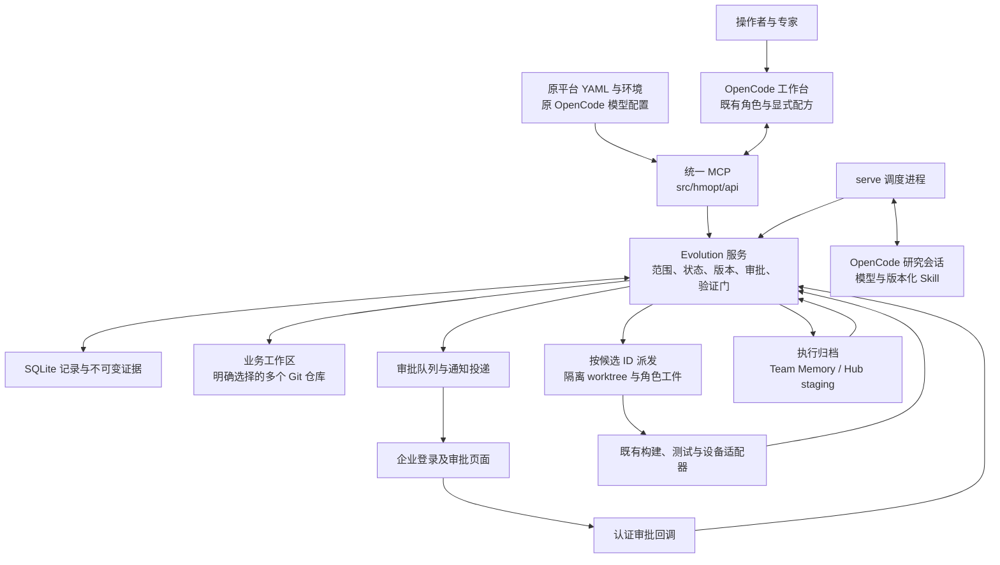
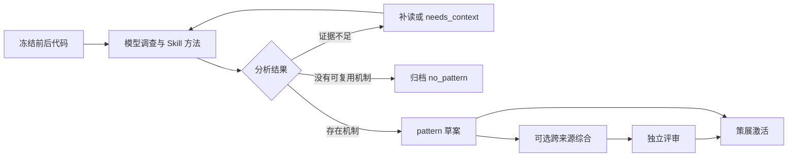
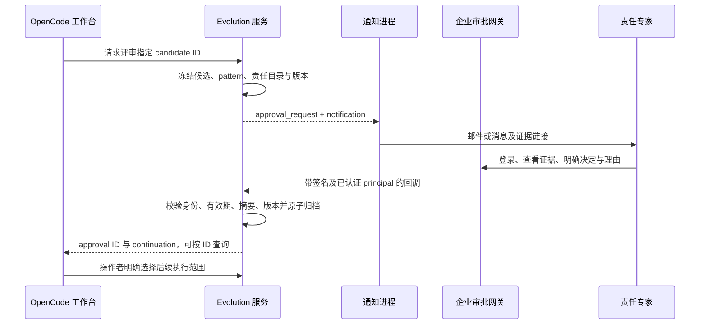
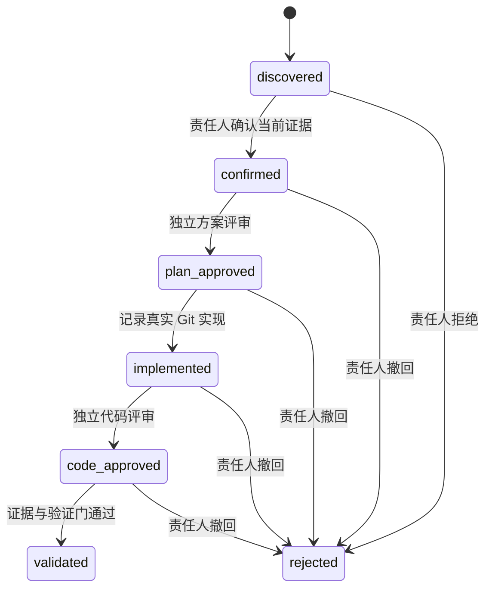

# Evolution 设计文档

本文说明平台目标、整体架构、各环节的职责与输入输出，以及关键设计取舍。
内容对应 `opencode` 的 Evolution 实现，整合更新于 2026-09-14。
代码与数据协议见[实现文档](EVOLUTION_IMPLEMENTATION_CN.md)，实际接入见[配置使用文档](EVOLUTION_USAGE_CN.md)。

## 目录

- [1. 平台要解决的问题](#overview)
- [2. 整体架构与职责分工](#architecture)
- [3. 工作区、版本与证据模型](#workspace)
- [4. 历史挖掘和 pattern 建设](#history)
- [5. 漏斗筛选与语义复核](#funnel)
- [6. 专家确认与审批归档](#expert-approval)
- [7. 按 ID 实施与阶段门禁](#execution)
- [8. 正确性与量化验证](#validation)
- [9. 经验沉淀与下一轮反馈](#learning)
- [10. 两种研究方式与规模化运行](#production)
- [11. 故障恢复、权限与可信边界](#reliability)
- [12. 完整示例与落地顺序](#rollout)

<a id="overview"></a>

## 1. 平台要解决的问题

把过去只在一个提交、一次评审或一个专家头脑中解决过的问题，转化成能够再次发现、
判断适用范围、获得责任人确认、实施并验证的通用工程能力。
内存、性能、可靠性是应用场景；平台围绕证据、方法、决策和验证组织，不按业务场景建立互相独立的流水线。

完整循环为：


产物必须能回答五个问题：来自哪次真实修改、为何适用于当前代码、谁确认了哪个版本、
实施修改是否经过评审、结果由什么测试和原始工件支持。
候选数量、模型输出数量或命令退出成功都不能代替这些答案。

这里采用“从历史改动提炼规律，再用分层筛选扩大应用”的方法。
它不意味着当前平台已经完成超大规模生产验证；吞吐、成本、候选质量和业务收益必须分别实测。

<a id="architecture"></a>

## 2. 整体架构与职责分工

OpenCode 是统一交互入口。Evolution 提供通用任务和证据服务，复用已有七角色、
Skill、语义索引、构建/设备工具、Team Memory 与 Skill Hub。



| 层 | 负责什么 | 不以什么代替职责 |
|---|---|---|
| Skill 与模型 | 阅读代码、补充调查、推断机制、提炼 pattern、复核适用性、设计方案 | 不用固定 Python 模板伪装语义理解 |
| Python 通用服务 | 读取冻结代码、执行受限搜索、校验引用和结构、维护版本/队列/门禁、归档 | 不把通过结构校验解释为模型结论正确 |
| 工作台角色 | 按现有权限完成研究、架构、实施、独立评审和验证 | 不从普通对话隐式启动完整流水线 |
| 责任人及策展人 | 确认候选、审阅方法边界、决定可复用知识的成熟度 | 不由模型替专家作出批准 |
| 业务采集适配器 | 实际构建、测试和采集，记录版本、环境与原始工件 | 不从退出码或自然语言 PASS 生成收益 |

Python 是可重复执行的协议和执行支撑，Skill 是可迭代的智能方法。
二者都需要：只写 Python 规则会限制调查能力，只写提示词则难以保证恢复、去重、版本和审批一致性。

MCP 注册和 HTTP/stdio 入口统一放在 `src/hmopt/api/`；领域逻辑在 `src/hmopt/evolution/`。
CLI 和 MCP 调用同一服务与状态库。无需新增 Evolution 专用端口、默认 MCP 连接或模型 provider。

<a id="workspace"></a>

## 3. 工作区、版本与证据模型

### 3.1 一个业务根目录，多个独立 Git 仓库

业务根可以由 repo 工具管理，也可以只是普通目录；它本身无需是 Git 仓库。
操作者登记项目并明确选择 `selected`，每个项目配置自己的路径和责任规则。
仅用于构建的项目放入 `dependencies`，冻结其版本，但不挖掘或扫描。

每次总任务冻结 manifest：工作区身份、所选项目、构建依赖、各 checkout 路径、Git revision 和责任规则。
任务中 HEAD 前进不会改变已有基线；扩大范围或换新基线需要新的任务。
同一业务项目在不同 checkout 可使用稳定逻辑身份，实际实施位置仍单独绑定，不能悄悄切换。

### 3.2 ID 是完整证据链的连接点

| 对象 | 用途 |
|---|---|
| workspace run / manifest | 说明这一轮关注哪些项目、使用哪些版本及配置 |
| source / history analysis | 连接原始提交、前后代码、分析结果与补充证据 |
| pattern ID + version | 标识一份具体机制、匹配规则、适用前提与反例 |
| scan / page | 保存固定树、固定词典的扫描进度与覆盖结果 |
| candidate ID | 标识当前仓库版本中的待评估目标，贯穿后续阶段 |
| approval request / approval ID | 分别表示待决请求与已经归档的明确决定 |
| dispatch / batch / execution context | 绑定角色执行范围、批次领取和隔离 worktree |
| experiment ID | 绑定实际构建/测试请求、资源占用、报告与结果 |
| evidence digest / journal / staging | 定位不可变证据及其经过策展的知识投影 |

每个可变对象都有版本。修改必须提交当前 `expected_version`；旧状态上的决定被拒绝。
`request_id` 用于同一请求重放，不是任意覆盖记录的钥匙。
候选档案把这些 ID 连接起来，审批后可按 ID 取用，无需从聊天记录判断专家是否同意。

<a id="history"></a>

## 4. 历史挖掘和 pattern 建设

### 4.1 先理解代码修改，再使用提交说明

采集沿 Git 第一父链分页读取，既包含标题为 `fix` 的提交，也包含只有 `update` 的提交。
标题、提交说明和显式导入的评审笔记是辅助材料，决定性证据是修改前后的代码及上下文。
Git 采集本身不会自动拉取托管平台的全部 PR/Gerrit 评审线程。

模型对每份修改回答：

1. **改了什么**：对象、位置、修改行及前后引用。
2. **怎么改变行为**：执行路径、条件、数据或调用关系发生什么变化。
3. **为什么可能这样改**：解释机制，区分有依据的推断与仍未知的原因。
4. **能否复用**：适用前提、反例、风险、修复方法与验证方法。

混合提交需要覆盖相关变更文件；内容不足时进入待补充状态。
后台模型可以请求固定 before/after 版本内的有限文件窗口和字面搜索，由服务执行并归档。
它不会因此获得任意 shell、任意文件或跨仓访问权限。

### 4.2 pattern 是带边界的工程方法

```text
问题特征 → 诊断路径 → 修复方法
     + 适用前提与反例
     + 可执行的初筛规则
     + 历史来源、前后代码与推断依据
     + 主评价指标及验证计划
```

服务检查引用真实性、版本一致性、变更行覆盖、来源归属，以及规则是否命中历史 before 并排除 after。
这些检查阻止虚构证据和无效规则，却不能证明推断的业务语义正确。

单提交可以提出草案；跨提交综合使用已完成分析的多个来源，说明共同机制及差异，
生成可审阅的归并结果。综合 pattern 需要独立评审，策展后才能激活。
重复调用多个 Agent 不会自动产生多个独立的历史证据。



<a id="funnel"></a>

## 5. 漏斗筛选与语义复核

初筛是有意受限的高效搜索；较贵的语义调查只用于缩小后的目标。

| 环节 | 判断或产物 |
|---|---|
| 范围门 | 仅扫描所选 Git 项目、冻结 revision、激活 pattern 的路径范围 |
| 字面规则 | 对源码执行 glob 与 all/any/none 条件；保留命中位置与证据 |
| 热点及责任信息 | 使用同版本运行时热点、责任规则、来源及反馈权重排序 |
| 覆盖与去重 | 分页记录全部该页候选，保留跳过原因，抑制已处理指纹 |
| Skill 语义复核 | 按机制、前提和反例逐项调查，提交满足/违反/未知及引用 |
| 专家确认 | 审阅目标和证据，决定是否投入实施 |

当前通用初筛以字面谓词为主，没有把 AST/数据流证明、跨全库语义等价或收益预测包装成已实现能力。
已有语义索引和调用关系工具可以支撑工作台调查，但不是每次扫描都自动执行这些推理。

固定树分页与词典分区让扫描能够续完；一次 Top-N 展示只是阅读窗口，不是全库覆盖量。
`complete` 表示遍历结束，`coverage_complete` 才说明该扫描没有记录到跳过内容。
未知前提必须保留未知，不应因评分高而自动变成适用。

热点不是所有正确性问题的必要条件。缺少热点不能虚构其热度或收益，
memory-bound、CPU、I/O、竞争与可靠性需要不同评价目标。
排序 score 是线索优先级，不是正确概率；专家接受率也不等于真实 precision。

<a id="expert-approval"></a>

## 6. 专家确认与审批归档

责任归属由操作者配置的“路径规则 → owner”决定。
通知目录再把 owner 映射到企业 principal 与消息目标/邮箱。
模型不能根据提交作者或自己的推断，直接决定发给谁、以谁的身份批准。



SMTP 或 webhook 负责通知；企业网关负责登录、身份映射和审批页面。
回调通过 HMAC 验证网关请求，并检查 principal 是否对应当前责任人。
普通 MCP bearer key 不能代替专家身份。

收到邮件、打开链接、已读或自由文本回复都不是批准。
当前实现不使用 LLM 从自然语言邮件中猜测决定；专家在网关明确 confirm/reject 并填写理由。
也可沿用受信任操作者环境中的责任人 CLI/确认单路径。

决定与候选状态、approval ID、continuation 在同一事务中记录。
重复的同一决定可重放；证据、版本、责任目录变化后不能套用旧决定。
批准只允许进入下一阶段，`automatic_execution=false`，不自动启动实现或设备操作。

<a id="execution"></a>

## 7. 按 ID 实施与阶段门禁



方案冻结假设、瓶颈类型、基线、精确允许修改的文件、评价策略及多仓 manifest。
实施必须是真实 Git 后代修改，不能越过允许路径；代码评审绑定实际实现摘要。
作者区分、阶段顺序、版本和摘要由服务检查，不能用工件中的文字 `approved` 替代服务状态。

工作台按 candidate ID 查询下一角色，也可只执行研究、方案、实现、评审或验证中的允许步骤。
批次由操作者明确选择已确认 ID，串行领取，每项使用隔离 worktree。
持久化 claim 防止同一目标被两个执行者重复领取；恢复前必须处理原会话，而非另开一个重复任务。

角色产物和 capsule 进入任务工作区，数据库是候选状态的权威记录。
每个阶段完成后提交证据，再取得下一阶段的分发包。
旧分发包不能为新版本授权，也不覆盖其他任务或原优化 singleton 状态。

<a id="validation"></a>

## 8. 正确性与量化验证

验证策略由问题性质决定，并在实施之前独立评审冻结。

| 场景 | 主验证方式 | 有效结论需要什么 |
|---|---|---|
| 可靠性/正确性修复 | CorrectnessReport | 基线实际复现失败，候选必需检查通过，版本与环境匹配 |
| 内存、性能等优化 | A/B 报告与原始来源 | 冻结主指标、配对测量、真实工件、功能与 guardrail 检查 |
| 仅协议演示 | simulation | 只说明协议执行，不计为真实收益或可发布验证 |

性能目标不能统一简化为指令数。内存路径可能以延迟、带宽或具体页面行为为主；
收益方向、单位、最低改进、允许回归、最低配对数及环境都应先冻结。
结论分为 pass、fail、inconclusive；证据不足不能解释为零回归或已经通过。

多仓验证的 baseline 包含所有关注项目和构建依赖的固定版本。
feature 仅替换本候选目标仓库的已评审实现版本，其他项目不变。
这样才能避免把依赖漂移或工作负载变化误算为本次优化收益。

实验适配器复用业务已有构建、刷机、lmbench/IC 与正确性测试流程，
按照 experiment ID 读取冻结请求、产生原始工件并返回规范结果。
退出码为零只代表命令完成，报告仍须经过版本、指标、配对及来源校验。
资源异常后保留占用，防止未停止的测试与新实验同时使用设备。

原始文件哈希证明字节内容，采集元数据说明声明的来源；它们不构成密码学硬件认证。
真实设备身份与采集器可信性仍由业务运行环境保障。

<a id="learning"></a>

## 9. 经验沉淀与下一轮反馈

成功、失败、不确定、专家否决及反例都需要保留。
只记录成功会使词典失去适用边界，下一轮继续推送已知无效的方向。

```text
候选与实验事实
    → 执行 journal / 质量统计
    → 策展后的规则调整或方法提案
    → pattern 新版本评审与激活
    → 新一轮扫描及验证

可共享经验
    → 原生个人 Team Memory journal
    → 原生 schema 校验及 Hub staging
    → 既有策展、评测与发布机制
```

内部 `skill` 记录是带来源的执行经验及成熟度投影，不能与可发布的原生 Skill 包混为一谈。
当前原生导出仅接受经过独立策展、真实验证通过的事实。
失败、否决、反例和方案教训保留在本地记录，供质量统计与策展 overlay 使用；
尚无独立的原生 anti_pattern/bad_plan 导出协议，局部失败不能直接推广为通用反模式。
导出只针对明确策展的条目，不重扫整个个人记忆，也不自动发布 Hub。

当前通过可追溯事实、指纹去重、质量统计、策展 overlay 和新版本形成持续改进机制。
自动修改词典、自动激活或发布属于另一个授权边界，不能由“自迭代”一词隐式授予。
评估 precision/recall 需要独立标签和漏检样本，不能从候选接受率推导。

<a id="production"></a>

## 10. 两种研究方式与规模化运行

| 方式 | 使用场合 | 执行形式 |
|---|---|---|
| 交互研究 | 疑难问题、试点、人工补读上下文 | 工作台选择少量提交或候选，现有角色加载 Skill 调查 |
| 后台研究 | 有界批量遍历、持续推进已授权队列 | Python 保存任务、限流和检查点，OpenCode 独立研究会话分析固定证据 |

两者共用分析协议、Skill、词典和证据库。
Python 直接调用 LLM 并不天然缺乏智能，Agent 数量多也不天然更准确。
选择当前混合方案的原因是复用已落地工作台的模型和方法，同时保留后台的持久化与资源管理。

`serve` 推进多仓历史、研究队列和扫描；只有显式开启通知投递，才发送已排队的审批请求。
它不代替策展、专家批准、角色实施或设备执行。
后台研究会话的工具权限受限，通过结构化请求取得补充证据，不自行无限派生更多 Agent。

分页、并发、上下文和模型尝试次数都有预算，失败状态保留以便检查。
暂停或重启后沿原会话及消息 ID 查询，发送结果不确定时不盲目重复提交。
这些是规模化运行的基础能力，尚不等于跨机构分布式调度或既定超大规模吞吐保证。

<a id="reliability"></a>

## 11. 故障恢复、权限与可信边界

| 原则 | 设计理由 |
|---|---|
| 不可变证据 + 可变版本化状态 | 允许流程前进，同时保留当时究竟审阅了什么 |
| 同库事务写入状态、决定和关联 | 避免“已经批准却无回执”“已有扫描却丢失任务关联” |
| 检查点、租约与迟到写入拒绝 | 允许重启恢复，防止旧 worker 覆盖新决定或取消结果 |
| 不确定动作由操作者处理 | 超时不能证明邮件未发出、模型没收到或设备已停止 |
| 权限随角色和阶段限定 | 候选确认不等于方案、实现、合入或设备授权 |
| 配置集中且按需启用 | 复用原路径、模型与工具，避免多份配置漂移 |

普通工作台会话仍从 assistant 开始，用户决定路由；显式 recipe 才由 coordinator 组织角色协作。
Skill 不扩大角色权限。任务工件目录是协作分工，不应当作操作系统隔离或多租户安全边界。
作者标签区分和摘要校验不证明背后是两个真实独立的人；企业专家回调的身份保证来自接入网关。
部署到不互信的使用者之间，需要额外的身份、执行器和隔离机制。

可信性分为三个层次：

1. **准备可用**：配置、Git、MCP 和工作台工件满足本地检查。
2. **协议闭环有效**：范围、引用、审批、版本、实施、验证及归档能够被测试复现。
3. **业务结果有效**：真实模型和专家在目标业务中产出被真实测量支持的结果。

`doctor` 只覆盖第一层；本地夹具和受监督运行不能替代第三层。
每次报告必须说明结果属于哪一层。

<a id="rollout"></a>

## 12. 完整示例与落地顺序

### 12.1 从普通提交到可验证修复

历史提交标题只有 `update`，代码把下面的 guard 改为 `raw.strip()`：

```python
# before：空白字符串进入 int()，抛出异常
return int(raw) if raw else 0

# after：输入契约允许空白归零时，避免错误转换
return int(raw) if raw.strip() else 0
```

模型先查明调用契约：输入必须是字符串，且空白表示默认值；如果 API 本来要求拒绝空白，
就属于反例。pattern 因而不是“到处加 strip”，而是一份包含输入契约和反例的修复方法。

多个历史来源支持同一机制后，综合草案经过独立评审与策展。
扫描找到同仓新目标文件中的相似代码，语义复核引用其空白归零约定，专家确认对应 candidate ID。
方案冻结只允许修改目标文件，并要求空白复现与正常/非法输入回归。
实现提交通过代码评审后，适配器实际执行冻结的前后版本。
基线复现失败、候选与回归通过，结果进入验证档案和 journal；策展后进入 staging。
这个实例证明正确性闭环，不报告不存在的内存或性能百分比。

### 12.2 业务落地按可验收结果推进

| 阶段 | 退出条件 |
|---|---|
| 接入 | 确定业务根、所选 Git、owner、工作台和现有配置；主 MCP 可用 |
| 只读试点 | 实际历史产生可核对的分析，草案和反例可由专家审阅 |
| 单项闭环 | 一个明确批准的候选完成独立方案/代码评审及真实测试归档 |
| 多仓验证 | 冻结的所选仓和依赖版本进入两侧构建报告，差异可归因 |
| 通知与恢复 | 真实专家身份回调可用，重启/超时/取消可恢复且无重复实施 |
| 扩大规模 | 独立标签评估质量，记录吞吐、成本、收益、失败及人工介入量 |

后台 Worker、认证审批回调、多仓调度、可恢复扫描和实验适配器已经有实现与本地测试。
真实业务 provider、企业页面/邮箱、硬件采集和规模吞吐仍需部署验收。
自动 AST/数据流证明、全历史语义聚类、常态化 profiler 自动摄取与回归 bisect、
自动发布 Skill Hub 都不属于当前已经交付的通用能力。

详细模块、接口和验证记录见[实现文档](EVOLUTION_IMPLEMENTATION_CN.md)；
按[配置使用文档](EVOLUTION_USAGE_CN.md)完成真实业务接入。
