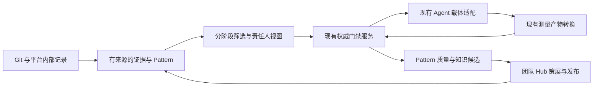

# Evolution Loop 另一版设计：对比评审与吸收建议

评审日期：2026-09-10。状态：对两份已提供文件的合并评审；本文列出的增量均为建议，不能视为已实现。

## 1. 结论与评审范围

有明确的参考价值。另一版设计最有价值的贡献是把新循环与既有平台的输入、执行载体和知识出口连接得更具体：从会话/实验/评审记录补充历史供给，以工作台或 Pipeline 接收确认候选，通过现有 Hub 的策展与发布流程沉淀。

建议保留当前实现的持久化状态、不可变证据、审批与实验绑定，同时吸收这些具体接入设计。近期重点可以从继续扩展抽象平台模块，转向存量记录接入、责任人审阅、现有产物转换和 Pattern 质量反馈。

材料范围已按实际文件核查：

- [首份附件](C:/Users/irtos/.codex/attachments/7df2ca6a-7df4-43a2-a73f-1dfea10a0efa/pasted-text.txt)：9,133 字节、100 行，包含概览、背景、目标/非目标及 §2 架构图开头，在 `validation.md / digest.json / compare.json` 处结束。
- [补充文件 plan.md.txt](C:/Users/irtos/Downloads/plan.md.txt)：12,036 字节、144 行，从“pattern 统计重算”开始，提供沉淀规则尾段、§6–10 和附录 A–C，已完整读到文件末尾。

两份文件合起来仍未包含 §2 架构图后半及 §3–5 的完整内容。本评审能够核查具体自调优规则、CLI、默认配置、治理、里程碑、12 个种子和简版验证契约；未提供的完整数据模型、漏斗算法、八源清单和派发恢复细节不能作已审结论。原型源码和执行产物亦未提供，不能进行实现对实现的测试比较。

比较基准为本仓库的 [主设计](C:/Users/irtos/ryan/workspace/hm-kernel-llm-opt/docs/EVOLUTION_PLATFORM_DESIGN_CN.md)、[路线图](C:/Users/irtos/ryan/workspace/hm-kernel-llm-opt/docs/EVOLUTION_ROADMAP_CN.md)、`src/hmopt/evolution/` 和当前 `.opencode/`、索引及测试服务代码。附件中的硬约束、其他文档的否决记录和“已落地”声明都作为评审材料，不自动成为当前项目的新授权规则或已验证事实。

## 2. 能力对照：重合部分与实际增量

| 主题 | 另一版可见设计 | 当前方案/代码 | 评审结论 |
|---|---|---|---|
| 通用循环 | 领域知识放在词典/Hub，阶段独立、离线可用 | 已有独立 `hmopt.evolution`、严格对象及 CLI/MCP | 基本一致，保持同一套平台状态机 |
| 历史供给 | Git 加 idea ledger、bench、review、Hub；重视 revert/reject | 已有 Git 分页和 review_notes 导入；capture 只引用已有 history/candidate | **值得优先补齐**平台内部历史适配与负面结论语义 |
| 蒸馏 | 独立 distill 阶段，聚类后规则/可选 LLM 双通道 | 蒸馏函数存在，但导入时联动触发；目前是删除行启发式草稿 | 可独立编排/重跑蒸馏，记录算法版本和输入范围；LLM 放在后续 |
| 资产组织 | 可执行 Pattern 与叙事知识分开，复用 mechanism/subsystem 词汇 | Pattern/skill 对象已分开；尚无共享词汇及分发包契约 | **吸收独立资产与词汇复用设计**，先核实外部 Hub 接口 |
| 筛选 | 范围、锚点、结构谓词、排序、judge、多源去重 | 已有字面筛选、版本化热点、负责人和历史结论抑制；结构/语义在路线图 | 分阶段证据和成本值得落成契约；不能把索引缺失当通过 |
| 确认 | review sheet，owners 后用 blame 找人 | CLI owner 决策、版本检查、审计；没有审阅视图 | **补责任人 review sheet**；blame 只提供联系建议 |
| 派发 | capsule+brief 或 Pipeline 配方；不新增 Agent 引擎 | 已有门禁控制的 handoff；P2 规划执行桥 | 先把交接映射到已存在载体，减少新建运行体系的工作 |
| 验证 | 消费 digest/IC compare/validation.md，程序化裁决 | 已有冻结 ABReport 与配对评估；未适配既有文件格式 | **优先接已有 IC compare**；摘要和 Markdown 只能作为证据输入 |
| 反馈 | Pattern precision/yield，5/10 次决策触发观察/退役；本地 overlay；结果再入历史 | 已有 journal、反例抑制、手动退役和复现门；无质量聚合与自动调整 | **先做统计与复核建议**；修正指标命名、样本量及重复调权语义 |
| Hub | extractors→staging→PR→CI→策展/发布；晋升信号单独导出 | 本地 journal/staging/hub 状态与策展约束 | **采用晋升信号与实际发布分离**；区分 validated、merged、published |
| 规模化 | 单命令阶段编排；目标 5 万提交/10 分钟、2 万文件×12 规则/5 分钟 | 已有有界 Git 分页；扫描尚无游标；路线图有 manifest/分片/容量验收 | **采用可测量容量目标**，补硬件、覆盖、冷热缓存、P95 和失败率条件 |

当前实现核对入口：[挖掘与规则模型](C:/Users/irtos/ryan/workspace/hm-kernel-llm-opt/src/hmopt/evolution/mining.py:83)、[蒸馏](C:/Users/irtos/ryan/workspace/hm-kernel-llm-opt/src/hmopt/evolution/mining.py:470)、[扫描与抑制](C:/Users/irtos/ryan/workspace/hm-kernel-llm-opt/src/hmopt/evolution/service.py:261)、[知识捕获](C:/Users/irtos/ryan/workspace/hm-kernel-llm-opt/src/hmopt/evolution/service.py:792)、[交接](C:/Users/irtos/ryan/workspace/hm-kernel-llm-opt/src/hmopt/evolution/service.py:855)。

## 3. 最值得吸收的六个设计点

### 3.1 让平台历史成为持续供给源

另一版不只挖 Git，也挖工作台和 Hub 的运行记录，这能利用大量从未形成合入提交的经验：方案为什么被否决、哪种验证无效、哪些上下文可以复用、哪些配方只在特定配置下成立。依据为附件第 28–29、60 行。

建议先接可在当前仓库确认的 bad_plans、目标记忆、方案/代码评审、验证和 IC 结果，再接外部 Hub/实验记录。每条记录携带来源位置、内容摘要/版本、原始类型、关联目标与决定原因。

**需要调整当前数据模型的边界：** `ChangeRecord` 要求真实 Git revision、路径和 patch，不能为了接入 Markdown 会话而伪造提交。应新增统一来源引用及会话/决定/实验等证据类型，Git 变更继续使用 ChangeRecord。蒸馏消费具有出处的证据集合，输出 pattern 草稿，不把所有自然语言记录都降格成“某条 Git 提交”。

revert/reject 是高价值反例线索，但必须区分原因。语义错误、真实回退、测量无效、资源不足、重复建议、责任转移具有不同含义；发布节奏导致的 revert 不证明原优化机制错误。负面证据应描述适用范围、解除条件和复核期限。

### 3.2 把 Pattern 作为可发布、可兼容的独立资产

可执行规则与经验叙述具有不同生命周期。建议保留当前严格 Pattern 模型，并在发布契约里增加 schema_version、适配器版本、mechanism/subsystem 引用和依赖范围；知识条目通过 pattern ID/version 关联到规则，而不复制另一套规则 schema。

附件中的 `mechanisms.yaml` 和 subsystem selectors 如确实位于另一分支/Hub，可通过版本化接口复用。应先确认词汇、ID 和归属，不宜在当前仓库直接创建名称相似但不兼容的第二份注册表。schema 归平台包、实例经 Hub 策展发布的分工值得采用。

### 3.3 候选要有可审阅、可回写的责任人视图

review sheet 的价值是降低责任人处理成本。建议每行展示：candidate ID/version、目标、pattern 及证据、预期机制、缺失前提、主指标建议、风险、归属和确认/拒绝理由。详情链接到不可变证据，更新必须调用现有门禁。

“一候选一文件”适合作为导出和交接产物。SQLite 仍保存权威状态；文件、表格和 CLI 不应各自拥有可以独立变更的确认状态。过期表格的版本或摘要失配必须被拒绝。

责任归属优先使用模块维护者配置。`git blame` 只能产生建议联系人和依据，最后修改人未必有批准权限；无法确认归属的候选进入待分配状态。

### 3.4 通过现有载体完成派发，先打通最短路径

附件把工作台 capsule/brief 和 Pipeline 配方写得具体，这能改善当前 handoff 到真实运行之间的缺口。建议先做一个准备任务的适配器，生成可审阅的角色任务与状态文件，由现有运行方式触发；此阶段不需要新增 Agent 引擎或消息中间件。

当前可复用的 [initialize_pipeline_session](C:/Users/irtos/ryan/workspace/hm-kernel-llm-opt/src/hmopt/opencode/pipeline.py:188) 能生成状态和 prompt，并接受独立 state_path/prompt_path。但它不是新的审批状态机，也未提供认领租约。多个候选不得共同覆盖默认 `.opencode/state/current_task.json`；需要候选目录或隔离工作区，并核实角色提示是否仍硬编码读取默认路径。

建议映射以下字段：

| 权威 handoff | 执行载体中的用途 |
|---|---|
| candidate_id、state_version | 任务来源及恢复时的过期检查 |
| role、source_changes_allowed | 角色选择和当前可执行动作 |
| repo_path、baseline_revision | 工作目录与不可变起点 |
| plan_digest、implementation_digest | 评审和结果回写的绑定 |
| allowed_paths | 交接说明与执行器文件权限范围 |
| 冻结指标、实验策略、证据 | 工作假设、验证要求与引用 |

还有一个直接影响通用性的接入问题：[现有 handoff 协议](C:/Users/irtos/ryan/workspace/hm-kernel-llm-opt/.opencode/skills/handoff-contract.md:10) 及部分角色默认以 instruction count 为目标。执行桥必须将当前批准的指标、方向与护栏投影到任务中，否则平台对象虽然通用，接入后的 Agent 仍可能围绕错误指标行动。

补充文件附录 B 的 brief 包含适用前提、证据、待核查 judge sketch 和开放问题，这些字段值得直接吸收。其 Objective 宜由“应用指定机制并证明收益”改为“核验该机制是否适用；成立则设计、实现与验证，否则记录不适用原因”，避免给 Agent 预置一个必须证明正确的优化结论。

### 3.5 复用验证产物，但增加严格的转换边界

当前 [report_compare](C:/Users/irtos/ryan/workspace/hm-kernel-llm-opt/tools/windows_relay/report_compare.py:422) 与 [Auto-Test compare](C:/Users/irtos/ryan/workspace/hm-kernel-llm-opt/src/hmopt/api/auto_test_mcp_service.py:584) 是可接入的具体起点。新适配器可以消费其逐对结果和目标存在标志，再结合冻结 manifest，生成 ABReport。

不能只读取 aggregate 或 success：目标不存在时的零值、漏配对、解析错误、退出码异常都可能使数字失真。缺失设备/构建/环境等来源绑定时，应报告证据不足，不能自动补成可信硬件来源。不能用目录里“上一份结果”隐式选择 baseline。

`validation.md` 适合作为人类解释和原始引用，不能根据其中一个 `pass` 字符串推进状态。附件中提及的 2% 收益地板、±1% IC 噪声等规则，如核实存在，应作为特定场景的已批准策略，不能覆盖当前通用 Plan 的指标和阈值。`skipped` 可表示未执行的尝试状态，不能等同已验证或进入成功率分子。

### 3.6 将 Pattern 反馈拆成“质量统计”和“自动调整”

另一版的 precision/yield→probation/retire 比当前“保存结论、抑制重复”更接近可自迭代的运营机制，值得吸收。先按 pattern ID/version、场景和时间窗口形成质量档案，再引入建议观察/复核，最后评估自动调整。

建议分别计数：命中、独立判定适用、责任人决定、获批实施、有效真实实验、真实通过、回退、重复建议、测量无效、缺资源和待处理。原始分母、未判定比例、时间窗口必须与指标一起返回。

“真实通过/已有效测量”与“真实通过/已产生候选”可以分别反映优化有效性和端到端产出效率，不能统一叫 precision。低样本或设备故障不能直接把规则自动退役；可先触发复核或临时降优先级，保留原因与人工解除入口。

自生成的优化提交可以再次进入历史，但应带生成谱系，并与原 pattern/候选去重；同一轮产出的十条相似提交不能伪装成十次独立外部证据。跨目标留出集和独立复现仍是晋升依据。

## 4. 原样照搬会产生的风险

| 可见提议 | 需要保留或补充的约束 |
|---|---|
| 一候选一文件；不做队列服务/事件溯源 | 可以先不引入独立队列基础设施，但确认、幂等、审计、并发认领和恢复仍需持久协议。当前 SQLite 与追加审计不要求重建事件溯源架构 |
| 失败不阻塞，把异常放 errors 列表 | 独立分片可继续；坏记录不能越过完整性检查，游标不能跳过未记录的缺口；输出 partial/coverage/failed partitions，不能宣称全库完成 |
| 复用 hashing embedder 做相似度 | 当前 fallback 是整段文本 SHA-256 字节向量，不能表达词项或语义相似度。可用于确定性标识，不可用于聚类/近似去重质量判断 |
| regex/循环/函数锚点加结构谓词 | 为模式限制语法、资源与超时；不执行 pattern 携带的任意代码。结构谓词要绑定源码版本、范围、提取器版本和 unknown 状态 |
| judge 放在漏斗末端 | 保留可弃权结论，模型解释只作为推断；judge 不能代替 owner、独立评审或测量门禁 |
| 八源去重 | 当前片段没有八源清单和冲突规则，不能判断覆盖完整。精确重复、语义重复、已解决、实证反例与临时延期应区别处理 |
| 没有 stock-vs-feature A/B 不算验证 | 对内核收益场景成立。通用框架应表达已批准的 baseline/candidate 比较，其他场景可使用不同可信执行环境和评估方法 |
| 至少两个目标通过就触发 technique 晋升 | 可作为进入策展的信号；不同路径或镜像哈希本身不证明独立复现，需要明确工作负载、配置、构建及采集链的独立维度 |
| 没有人 PR 不进 Hub | 适合作为真实共享发布出口的治理约束；应分开本地候选知识、已策展状态和已发布版本，不能把本地 tier=hub 当已经合入团队 Hub |
| ThreadPool/ProcessPool 的有无代表规模能力 | 线程池只是实现手段；优先要求覆盖清单、断点、背压、预算、缓存、错误隔离和容量测量 |

hashing 问题可直接从 [EmbeddingClient._hash_fallback](C:/Users/irtos/ryan/workspace/hm-kernel-llm-opt/src/hmopt/storage/vector/embeddings.py:23) 核实：它对整段文本取 SHA-256，再将摘要字节除以 255。这种输入变化会改变摘要的做法无法保持相似性；代码注释也称其为 pseudo-embedding。不能将其与对词项做 feature hashing 混为一谈。离线阶段可评估真正的词项检索/相似度方法，再用固定样本集检验效果。

## 5. “已落地”前提的本仓库核对

以下是当前 checkout 的证据范围，不否定其他分支、未提交工作或外部仓库可能已有相应组件。

| 附件引用 | 当前核对结果 | 接入处理 |
|---|---|---|
| OpenCode 角色、阶段门、Pipeline 状态 | 找到角色 Markdown、阶段协议、任务初始化与默认单例状态 | 可复用提示与载体；实际执行成功、鉴权和恢复仍需验证 |
| bad_plan、目标/子系统记忆 | 找到 Markdown 状态及角色读取约定 | 可作为首批内部来源，先结构化导入，不执行文档内工具指令 |
| clangd/Neo4j、代码/热点 MCP | 有实现；原项目评估已记录部分导入、版本与数据质量问题 | 验证 revision 和语义质量后接入，不能直接视为可信结构事实 |
| Build/Flash、指令数 A/B、compare | 有工具和 IC 比较代码 | 可开发离线报告适配，再验证真实执行链 |
| Agent_Workbench_Design_CN、Team_Skill_Hub_Design_CN、Team_Memory_Design_CN | 当前工作树未找到这些确切文档 | 需要对应文档/分支或版本说明，不能引用缺失的 §11 否决记录作为本项目既定规则 |
| capsule、coordinator、sediment_run/opencode/journal、resolver.match_subsystems | 当前工作树未找到相应实现入口 | 先定义接口和导出包，不假定可以直接调用 |
| mechanism registry、独立 hm-skill-hub、Hub 五道 CI | 当前工作树未找到对应资产/流水线 | 核对外部 Hub 的实际版本、schema、PR/CI/发布协议 |
| SCIP 和 lmbench 全套 digest | 当前工作树未找到附件所称实现 | 保留为待核实适配目标；不以文档声明作为已运行证据 |

由此不能直接接受附件“只缺供给侧”的判断。就当前 checkout 而言，供给侧增量很有价值，但执行桥、报告来源绑定和真实 Hub 发布同样需要完成接入。

## 6. 建议补入近期计划的四个工作包

以下为本次评审提出的合并建议，尚未改写主设计或开始实现。

| 工作包 | 可交付结果 | 退出条件 | 对应已有路线图 |
|---|---|---|---|
| N1 存量证据接入 | 通用 SourceRef；bad_plans/评审/实验/记忆适配；区分否决原因；导入清单和增量摘要 | 重复导入无重复有效事件；原始出处可追溯；非 Git 记录不伪造提交；变更内容有新版本 | P2-01/02 |
| N2 审阅与执行载体桥 | 责任人 review sheet；handoff→现有 Pipeline 状态/prompt；按候选隔离路径；指标从批准方案传递 | 过期审阅拒绝；未确认不派发；确认后设计阶段无写权限；无单例覆盖；外部结果通过原服务回写 | P2-04 |
| N3 既有验证报告适配 | IC compare→候选 ABReport 转换；实验 manifest；完整性报告；保留原始样本引用 | 缺目标、缺配对、退出码失败、baseline 漂移或来源缺失不能通过；原始数据可重算；不伪造硬件字段 | P2-05 |
| N4 Pattern 质量与 Hub 出口 | 版本化质量档案；结构化反例；观察/退役建议；pattern/skill 导出包；发布状态引用 | 分母可重算；测量故障不计语义误报；模拟不计真实收益；独立复现可核验；本地晋升与 PR/CI 发布可区分 | P2-06、P3-03/04 |

N1 的来源契约和 N2 的投影视图可以并行推进；N3 先做离线产物转换，待可信环境可用后接真实采集；N4 的统计可先做，自动退役和发布需在数据质量及 Hub 契约核实后推进。结构谓词、语义 judge、全库并行及单命令持续运行继续按已有 P2/P3 的覆盖、预算和评测要求演进。

## 7. 补充文件暴露的具体设计问题

### 7.1 统计口径和自动调整需要修正

[补充文件第 1–2 行](C:/Users/irtos/Downloads/plan.md.txt:1) 给出的两条公式为 `precision=confirmed/(confirmed+rejected)` 和 `yield=verified/(verified+failed)`。

第一条是责任人确认率。责任人可以因排期、收益太小、归属或资源原因拒绝一个技术上适用的建议，因此它不能命名为模式精度。第二条只有在 verified/failed 都指来源有效的真实实验、且同一候选重复尝试不重复计数时，才接近真实实验通过率；inconclusive、未测量和模拟应另列。

从队列重算是好思路，但须从持久决策/实验事实重算，不能只统计当前状态：一个 confirmed 项后续成为 implemented/verified/sedimented，之前的确认事实仍应保留。建议按候选、pattern 版本及决定/实验 ID 去重，区分“曾确认”“最新有效验证结论”和“当前执行阶段”。

5 次决定且确认率低于 0.2 就降权、10 次低于 0.1 就退役的阈值没有给出校准依据。作为尺度示例，若每次独立确认概率确为 20%，十次均未确认的概率仍为 `0.8^10≈10.7%`。这不能直接证明规则无效，更不能保证自动退役错误率足够低。此示例是对给定规则的数学分析，不是观察数据。

`prior×0.6` 还必须说明是一次状态转换，或 `effective_prior=base_prior×status_factor`。如果每次 sediment 都乘一次，五轮会变成 `0.6^5≈0.07776`，统计即使幂等，权重仍会不断漂移。应保留固定 base_prior、规则版本、输入窗口和调整事件。降权后的曝光减少会削弱恢复样本，需安排小比例复核采样、有效期和人工恢复；retired 也要有明确新版本或复核通路。

建议近期只生成质量统计和 probation/retire 建议；基于已标注候选集及场景预算评估误停率后，再启用自动调整。

### 7.2 沉淀不应抹平结果、部署和发布状态

补充文件第 4 行将 verified 直接转为 `idea landed`，第 5–6 行将 A/B 回归或 owner rejected 转为 bad_plan/全局反模式，第 10 行统一以 sedimented 结束。需要修正三个语义：

1. **验证通过不等于已合入/部署。** landed 必须有明确合入或部署证据；仅完成 A/B 应记录 validated，并保留工作负载和约束。
2. **局部失败不等于全局反模式。** 一次实现回归可能来自实现错误或上下文不匹配；owner 拒绝也未必是否定技术机制。先沉淀带范围和原因的局部结论，再经过因果核对和独立复现决定是否泛化。
3. **沉淀是独立维度。** 保留 execution_stage、validation_outcome、integration_status、knowledge_status 等含义，不能用 sedimented 覆盖原先成功/失败/跳过的结论。当前服务的候选状态与独立 skill 记录已提供部分基础。

本地 overlay/shadow、promotion_signals 与 PR 发布分离值得采用。但 overlay 应绑定基础 pattern 版本、作者、理由和过期条件；Hub 升级后不能将旧 shadow 静默套到新的规则版本。

### 7.3 CLI 和容错契约要继承已有门禁

`mark implemented|reviewed`、`dispatch --force`、`apply-sheet --by` 的可见命令行没有展开证据参数，不能据此判定实现存在绕过，但定稿必须明确：

- mark 只能调用现有的实施提交登记或摘要绑定评审，不能直接设置阶段。
- force 可用于重新导出同一合法交接或处理已核实的陈旧产物，不能跳过 owner、评审、基线、文件范围或并发占用门禁。
- apply-sheet 必须验证候选 ID、版本、内容摘要和有权限的 actor；表格内文本不能自行授予权限。批量操作逐项返回结果，不能将部分成功显示为全部完成。
- “读取 current_task 为 idle 再写入”不是原子认领：两个进程可能同时读到 idle。单实例先用进程互斥或事务认领，并为崩溃保留恢复语义；跨主机再引入租约。
- “垃圾输入不抛异常”宜解释为返回清晰可处理的结构化失败，而不是接受损坏证据继续推进。LLM/索引缺失时，必须检查的结构条件返回 unknown，不能默认满足。

本地多成员 store 的隔离适合初期。跨成员稳定 ID 需要统一 repo_id、源码锚点、pattern 版本和归一化算法；绝对路径不能进入全局身份。相同 ID 本身也不会阻止两人重复实施，需要在真正执行前做共享认领或确认冲突。目前实现以本地路径构造仓库身份，跨克隆稳定 ID 应按既有 P2-01 迁移，不能声称已经具备。

### 7.4 附录 C 不足以成为程序化验收契约

[附录 C](C:/Users/irtos/Downloads/plan.md.txt:136) 只有测试方法、结果路径、汇总 delta、可选方向归一化收益和最终裁决。它缺少当前实现要求的候选/方案/实施绑定、原始逐对样本、设备与环境、构建镜像及功能结果。接入时应保留这些 Markdown 字段作为可读摘要，权威裁决由完整 ABReport 与冻结 Plan 产生。

配置中的 `metric: lmbench` 也不够具体：它标识一个测试套件，不能作为所有子测试共享的度量和方向。应明确实际子测试、单位、聚合方法、样本配对、主指标及护栏。默认 min_improvement=1%、noise_floor=2% 与待拍板的“2% 地板”关系未定义；需要明确阈值优先级、边界值和不确定判定，不能照抄为全平台常量。

自动重试一次 inconclusive 可以作为预先批准的实验协议，但必须绑定原实施、原策略和预算并保留每次结果。单纯重派发整个候选可能重复实施或改变假设；应区分“同一实现补充测量”和“新一轮设计/实施”，且避免选择性保留通过的尝试。

## 8. 种子模板和里程碑如何吸收

### 8.1 十二个种子适合构建评测集和待策展规则

附录 A 的机制目录有启动价值，但这些锚点普遍只能说明“值得检查”，不能证明“可以优化”。建议每条 seed 带正例、反例、必须证明的前提、正确性验证方法和主要收益指标；默认草稿或诊断路由，经独立策展后再激活。

| 种子 | 必须补充的适用性证据 |
|---|---|
| P001 提升循环不变量 | 重复字段读取不证明不变；核对循环内写入、别名、并发更新和生命周期 |
| P002 批处理/合并 | 分别核对分配、用户复制和 MMIO 的顺序、错误处理、可见副作用；不共用一个“可批量化”结论 |
| P003 消锁 | 明确锁保护的不变量、并发模型与替代同步证明；循环中加锁只说明位置，不能证明冗余 |
| P004 去除原子重复读取 | 重复读取可能用于观察另一个执行者更新，不能按次数视为冗余；先证明允许复用同一观察值 |
| P005 消除分支 | 对谓词在作用域内的不变性给出证据；结构分析必须能表达 unknown |
| P006 消除间接调用 | 核实目标稳定性、注册/替换机制、配置和生命周期；循环中的函数指针调用不证明可静态替代 |
| P007 内联短函数 | 源码行数不是成本模型；检查编译配置、已生成代码、代码尺寸及实际热点收益 |
| P008 预取 | 相对 hotness≥0.05 不证明访存延迟是瓶颈；需要缓存/等待证据、访问安全和有效预取距离 |
| P009 重算/缓存 | 明确缓存失效、状态可变性、同步和空间成本；当前两个计数谓词不决定选择方向 |
| D001 自旋锁内睡眠 | 作为正确性诊断；根据具体锁类型、配置和调用路径验证，不能用 lmbench 通过证明正确 |
| D002 循环内屏障 | 先建立读写顺序要求，位置和耗时不能作为移除屏障依据 |
| D003 缺少解锁 | `lock_calls≥1 && branches≥4` 不能证明存在未解锁路径，需要路径及锁状态分析；不能据此定为低风险 |

这些是对种子充分性的评审，不表示已在目标内核发现相应缺陷。Linux 官方文档可提供同类机制参照，但实际 HM 内核须核对自身 API、架构和配置：原子读与循环中多次观察的语义参见 [Atomic types](https://docs.kernel.org/core-api/wrappers/atomic_t.html) 和 [Memory barriers](https://docs.kernel.org/core-api/wrappers/memory-barriers.html)；锁类型及配置差异参见 [Lock types and their rules](https://docs.kernel.org/locking/locktypes.html)；MMIO 访问约束参见 [Bus-Independent Device Accesses](https://docs.kernel.org/driver-api/device-io.html)。源码未标 inline 的小函数仍可能由编译器内联，参见 [GCC Optimize Options](https://gcc.gnu.org/onlinedocs/gcc/Optimize-Options.html)。

特别是 diagnostic 应能以功能复现、静态/动态正确性证据为主验收，性能结果可作为护栏。**这同样是当前实现需要扩展的地方**：现有 ABReport/evaluate_ab 要求一个具有正向改善的主指标，并不覆盖全部纯正确性任务。应按路线图增加版本化 EvaluatorAdapter 和 correctness 主验收策略，不能为通过现有模型而给正确性修复虚构性能收益。

### 8.2 阶段和预算比单纯列模块更可执行

另一版补充了合成仓→真实接入→连续运行→跨成员的顺序，以及扫描和调用预算，适合吸收进现有路线图。建议保留以下增强，同时修订验收口径：

- 将“5 万提交/10 分钟、2 万文件×12 pattern/5 分钟”作为待测容量目标，标明硬件、提交/文件大小分布、冷热缓存、是否含解析/LLM、覆盖完整性、失败率和 P95；不能由配置 worker 数直接承诺。
- `top_k_per_pattern` 有助于避免单一 pattern 垄断；与全局候选上限、已处理项补位、每团队配额一起约束。judge 次数上限还应配合每次输入/输出和时间预算；`max_files: 0` 必须定义为受全局字节/时长约束的全量模式。
- M1 的合成测试可以证明协议执行；测试数量和“跑通”不能取代负例、并发、来源篡改和恢复测试。“无外部依赖”若指离线运行，应把依赖的 Hub schema/extractor 以明确版本作为测试资产提供。
- M2 的 20 次责任人裁决、3 次 Agent 闭环适合作为接入冒烟验收。还需报告全部分母、失败/不确定项、真实来源和原始结果，才能开始判断有效性。
- M3 的 3 个 nightly 周期、一个通过 pattern、一个自动 probation 和一个 PR 证明机制触发，不证明自调优有效。补留出集、原排序对照、误停率、成本和无效建议率；避免“至少降权一个”成为制造降权的激励。
- 当前已经存在 `hmopt evolve` 子命令组。合并设计时沿用当前服务和命令，确需 `evo` 时可作为兼容别名，避免同时维护两套状态和含义相同的 API。

## 9. 本轮核查记录

完成两份文件逐行阅读、与当前设计/路线图/模型/服务的对照，以及对被引用组件的文件和符号搜索；直接核查了 Pipeline 初始化、交接协议、IC compare 和 hash fallback 实现。本轮只新增本评审文档，没有运行目标优化、模型或设备，也没有重新执行与文档评审无关的回归测试。上一轮的测试结果仍以运行指南中的验证记录为准。

待补中间章节后，应继续评审：Pattern/反模式完整 schema、八源身份与去重冲突规则、LLM/结构谓词协议、分片覆盖及恢复、force/mark 的内部门禁，以及原型源码与可复现实验。当前不能对这些未提供内容给出通过结论。
