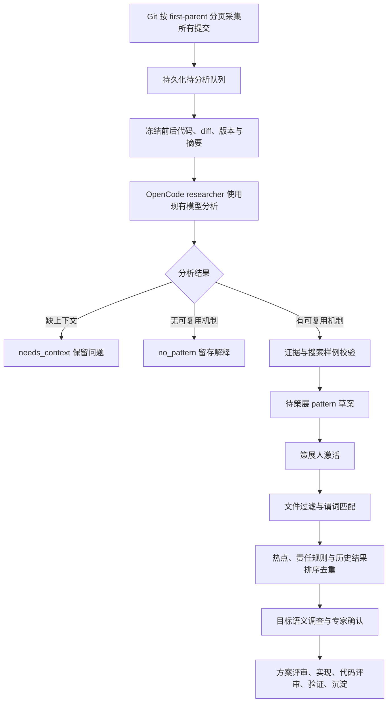

# 基于代码变更的历史挖掘：实现与执行方式评估

2026-09-11。本文区分已经实现的基础协议和仍需建设、实测的规模化能力。

## 1. 结论

采用 **Python 管理任务与证据，OpenCode Agent 负责代码调查，跨提交归并与独立审阅负责模式质量** 的组合架构。
Python 直接调用 LLM 也能完成智能分析；质量取决于模型、上下文、工具循环、审阅和评价方法，不能由使用 Python 或 OpenCode 来判断。
只把 diff 放进一次提示词，与允许 Agent 补读定义、调用者、测试、历史版本，是两种不同的信息条件。
需要在同一真实语料、模型与预算约束下比较，不能预先宣称批量 Agent 更准或更便宜。

早期 `mining.distill_patterns` 没有调用 LLM，而是读取提交说明中的关键词再抽取删除行。
`core.llm.LLMClient.chat` 是项目通用文本模型调用封装，但原 Evolution 历史挖掘并未调用它。
因此，原流程跑通、SQLite/MCP 测试通过，都不能证明完成了智能 pattern 挖掘。
当前已删除该函数及其后续空实现；历史入口统一为入库待分析，再通过 `change_analysis` 和 OpenCode Worker/Skill
提交带前后代码证据的分析。文档中的“原流程”仅用于解释这次设计调整。

## 2. 三种执行方式

| 方式 | 能做什么 | 局限和成本 | 定位 |
|---|---|---|---|
| Python 遍历 + 单轮 LLM | 提供充分上下文时分析清晰、局部的代码变更，统一输出结构 | 不能主动补读证据；容易根据差异编写看似合理的原因；批量错误也会很快 | 简单变更的受控基线，不能直接成为可信词典 |
| OpenCode 内批量 Agent | 复用工作台模型、MCP、代码工具和角色，分头调查不同变更 | 重复读代码、重复模式、会话与模型限流、上下文膨胀；更多 Agent 不等于独立证据 | 交互式研究与小规模受控并发 |
| Python 调度 + OpenCode workers | 用持久化队列实现限流、租约、重试、检查点，让 Worker 保留工具调查能力 | 需要调度适配器、会话生命周期和质量评估；不是接上 SDK 就完成 | 推荐的规模化演进方向 |

OpenCode 官方 Server 已提供创建会话、异步 prompt、状态、消息、子会话和中止接口，适合接入外部调度。
具体请求结构必须以部署版本 `/doc` 为准：[Server 文档](https://opencode.ai/docs/server/)。
角色、工具与子 Agent 权限已有配置方式，可复用 researcher/reviewer/coordinator：
[Agents 文档](https://opencode.ai/docs/agents/)。这些接口的存在不证明本项目已经实现 Worker 调度。

## 3. 本次已经接入的基础链路



1. **采集不按标题过滤。** `fix/perf/update`、中文简述或普通说明都进入队列。提交说明与评审记录仅是辅助证据。
2. **前后代码可追溯。** `change_analysis.prepare_analysis` 从 Git 对象读取 before/after、每文件 diff 和父提交信息；不读取脏工作区代码。证据包按内容摘要不可变保存。
3. **模型输出明确结构。** 每项 finding 包含修改对象、行为变化、原因推断及精确前后行引用。混合提交必须覆盖各文件；`why_status` 区分 inferred/unknown，不能声称知道作者意图。
4. **抽象必须附边界。** proposal 包含机制、问题、诊断、改法、适用条件、风险、反例、验收步骤、指标选择理由、搜索规则和来源 finding。
5. **后端能检查的部分严格检查。** 精确引用是否真实、是否包含变更行、两侧是否齐全、是否漏文件、规则是否命中 before 并排除 after。不能把这些检查称为语义证明。
6. **草案与执行隔离。** 模型不能激活词典、代替专家确认。新草案带语义复核标记，筛选后保持 workbench 车道。未知收益不得默认变成 instruction_count 优化。
7. **可恢复。** 分析提交使用版本、packet digest、request ID；重复请求重放，冲突不覆盖。升级后旧 history 即使采集游标已到 HEAD，也会进入分析队列；不覆盖已有人工策展记录。

统一 MCP 注册仍在 `src/hmopt/api/evolution_mcp_service.py`，主 HTTP/stdio 共用：

| 工具 | 输入/结果 |
|---|---|
| `evolution_history_analysis` | profile 下列待分析项；指定 source_id 后返回证据包、记录版本和输出 JSON Schema |
| `evolution_submit_history_analysis` | 提交分析结果；校验证据及历史前后搜索样例，事务性保存草案和审计事件 |
| `evolution_run_discovery` | 完成采集/辅助来源处理后，遇未完成代码分析返回 awaiting_analysis；完成后同批次继续扫描 |

用户仍使用 `/evolve-discover pilot [batch-id]`。显式研究配方由 researcher 执行，沿用现有 OpenCode 模型配置；默认 assistant 不变。
本轮配方每次至多分析五个提交，随后显示续跑入口。这是有界交互模式，**不是已实现的无人值守批量 Agent 调度器**。

## 4. 原因分析与 pattern 的示例

```python
# before
return int(raw) if raw else 0
# after
return int(raw) if raw.strip() else 0
```

代码事实：空白字符串原来通过非空判断，随后发生数值转换；修改后先以 strip 后的值判断空白。
推断原因：可能希望把纯空白输入视为默认值。仅凭 diff 不能证明这是 API 的正确契约，也不能证明测试通过。
可复用机制：输入校验使用的“空”定义与转换函数接受的输入集合不一致。
适用前提：raw 确为字符串，并且业务定义空白输入应等同空输入。
反例：严格解析器明确要求拒绝空白；非字符串类型；strip 存在自定义副作用。
验证：前后比较空串、空白、带空格数字、正负号、非法数字，并检查调用者的失败处理约定。
搜索应寻找旧形态并排除已修复形态，但固定变量名只能做到字面检索；标识符泛化和 AST/数据流匹配仍需后续实现。

## 5. 规模化方案：需要继续实现的部分

### 调度与 Worker

Python 维护不可变目标版本、内容哈希、分片、任务租约、重试计数、超时、token/费用预算和队列进度。
一个语义变更单元由一个 Worker 负责；不要让大量 Worker 重复分析同一提交。多机制提交先拆分，同一模块相关提交可以组成有界研究簇。
Worker 复用 OpenCode researcher，通过现有工具调查定义、调用者、历史测试和锁/生命周期协议；与人工模式提交相同的分析协议。
显式批量模式由 coordinator 确定分工、预算与汇合条件；Python 执行持久化调度，不自行扩大角色权限。当前单次有界研究入口仍是 researcher。
独立会话隔离短期上下文，共享的是只读证据与版本化知识。仅 coordinator 具有角色委派职责，researcher 不自行继续分裂 Agent。
并发从小规模受控试点开始，根据模型限流、单位有效模式成本和人工复核负担调整；不把固定高并发写成效果承诺。

### 模式归并与审阅

先形成逐变更事实，再按机制、适用条件、修复方向归并。不要把相同删除行当同一模式，也不要把相同改法直接迁移到不同锁/内存模型。
cherry-pick、回滚、重复提交应建立来源关系，不能当多份独立验证证据。相反结论和失败记录必须保留。
归并 Worker 输出完整来源集合与冲突条件；独立 reviewer 检查过度归纳、反例、测试设计和历史回归。
随后在未用于抽象的提交/模块上检验候选规则。词典提升依据审核与效果证据，不能由写出更多草案触发。

### 已知边界

- 当前证据包每提交最多 16 个文件，单文件 patch 最多 64 KiB，总读取预算 512 KiB；大文件的小改动可用完整变更 hunk 与真实行号映射取证。超大 diff、二进制、非 UTF-8 或特殊模式仍保留 needs_context。
- 已提供固定 Git 版本的分页补读、后台模型多轮 read/search 调查，以及当前未完成 packet 的显式 refresh。大提交语义拆分仍需研究者处理，超界项不会自动完成。
- 多 Git 工作区已支持显式选仓、各仓 first-parent 增量历史、冻结版本和独立恢复；不是所有分支的完整历史分析。详见 [多仓指南](EVOLUTION_MULTI_REPO_RUNBOOK_CN.md)。
- 后续生产增量已实现 Python→OpenCode 持久化 Worker、租约、并发预算和原 session 恢复，仍使用工作台的模型与 Skill。
  不另设 Python 直连模型的平行推理流程，参见 [生产使用指南](EVOLUTION_PRODUCTION_RUNBOOK_CN.md)。
- 已实现显式选择 2–8 个已分析 source ID 的 Skill 归并与独立 pattern 评审；相同修改不计独立证据。
  生产增量提供分页机制文本分组建议，自动全历史语义聚类仍未实现。
- 应用筛选仍以字面谓词和启发式排名为入口，新增 Skill 对机制、前提和反例逐项引用代码复核。自动 AST/CFG 匹配或形式化语义证明没有实现。
- 当前测试中的分析 JSON 是明确构造的模型响应夹具。它们验证协议和门禁，不能作为模型真实抽象质量结果。

## 6. 如何证明“挖得好”

建立一个真实提交评测集，包含普通标题、误导标题、局部修改、多文件语义变化、锁/生命周期调整、回滚、无意义格式变更和上下文不足样本。
先取约 100–200 个供专家标注的样本做试点评测（这是建议规模，不是已完成的实验）。
按时间或模块留出测试集，归并抽象过程不得读到测试集答案。

比较三条执行线路：相同模型的一次性 Python 调用、带工具调查的 OpenCode Worker、组合路由。
记录各自的输入上下文、工具权限、推理/输出预算和模型版本；另做同工具能力的 Python Agent 与 OpenCode 对比，避免把工具差异误算为运行环境差异。

| 维度 | 衡量方法 |
|---|---|
| 事实正确性 | 逐项核验代码变化、引文、前后版本和因果解释 |
| 抽象质量 | 专家评估可迁移机制、必要前提、反例、是否过度归纳 |
| 搜索效果 | 在有标注的留出集计算 precision/recall；未标注全库不能声称已知召回率 |
| 有效产出 | 独立审核通过且非重复的模式数量、后续候选有效率、最终验证收益 |
| 成本效率 | 每个有效模式的 token、费用、墙钟时间与专家审阅分钟数 |
| 可运行性 | 超时/重试率、恢复正确性、needs_context 比例、覆盖和遗漏原因 |

先完成协议与交互，接着补上下文调查与小规模 Worker，再做归并和盲审评测，最后扩大历史范围与并发。
没有这组质量数据前，只能称“具备执行和校验能力”，不能宣称“已经高效准确地挖掘出通用优化词典”。

## 7. 逐提交协议首轮验证（后续增量另见实施文档）

相关回归覆盖真实本地 Git、分析 JSON 校验、统一 MCP HTTP/stdio、配置/doctor、工作台契约、游标与恢复流程。
首轮 219 项通过、2 项跳过，另 1 项发现 golden 仍把发现入口固定为 assistant；针对本次有意迁移到 researcher，更新该唯一命令的 golden 与方法技能后，相关 10 项复测通过。
合并计为 220 项不同测试通过、2 项跳过；不是一次完整项目全量测试报告。
Ruff、Skill Registry lint、Git diff 检查通过；所有本次变更文件保持 LF。
上述检查没有运行真实模型语料对比、批量 OpenCode Worker 或真机性能验证，不能据此评价模型挖掘质量。

2026-09-11 后续增量：方法快照、分页代码取证、跨提交归并/独立评审、候选适用性、审批档案与受控执行批次已实现。接口与最新验收范围见 [Skill 工作流实施](EVOLUTION_SKILL_WORKFLOW_IMPLEMENTATION_CN.md)。
