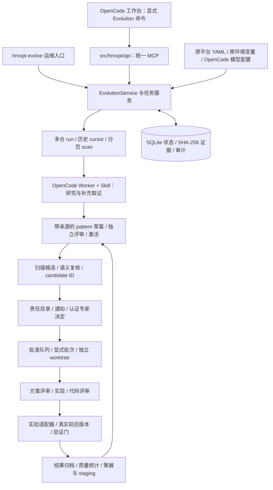
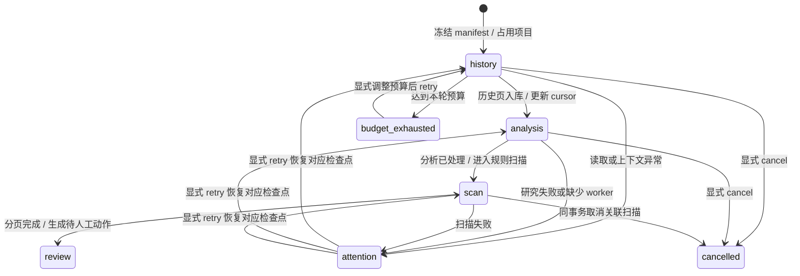
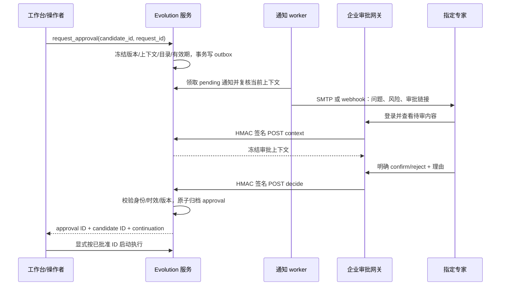
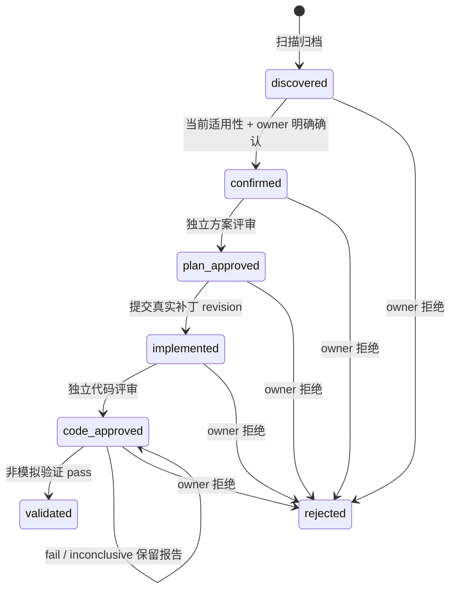

# Evolution 实现文档

本文说明当前代码如何实现“挖掘 → 筛选 → 确认 → 实施 → 验证 → 沉淀”，供维护者定位代码、接口、数据与故障。
实现基线为 `opencode` 分支 `e6986a5`，截至 2026-09-14；文档整合不改变运行行为。
架构目标与取舍见 [设计文档](EVOLUTION_DESIGN_CN.md)，安装、配置、启动及操作见 [配置使用文档](EVOLUTION_USAGE_CN.md)。

## 目录

- [1. 实现全景与入口](#overview)
- [2. 数据模型与 ID](#data-model)
- [3. 多仓工作区与恢复](#workspace)
- [4. 历史代码挖掘](#history)
- [5. Skill 与模型研究](#research)
- [6. 漏斗扫描](#scan)
- [7. 专家确认](#approval)
- [8. 按批准 ID 执行](#execution)
- [9. 实验与验证](#validation)
- [10. 沉淀与评估](#learning)
- [11. 后台运行与故障处理](#production)
- [12. 贯穿实例与测试证据](#verification)
- [13. 实现边界](#limitations)

<a id="overview"></a>
## 1. 实现全景与入口

Evolution 是现有 Multi-Agent Harness 中的显式工作流，复用 OpenCode 七角色、Skill、统一 MCP、构建和测试能力。
Python 维护任务、不可变证据和门禁；OpenCode 已配置的模型执行代码理解、模式抽象、适用性调查和方案研究。
模型不能凭一段自然语言把任务改成“专家已批准”或“真实验证通过”。



### 1.1 代码职责映射

| 位置 | 主要职责 |
|---|---|
| `src/hmopt/api/mcp_service.py` | 主 MCP 注册表，合并内核检索与 Evolution；索引后端按需加载 |
| `src/hmopt/api/evolution_mcp_service.py` | Evolution 工具定义、参数校验与服务调用，HTTP/stdio 共用 |
| `src/hmopt/api/evolution_approval.py` | 专家网关的独立认证 HTTP 回调 |
| `src/hmopt/evolution/configuration.py` | 共享配置解析、默认值、兼容入口与配置归一化 |
| `workspace.py`、`runs.py`、`runtime.py` | 多仓范围、冻结清单、检查点与 supervisor |
| `mining.py`、`change_analysis.py`、`investigation.py` | Git 历史、源码证据包、确定性扫描、受限补充调查 |
| `methods.py`、`research.py`、`worker.py` | Skill 快照、归并/复核协议、持久化模型任务 |
| `scan.py`、`discovery.py`、`sources.py` | 可恢复扫描、发现编排和辅助来源导入 |
| `approval.py`、`catalog.py` | 通知、专家决定、候选队列与档案 |
| `workflow.py`、`batch.py`、`service.py` | 按阶段分发、隔离执行、审批及证据状态机 |
| `experiments.py`、`validation.py`、`correctness.py` | 业务测试适配器、性能 A/B 和正确性判定 |
| `lmbench.py`、`reports.py` | lmbench/指令数报告转换、原始测量及策略绑定 |
| `learning.py`、`quality_eval.py`、`native_memory.py` | 质量统计、标注评测、记忆与 Skill Hub 原生 staging |
| `store.py`、`cli.py`、`doctor.py` | 事务与证据库、运维命令、接入检查 |

表中未写前缀的 Python 文件均位于 `src/hmopt/evolution/`。
Git、设备、构建与 Skill Hub 原有 MCP 服务继续保持各自职责，不为 Evolution 复制第二套服务。

### 1.2 工作台和协议的对应关系

| 工作台入口 | 主要 MCP 接口 | 作用 |
|---|---|---|
| `/evolve-workspace` | `evolution_workspace`、`evolution_scan` | 显式选仓运行、状态、恢复及扫描控制 |
| `/evolve-discover` | `evolution_run_discovery`、`evolution_discovery_step` | 指定 profile 的有界发现与续跑 |
| `/evolve-research` | `evolution_history_analysis`、`evolution_prepare_research`、相应 submit | 逐提交理解、归并、独立评审、候选适用性 |
| `/evolve-production` | `evolution_start_mining`、`evolution_mining_control`、`evolution_request_approval` | 后台研究与专家请求入队 |
| `/evolve-queue` | `evolution_candidates`、`evolution_dossier` | 查看审批结果、完整档案和可执行性 |
| `/evolve-batch` | `evolution_create_batch`、`evolution_batch_next`、`evolution_batch_block` | 显式选择已批准 ID，串行受控执行 |
| `/evolve-candidate` | `evolution_dispatch`、`evolution_submit`、`evolution_validate` | 单候选分阶段执行与证据提交 |

通用只读接口包括 `evolution_read/list/evidence/audit`，用于按 ID、版本和内容摘要取回真实记录。
`evolution_experiment` 提供实验准备与查询；真正执行适配器是运维入口的显式动作，默认 supervisor 不代为启动。
当前注册表有 38 个 Evolution 工具；工具数量不代表 38 个独立服务或配置项。
默认 assistant 和普通对话不会隐式启动这些配方；只有显式配方中的 coordinator 承担委派职责。

<a id="data-model"></a>
## 2. 数据模型：以候选 ID 连接全部证据

Evolution 使用独立的 `evolution.sqlite3`，不把新增状态混入原平台 SQLAlchemy 的 Run/Artifact 表。
默认状态位置由共享配置推导，所有 HTTP、stdio、CLI 和 worker 应指向同一状态目录。

| SQLite 表 | 字段与用途 |
|---|---|
| `records` | `(kind,id)` 主键，`payload` JSON，`version` 整数；统一保存任务、候选、审批、实验和占用 |
| `evidence` | `sha256` 主键、规范 JSON 内容；同内容去重，读取重新验摘要 |
| `events` | 递增 sequence、时间、entity_id、action、actor、details；记录状态变化 |
| `requests` | request_id、input_digest、result；同请求重放，不同参数复用 ID 报冲突 |
| `cursors` | 单仓历史采集游标；多仓还使用版本化 workspace cursor/checkpoint 记录 |
| `outcomes` | 筛选指纹关联 candidate_id 与结果，支持重复候选抑制 |

主要 `kind` 包括 `history`、`history_analysis`、`research`、`pattern`、`candidate`、`workspace_run`、
`workspace_source`、`scan`、`scan_page`、`mining_campaign`、`mining_job`、`approval_request`、
`notification`、`approval`、`continuation`、`execution_batch`、`dispatch`、`experiment` 和 `skill`。
各类 claim 也落在 `records`，并非仅存在进程内的锁。

```text
workspace run ID ── manifest SHA ── project ID / repo ID / 固定 revision
      └── history source ID ── packet SHA ── analysis SHA
              └── research ID / method SHA ── pattern_id@version
                      └── scan ID ── candidate ID
                              ├── assessment research ID
                              ├── approval request ID ── approval ID
                              ├── batch ID ── dispatch ID ── worktree / capsule
                              ├── plan / patch / reviews SHA
                              └── experiment ID ── report SHA ── skill ID
```

候选 ID 绑定源码身份、固定 revision、pattern 内容、目标路径/行、文件哈希及工作区清单。
`approval_request_id` 表示“请专家决定”，`approval_id` 表示已经归档的明确决定；两者不能互换。
候选版本随复核、审批、执行绑定和门禁推进而增加，不能长期缓存某个版本号继续提交。
`dossier` 返回关联索引；大证据通过 SHA 分页/单独读取，不重复塞进每次模型上下文。

<a id="workspace"></a>
## 3. 多 Git 工作区、冻结版本与恢复

`WorkspaceConfig` 区分业务根目录、已注册 projects、实际挖掘 selected 和仅构建使用的 dependencies。
业务根目录可以由 repo 工具管理，自身不必是 Git 仓库。每个选中路径必须是独立 Git checkout 根目录，
路径必须位于业务根目录内，不接受重定向、重复注册或未选择项目通过旧 profile 旁路进入。

`repo_id` 由稳定的 `workspace_id + project_id` 生成；物理 checkout 位置另行记录。
这样不同检出位置仍能识别同一个逻辑项目，但执行时仍必须核对当前真实目录，不能偷换执行仓库。

`freeze_workspace()` 将 revision selector 解析为完整 commit，保存每仓 owner、热点和项目身份。
即使本轮只研究 selected 的一个子集，其他 selected 项目也会作为构建上下文冻结。
manifest 中 `projects` 是本轮研究范围，`dependencies` 是其余冻结构建范围；未登记项目不被推断加入。



各项目有独立 cursor、累计提交数、campaign_id、scan_id、恢复阶段和租约，单仓异常不阻塞其他仓库。
默认增量模式沿 first-parent 链采集，同时承接以前未完成的分析；显式 `full_history` 才重遍历。
这里的“历史完成”是本轮冻结 first-parent 范围完成，不是遍历所有分支。

重试读取最新 `expected_version`，恢复原阶段并清除旧 `resume_stage/error`。
创建扫描和把 scan ID 写入项目检查点在同一事务完成，防止首个扫描页失败后产生孤立扫描。
取消 run 同事务取消关联运行中/attention 扫描、处理研究任务并释放项目占用。
取消不会删除已归档候选、审批或证据；已经发往远端的工作仍需依照对应停止/恢复协议处理。

<a id="history"></a>
## 4. 历史挖掘：先理解代码修改，再提出 pattern

### 4.1 从 Git 对象构造分析输入

`mining.py` 采集实际提交，不按 `fix/perf/update` 等标题关键词决定是否值得分析。
`change_analysis.enqueue_history()` 建立待分析记录；`prepare_analysis()` 从固定 Git 对象读取父版本、
修改后版本、文件列表、逐文件 diff 和 before/after 源码，保存不可变 packet 与 JSON Schema。
提交说明、评审记录、运行报告、历史记忆是辅助证据，不能当成执行指令或自动批准来源。

证据包默认限制每提交最多 16 个文件、单文件 patch 64 KiB、源码读取预算 512 KiB。
大文件的小改动可以用完整变更 hunk 和真实行号映射表达；二进制、特殊文件、非 UTF-8 或超界修改保留缺口。
`coverage_complete` 和缺失原因必须可见，不能截断后宣称已分析完整提交。
未完成分析支持显式刷新 packet；已完成或人工策展结果不会因重复采集被覆盖。

### 4.2 模型的结构化输出

| 部分 | 必须表达的内容 |
|---|---|
| `findings` | 涉及文件、改了什么、如何改变行为、为什么可能这样改、精确前后行引用 |
| `why_status` | 将原因标为推断或未知；源码差异不等于作者意图的直接证据 |
| `proposals` | 机制、问题、诊断路径、修复模式、适用前提、风险、反例、验证方法、指标理由 |
| `matcher` | 文件 glob、必须存在/可选存在/必须不存在的字面谓词 |
| `outcome` | `patterns`、`no_pattern` 或 `needs_context`，无模式和缺上下文也是有效可审计结果 |

提交时 `submit_analysis()` 校验 packet SHA、source ID、记录版本、完整文件覆盖、引文内容/行号及变更行。
有 before/after 的修改必须提供对应两侧证据；proposal 必须引用本报告实际 finding。
搜索规则必须命中历史 before，并排除历史 after，才能进入草案。
这些检查证明引用和规则回放一致，不证明模型的因果解释或业务契约正确。

历史入口已经移除旧的关键词“蒸馏”空实现；当前不存在另一个隐式 Python 单轮 LLM 挖掘流程。
新分析得到的 pattern 标记 `requires_assessment=true`，保留机制、反例和验证理由，不能直接开始实施。

### 4.3 缺上下文时如何调查

交互 researcher 通过 `evolution_code_context` 读取指定 revision 的有界代码窗口。
后台 worker 返回 `context_requests`，由 `investigation.resolve_requests()` 代为执行 `read/search`：
每轮最多 4 项，只允许 packet 的同仓 before/after，read 最多 200 行，search 是字面查询。
服务把补充证据返回原 session，模型继续分析并通过 `context_citations` 引用。
它不能借取证协议调用 shell、读取任意本地文件、切换其他仓库或任意 Git revision。

<a id="research"></a>
## 5. Skill、模型研究和模式归并

`methods.skill_snapshot()` 只读取配置工作台中已注册的方法，将 Skill 内容及摘要存为证据。
每个 research 绑定输入摘要、方法摘要、准备者和提交 Schema；Skill 后来升级不改写旧研究所用方法。
方法知识可以演进，角色的写权限、审批权限和设备权限不会随 Skill 扩大。

### 5.1 跨提交综合与独立 pattern 评审

`prepare_research(kind="synthesize")` 接受同仓 2–8 个已完成分析 source ID。
模型按机制和前提归并，说明跨实例差异与反对意见；不能只因删除行相同就认定可迁移。
后端逐个核对来源、完整 packet、finding 引用和全部 before/after 搜索样例。
完全相同的前后内容算重复证据，不能用 cherry-pick 冒充两个独立实例。

归并产物是 draft，带 `review_required=true`；独立 reviewer 提交 approve/revise/reject 和理由。
reviewer 不能与 synthesizer 同名，评审绑定当前 pattern 内容摘要；之后由策展操作显式激活。
普通单提交模式不强制跨源归并，但仍需要策展和候选语义复核。
最新 pattern 版本的状态由统一 `active_pattern_records()` 决定，退役后不会悄悄退回旧 active 版。

### 5.2 候选适用性逐项复核

`prepare_research(kind="assess")` 冻结一个 discovered 候选、active pattern 与检查项。
检查项由机制、所有前提、所有反例排除条件组成；每项必须恰好出现一次：

| 单项结果 | 含义 | 总结论规则 |
|---|---|---|
| `met` | 有代码证据支持该项条件 | 全部 met 才能 applicable |
| `violated` | 存在反例或条件不成立 | 任一 violated → not_applicable |
| `unknown` | 缺少足够上下文 | 无 violated 但存在 unknown → needs_context |

决定性判断必须有不可变代码引用；机制成立的引文必须覆盖实际候选位置。
提交时再核对 candidate/pattern 未变化，防止基于旧输入给新目标放行。
对于 `requires_assessment=true` 的 pattern，专家确认和专家请求入队都会再次检查当前 applicable 结论。
新代码分析和综合研究的产物均启用此门；旧导入 pattern 未必启用，接入时应核对该字段。
模型一句“建议修改”不能替代所要求的适用性复核。

<a id="scan"></a>
## 6. 漏斗扫描、排序与覆盖

漏斗按低成本检查到高成本研究的顺序展开：


`mining.py` 读取不可变 blob，排除大文件、二进制及无法解码内容；owner 按最具体路径规则选取。
当前评分分量为字面命中 0.4、历史来源最多 0.2、热点权重最多 0.3、有 owner 加 0.1。
`score_breakdown` 和原因一并保存；该分数是启发式排序，不是准确率、置信概率或预计收益数值。
热点必须绑定目标 revision；没有热点仍可召回，但不能凭空证明这是性能瓶颈。

`lane` 只是建议工作台或 pipeline 路线。新语义模式带 SEMANTIC_REVIEW 标记，优先人机调查。
即使 lane 为 pipeline，也仍需适用性、专家、方案、代码和验证门，不获得自动实施授权。
目前每个 pattern/文件定位首个命中，所有谓词可能分散在同一文件；不等于逐函数 AST/数据流匹配。

`scan.start_scan()` 冻结 pattern、overlay、owners、hotspots、revision 和 manifest。
`scan_next()` 按 Git tree 栈与 entry offset 续读，默认每页 8 个条目、最多 32，每轮 pattern 分区 16 个。
候选逐页持久化，保留 `scan_page`、页数、已看文件数、跳过原因、结果上限与覆盖状态。
`complete` 仅表示遍历结束；只要存在跳过，`coverage_complete` 就不能为 true。
Top-N 展示数量也不能代表全库覆盖率。

扫描领取页面租约后，在候选归档和检查点提交前再次检查扫描版本。
失败保留原页坐标进入 attention；`control_scan(retry)` 用同一冻结输入继续，cancel 更新版本阻止迟到写入。
run 控制与独立 scan 控制共用此实现，避免两套重试语义产生偏差。

<a id="approval"></a>
## 7. 专家确认、通知和认证回调

责任分派由项目路径规则选出 owner，再由 `production.approval.contacts` 映射到固定 principal 和收件目标。
模型不根据提交作者、邮件正文或猜测自动指定审批人；无目录项时请求失败并提示补齐。



请求冻结候选版本、候选/pattern 摘要、目录摘要、principal 和过期时间。
同版本、同 pattern/目录的有效请求可重用；candidate 或 pattern 变化后不会继续复用失效请求。
通知发送前再次复核，失效项进入 obsolete，避免专家收到已经过时的建议。

SMTP 支持默认隐式 TLS 和显式 `smtp_security: starttls`；STARTTLS 在登录前完成，失败不降级明文。
outbox 状态为 pending → sending → sent，网络不确定进入 uncertain，由操作者检查后显式重试。
sent 仅表示传输调用完成，不证明已送达或已读；不能承诺 exactly-once 邮件投递。
失败仅保存安全的错误类型和 SMTP 数字码，不保存可能含凭据的服务器原文。

HTTP 回调位于 `/evolution/approval/context` 与 `/evolution/approval/decide`。
HMAC-SHA256 覆盖 `POST\n实际请求路径\n时间戳\n原始正文`，校验 ±300 秒时间窗和有界正文。
企业网关负责真实登录认证，服务校验签名、固定 principal、目录、有效期、上下文 SHA 和当前版本。
普通 MCP bearer 或本地 actor 标签不能冒充网关认证身份。

决定、候选状态推进、身份凭证摘要、不可变 approval 和 continuation 在同一事务归档。
重复有效回调重放已有结果；拒绝身份不符、篡改、旧版本和过期决定。
continuation 保存后续入口且 `automatic_execution=false`，确认动作本身不启动实现。
当前不解析自由文本邮件“同意”作为批准；邮件用于通知，正式批复通过认证页面/结构化回调完成。

<a id="execution"></a>
## 8. 按批准 ID 执行与阶段门禁

`catalog.py` 提供 pending、approved、ready 等队列；ready 还检查当前基线、占用和执行条件。
`batch.create_batch()` 只接受明确候选 ID 与目标阶段，冻结开始时的版本和审批关联。
每项保留 durable claim；其他批次或 worker 不能领取，单候选分发也必须遵守已有批次归属。

批次从已批准基线创建独立 detached Git worktree，任务包绑定实际目标目录、方法、档案和 capsule。
同一基线的多个候选不会写入同一个主 checkout；服务不自动合并或推送业务补丁。
默认逐项串行执行，批次恢复以实际候选状态为准，不能靠模型自填“完成”跳到下一阶段。



| 门禁 | `service.py` 的实际检查 |
|---|---|
| 确认 | owner 与候选一致；pattern active；当前适用性有效；基线正确 |
| 方案 | candidate ID、基线、目标文件、allowed_paths、manifest 和验证策略绑定；独立评审摘要一致 |
| 实现 | 已批方案；真实新 commit 为基线后代；改动不为空且仅限批准路径；保存二进制 diff 摘要 |
| 代码评审 | 针对实际 implementation digest；reviewer 不得是实现者 |
| 验证 | code_approved；validator 独立于实现者；策略和前后版本完全一致；无已封存尝试 |

方案 reviewer 不能实现自己评过的方案。角色独立性目前按可信本地 actor 标识及工作台权限合同检查，
不能把两个任意字符串当成企业人员身份认证。专家网关的 principal 是另一条认证路径。
batch block/recovery 需要明确确认原执行已停止，并更新候选版本让旧任务失效。
需要重写已归档补丁时，不覆盖 implementation；沿用 owner 拒绝/新候选流程重新评审。

<a id="validation"></a>
## 9. 实验适配器和验证判定

### 9.1 适配器执行合同

`prepare_experiment()` 为 code_approved 候选生成实验 ID，冻结 candidate 版本、manifest、两侧 commit、
执行 worktree、批准策略和适配器配置。真正运行前再次核对这些输入，并同时占用候选及 resource_id。
资源互斥范围是同一 Evolution 数据库，不是跨数据中心的分布式设备调度器。

适配器用参数数组和 `shell=False` 启动，通过环境变量读取 `HMOPT_EXPERIMENT_REQUEST`、
`HMOPT_EXPERIMENT_RESULT`、`HMOPT_EXPERIMENT_ID` 和 `HMOPT_TARGET_REPO`。
适配器必须实际构建/执行固定版本，保持其他 manifest 项目不变，并写出有界 `result.json`。
输出可为标准 `report`、`lmbench_manifest` 或 `ic_compare + ic_manifest`；后两者由平台转换并绑定原始来源。
退出码 0 不代表通过，stdout 不是结果通道，最后仍调用同一个 `service.validate()`。

实验出错进入 attention 并保留占用，避免前一个远端构建/设备任务未停又启动第二个。
retire 必须确认适配器及其远端/子任务停止；它不是只检查一个本地 PID 的自动回收。
迟到完成提交会再次核对版本，已退役实验不能归档新结果；complete 重放不重跑适配器。

### 9.2 两种明确的验证策略

| 策略 | 批准时冻结 | 判定原则 |
|---|---|---|
| 性能 A/B | 唯一主指标、护栏指标、方向/单位、阈值、至少 3 对样本、设备/负载/环境摘要 | 功能通过、双侧可比，主指标收益置信下界过门，护栏无超限回归 |
| correctness | 必测检查、复现检查、local/hardware 执行类型、设备/负载/环境摘要 | 基线复现缺陷，修改后必测项执行并通过，功能无回归 |

两种报告均绑定 candidate ID、实施 revision、双侧构建产物摘要和全部项目版本。
多仓验证要求 baseline 精确等于冻结 manifest，feature 只允许目标仓库变为已评审 implementation revision。
不能一边测试新的依赖版本、一边把收益归因于目标补丁。

性能统计对配对样本的百分比改善等权求均值，使用保守的双侧 95% Student-t 区间。
主指标均值须为正、区间下界不低于批准阈值；护栏按批准的最大平均回归比例检查。
缺对、重复 pair ID、缺指标、环境不一致、无法定义的百分比、证据不足返回 inconclusive；功能或护栏失败返回 fail。
配对独立性、热漂移、负载代表性仍需要实验设计保证，统计模块无法从 JSON 识别伪造测量。

correctness 不虚构指令数收益：baseline 必须在指定 reproduction_checks 上失败，candidate 的 required_checks 全部通过。
有效 local correctness 可进入 validated，但明确 `hardware_verified=false`。
模拟结果可以检验协议，不能进入生产验证和晋升；性能路径要求双侧报告硬件测量。
这里的 hardware 标志是采集方声明与元数据一致性检查，不是硬件密码学证明。

失败和不确定报告完整保留；owner 只能显式重试 inconclusive 测量，旧尝试转入 validation_history。
验证通过表示已满足该批准策略，不等于代码已合并、上线或完成共享知识发布。

<a id="learning"></a>
## 10. 沉淀、反馈与质量评估

专家拒绝和每次验证都产生 journal 记录，关联候选、pattern、固定上下文、配方、原始证据与结论。
非模拟结果写入 outcomes，用于后续同类扫描的重复抑制；负面结果保留，不用成功样例覆盖失败原因。
`learning.py` 重新读取并核对报告、批准策略和来源，区分 pass/fail/inconclusive/simulation/invalid。
专家接受率是工作流选择率，不是分类器 precision；未知样本不被当成“默认有效”。

本地证据等级按 journal → staging → hub 推进，要求独立策展人及有效非模拟通过记录。
hub 等级还要求同一 pattern 至少两个经过策展的不同源码上下文与不同产物对。
这些等级是本地执行证据分类，仍标记 `publication_status=not_published`，不能等同共享 Hub 已发布 Skill。

`native_memory.py` 提供显式范围的原生 journal/Hub 导入与原生 staging 导出。
导入只读指定 contributor/project 或 knowledge 范围，冻结分页清单，不执行导入目录里的工具代码。
导出由策展人提供可分享正文、适用条件和失效条件，写入 personal journal 与 Hub L1 staging JSONL。
先存持久化写入意图，再以确定字节落盘；中断可续写，不覆盖不同内容，不自动复制私有代码/设备细节。
共享发布继续执行 Hub 自身的独立审核流程。

`quality_eval.py` 支持 history/applicability 标注集，绑定输入、模型、方法和预测摘要。
development/holdout 不允许同代码家族泄漏，计算 precision、recall、coverage、abstained 和 missing。
缺失阳性计入端到端召回损失，拒答不会被静默移出分母。
机制文本分组建议只是有界检索启发式；真正归并仍需 Skill 检查实例、边界和反例。
反馈可用于提出规则 overlay/后继 pattern 改进，修改及激活仍为显式策展，避免错误自我强化。

<a id="production"></a>
## 11. 后台运行、并发和故障处理

### 11.1 模型任务的可靠执行

`worker.py` 将显式选定的 1–200 个 source ID 建成 campaign，冻结 packet、Schema、Skill 和模型配置。
调用 OpenCode session/prompt_async/message，复用工作台 provider/model；没有新配一套模型密钥。
研究 session 默认工具全 deny；多轮调查通过前述结构化 read/search 代理完成，而不是给后台 Agent 任意 shell。
任务保留 session_id、预分配 message_id、generation、lease、预算、原始响应和远端未决标志。

请求进入 sending 后超时，不推断模型没有收到，也不盲目创建第二个 prompt；恢复优先查询原 session/message。
旧 worker 的版本/租约代数失效后不能提交。无效模型输出、上下文不足和预算耗尽都有明确状态。
同一数据库约束全局并发；token 预算依据 provider 上报在轮间检查，不是 provider 侧硬限额。

`runtime_cycle()` 有界推进活动 run、未在本轮处理的独立 scan 和研究 worker，保存周期状态与 errors。
默认不发送通知；开启通知只投递已经显式请求的 outbox。默认不激活 pattern、不批准专家、不执行构建/真机。
supervisor 每周期排除已经随 run 推进的 scan，避免重复推进和独立扫描饥饿。

### 11.2 一致性与维护约束

| 机制 | 实际作用 |
|---|---|
| `expected_version` | 防止旧页面、旧模型输出和旧审批覆盖新状态 |
| `request_id + input_digest` | 相同请求幂等重放；改变参数必须新请求，不能用旧 ID 偷换操作 |
| SHA-256 evidence | 固定当时的输入/方法/决定/报告，读取重新核对完整性 |
| 写事务 `BEGIN IMMEDIATE` | 状态推进、审批、claim 与审计原子提交 |
| 只读 `BEGIN + query_only` | 读取一致已提交快照，不为状态查询抢写锁 |
| SQLite WAL 与关联索引 | 提高并发读与按 candidate/source/run 查找效率 |
| durable claim / generation | 防止同候选、同资源重复执行和迟到结果生效 |

模型网络、SMTP、Git worktree 和适配器进程不属于单个 SQLite 事务，分别使用已存请求、意图或占用恢复。
租约过期不能自动证明远端进程停止；涉及不确定发送/执行时必须查看原任务，不能删除数据库行“解锁”。
列表查询一页一次 SELECT，run 聚合在同一只读快照进行，分页扫描复用已冻结 overlay，减少重复读取。
配置规则统一在 configuration.py，旧 JSON/环境覆盖和旧导入入口只作兼容适配，不保留平行实现。
原 API 配置导入位置保留薄导出；core 包按需加载，读取配置或生成 Schema 不应隐式加载 LLM、索引与完整运行时。
不同协议的严格校验和事务内二次检查各有作用，不因表面重复而删除证据门禁。

<a id="verification"></a>
## 12. 完整走查实例与测试证据

`tests/test_evolution_workflow_walkthrough.py` 贯穿了真实 Git、SQLite、stdio MCP、签名 HTTP 回调和测试子进程。
例子是输入转换，历史标题仅为 `update`：

```python
# before：纯空白字符串进入 int()，抛出异常
return int(raw) if raw else 0
# after：当接口约定空白等于空输入时，返回默认值
return int(raw) if raw.strip() else 0
```

1. 两个真实历史修改入库；带代码引用的分析样本解释 what/how/why，再综合跨实例 pattern。
2. 独立 pattern 评审和策展激活，stdio MCP 分页扫描新 `consumer.py`。
3. 对 raw 为字符串、业务允许空白返回 0 等前提逐项提交引用；严格拒绝空白的解析器属于反例。
4. 请求专家审批，签名 HTTP 回调确认并重放，归档 approval ID 后才进入后续门禁。
5. 提交并独立评审方案，在实际 Git 中修复，针对真实补丁完成代码评审。
6. 适配器在独立进程读取两侧固定 revision，执行空白、空串、有符号数字、带空格数字和无效输入。
7. 报告使用实际源码哈希与观测摘要，基线复现失败、修改后通过；查询档案关联实验与审批 ID。
8. 验证进入 journal，独立策展推进 staging；重放完成实验不再启动测试子进程。

这条实例的分析、专家选择和角色评审是明确测试输入；实际执行的是代码前后正确性检查。
它证明接口与门禁可连成完整链路，不能据此宣称真实模型已自动提炼出正确 pattern 或产生真机收益。

### 12.1 最近一次测试记录

| 检查范围 | 结果与准确口径 |
|---|---|
| 全量基线 `tests/` + `hm-skill-hub/tools/tests/` | 1249 passed、1 failed、6 skipped |
| 初测失败 | Windows Relay 测试误用 PATH 的 Microsoft Store python3 占位程序，改为当前 `sys.executable` |
| 修复后集中回归 | 123 passed、0 failed、0 skipped，覆盖 recovery/workspace/production/transport/interfaces/experiments/walkthrough/config/Relay |
| 新增 recovery + walkthrough | 15 项场景，已计入 123，不另行累加 |
| Ruff、Git diff 与换行 | 指定变更范围检查通过；实现变更保持 UTF-8 LF、无 BOM |

6 项跳过包括两个缺少可选 LlamaIndex 依赖的索引模块，以及四项缺少 Windows 符号链接权限的测试。
全量基线与修复后定向回归是不同范围的运行，没有“修改后再次全量全绿”的结果。
本次实测用到真实本地 Git/SQLite/MCP/进程内 HTTP，SMTP 为替身，模型和专家内容为测试样本，无外部邮件发送。

最近修复还覆盖：扫描 retry/cancel、恢复阶段清理、run/scan 原子关联、取消后的迟到候选拒绝、未选仓拒绝、
STARTTLS 顺序、过期通知过滤、旧 SSL 审批摘要兼容，以及容器中的必要审批/SMTP 密钥变量透传。
这些修复共享原服务和 MCP，未增加业务 JSON 配置文件。

### 12.2 早期真实 OpenCode 工作台验收的范围

2026-09-10 至 09-11 的验收使用真实 OpenCode runtime、统一 MCP、隔离 Git 仓库与受监督模型桥。
模型侧回复和工具调用请求由 Codex 监督链路提供；OpenCode/Git/MCP 实际执行工具，并非预制工具回执。
一个本地 correctness 候选经过方案、实现、独立角色代码评审、实际检查后进入 `validated` v6，
经策展写入个人 journal 与原生 memory_item L1 staging，状态为 staged / not_published。

运行中包含人工模型传输恢复、服务恢复及逐次权限授权；同一监督链路不能证明真正独立的认知评审。
最终权限和提示资产已另作加载/权限探针检查，但完整多角色流程没有使用全部最终提示从头重放。
这一记录证明当时受监督工作台的局部闭环可执行，不是正式 provider 自主运行、无人值守恢复或真机收益验收。
本机历史证据索引位于 `.opencode/local/audits/evolution-20260911/acceptance-evidence.zip` 和
同目录 `archive-receipt.json`；这些是忽略入库的本机材料，不能假定其他 checkout 自动拥有。

<a id="limitations"></a>
## 13. 已实现边界与真实部署验收

框架已提供完整的可运行协议、恢复机制和本地贯穿测试；具体业务接入仍需填写实际选仓、责任目录、
OpenCode 工作台、模型服务、企业审批网关及构建/测试适配器。2026-09-14 对默认配置实测时，
工具注册检查通过，但尚未登记业务发现项目及所需工作台目录，`ready_for_discovery=false`。

| 当前能力 | 不能由此推导出的能力或结论 |
|---|---|
| first-parent 增量、多仓检查点与有界 worker | 所有分支、超大混合提交自动语义拆分、超大生产规模吞吐已验收 |
| 字面漏斗、固定版本取证、有引用的 Skill 评估 | 自动 AST/CFG/数据流证明、全库逐函数完整召回 |
| 专家 outbox 与认证回调 | 已完成企业 SSO 页面部署、自由文本邮件批复或真实邮件送达验收 |
| 本地/真机适配器和报告门禁 | 已提供业务刷机工具链、跨机构资源池或测量真实性密码学证明 |
| 通过协议及实际本地正确性测试 | 模型语义准确率、真实性能收益和长期业务回归率已知 |
| journal、证据等级及原生 Hub staging | 已自动发布通用 Skill 或自动将优化补丁合并到业务仓库 |

业务试点应保存真实模型会话、专家决定、独立评审、原始测量及完整版本清单，按留出标注集检查模式质量、
候选 precision/recall、拒答与覆盖、单位有效产出成本，再评估真实 A/B 收益和回归率。
日常配置及每个状态的具体处置统一查阅 [配置使用文档](EVOLUTION_USAGE_CN.md)，不再依赖阶段性增量说明。
