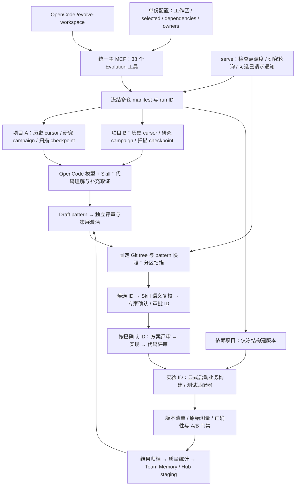

# Evolution 多 Git 工作区：业务运行增量

状态：框架实现已完成，本地集成验证通过；真实业务模型、专家网关和设备验收待接入。2026-09-11。

## 目标和边界

一个业务 repo 工作区可以包含很多独立 Git checkout，包括 repo 工具管理的目录。
操作者显式注册并选择关注的项目；工作区根目录无需自身是 Git 仓库。
沿用 OpenCode、统一 MCP、同一 Evolution 配置和证据库，不创建第二套模型或审批体系。

每次总任务冻结 workspace ID、所选 project ID、checkout 路径和各仓库 revision。
候选仍是单仓精确目标；涉及多个仓库的方案必须明确列出依赖和分别获得审批，不能把一个仓库的批准扩展到其他仓库。
构建/真机验证必须同时记录业务基线清单，不能把其他仓库的漂移误算为目标补丁收益。

## 实施清单

1. 多仓配置与稳定逻辑身份：工作区根目录、命名项目、相对路径、选择清单、每仓 owner；
   生成现有 discovery profiles，拒绝越界/重复/非 Git 根目录。保留旧配置和本地身份兼容。
2. 多仓总任务：冻结 manifest，各仓独立检查点；有界增量采集、后台挖掘、扫描、人工动作列表；
   单仓失败不拖垮其他仓库，重启不会扩展范围，不自动激活 pattern 或批准实现。
3. 可续完扫描：按不可变 Git tree 分页枚举，冻结 pattern/热点/owner，逐页保存候选和覆盖数据；
   重放不漏页、不覆盖旧审批；报告跳过原因、召回上限及未扫描范围。
4. 后台调查：模型提出结构化只读取证请求，服务仅在该任务固定仓库和 before/after 版本执行
   文件窗口读取或字面搜索；保留每轮证据、消息 ID、预算、原始模型输出与恢复状态。
5. 运行入口：统一 MCP 和 OpenCode 总任务命令、单个前台 supervisor 管理已授权任务和研究 worker；
   通知投递独立显式开关，状态/阻塞/下一步聚合展示；既有按 ID 执行和评审门禁继续复用。
6. 业务接入与验收：多仓配置生成、配置/身份/范围检查、冻结构建基线上下文、正负反馈改进提案；
   多仓真实 Git + SQLite + MCP 集成测试，故障恢复、越界/旧版本/错误仓库拒绝测试。

## 验收标准

- 三个独立 Git 仓库中选择两个，第三个不被挖掘或扫描；根目录非 Git 也可运行。
- 相同逻辑项目在不同 checkout 的源码身份稳定；执行位置仍明确绑定，不偷换运行工作区。
- 多页历史和扫描可恢复；HEAD 移动不改变总任务的冻结目标。
- 模型先请求补充上下文，再分析；取证不能读取其他仓库、任意文件系统或任意版本。
- 输出和模型网络响应不确定时续查原消息，不盲目重复推理或实施。
- 模型/审批/真机仍需接入真实业务环境；夹具测试不宣称模型准确率或真机收益。
- 所有修改保持 UTF-8 LF，不改动无关文件和 Git 历史。

## 当前实现架构

Python 负责不可变版本、任务状态、预算、协议与证据校验；理解原因、抽象机制和语义适用性仍由模型和 Skill 执行。
后台模型可在同一 session 请求限定的 read/search 证据，不获得任意 shell、跨仓文件读取或审批权限。
多仓总任务只自动推进到明确的人工处理边界；产出草稿、模型输出或命令退出 0 都不能替代评审与验证。

## 代码和运维入口

| 职责 | 主要实现 | 运维/工作台入口 |
|---|---|---|
| 多仓选择与构建基线 | `workspace.py` | `setup-workspace`、`source_workspace` |
| 增量历史与恢复 | `runs.py` | `/evolve-workspace`、`workspace-status/control` |
| 固定树/规则快照分页 | `scan.py`、`mining.py` | `evolution_scan`、`scan-start/next` |
| 主动补充取证 | `investigation.py`、`worker.py`、`change_analysis.py` | 现有 OpenCode worker，严格请求协议 |
| 统一运行进程 | `runtime.py`、`cli.py` | `serve`、`serve --once` |
| 实验执行与占用 | `experiments.py`、`production.py` | `evolution_experiment` 准备；CLI run/retire |
| 多仓报告门禁 | `service.py`、`validation.py`、`correctness.py`、`lmbench.py` | 原有 `evolution_validate` |
| 工作台与统一协议 | `api/evolution_mcp_service.py`、`evolve-workspace.md` | 原 HTTP/stdio 主 MCP |

新任务默认增量采集，同时继承前一轮未解决分析；显式 `full_history` 才重遍历。
各项目分别持有运行占用和检查点；失败的项目进入 attention，其他项目继续。
扫描完成状态与覆盖完整性分开记录；每页候选归档，不能用 Top-N 显示条数推算扫描覆盖。
每个候选、审批、分发、实验及测量均保留自己的 ID，通过候选档案关联。
模型 token 预算依据 provider 上报在轮间检查，不能宣称是 provider 侧硬限额。

## 本地验收记录

- 首次 Evolution 全套及 OpenCode golden：670 passed、4 skipped、2 failed。失败之一暴露大文件窗口行号校验错误，已修复；
  另一项为原有 Hub 子进程在 Windows cp1252 下输出箭头失败，已定位并使用 `PYTHONUTF8=1` 验证。
- 随后多仓、历史分析、原生记忆出口、setup、挖掘和实验适配器回归：95 passed、2 skipped，122.80 秒。
  包含真实 CLI 的 setup/start/serve/status、真实多 Git、SQLite 与 MCP stdio；模型与测量内容仍为明确夹具。
- 最后重点回归：70 passed、1 warning，128.42 秒，覆盖 workspace、experiments、change_analysis、investigation、doctor、
  unified stdio 和 OpenCode golden。包含真实多仓候选→方案/代码评审→适配器→验证，以及迟到实验结果拒绝。
- 最后的每仓热点配置补充验证：3 passed，14.39 秒，覆盖 profile/manifest 传递、多仓推进和实际 CLI 配置启动链。
  各轮有重叠，不累加成独立测试总数；首次全套出现的两项失败均已在后续对应回归通过。
- 现有 OpenCode 1.18.30（本地端口 49174）实际读取到了新增 `/evolve-workspace` 和已有 6 个 Evolution 命令；
  原 `hmopt_kernel_index` MCP 状态为 connected。该检查没有调用业务模型、发送审批通知或执行真机测试。
- 修改的 Python 文件通过 Ruff；两份更新的 Skill 通过 quick_validate。源码与文档保持 LF，未改写 Git 历史。

## 业务接入与剩余边界

配置和命令步骤见 [多仓运行指南](EVOLUTION_MULTI_REPO_RUNBOOK_CN.md)，必要运行字段统一见
[实际运行配置](../configs/evolution/README.md)，复用原平台 YAML。
部署需要提供实际大 repo 根目录、选中项目及构建依赖、已有模型 server/provider/model、责任目录与审批网关、
现有构建和真机脚本。当前未获得这些业务参数，不声称真实业务部署、模型准确率或优化收益已完成验收。

以下属于明确的后续能力或验收边界：

- 扫描仍是文件/字面谓词召回，加 Skill 语义复核；没有全自动 AST/数据流证明或所有命中位置逐函数枚举。
- first-parent 历史采用各仓 cursor；超大混合提交的自动语义拆分、全历史语义聚类及超大规模吞吐尚未验证。
- 适配器对接已有工具链，资源互斥覆盖同一 Evolution 数据库；不是跨机构分布式设备资源池或硬件密码学证明。
- 代码评审后需要重做补丁时，沿用现有 owner 拒绝/新候选流程；不覆盖已归档 implementation 或放松原评审门。
- 晋升到共享 Skill Hub 仍需独立策展和发布；真实试点应保存完整模型会话、专家决定、评审工件和原始测试数据。
