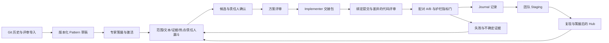

# HMOPT 通用优化循环：方案、实施计划与边界

本文保留第一版基础设计。吸收补充方案后的当前模块、实现状态与整体落地计划见 [V2 完整设计](EVOLUTION_V2_IMPLEMENTATION_CN.md)，运行入口见 [V2 操作指南](EVOLUTION_V2_OPERATIONS_CN.md)。下文“首期”不代表 V2 当前能力上限。

## 1. 目标与依据

本次演进以《HMOPT_Plan_2027.pptx》单页规划和用户明确要求为依据。内存、性能、可靠性是 scenario 插件，不作为平台模块边界。平台围绕“挖掘、筛选、确认、实施、验证、沉淀”构造通用对象、可执行门禁和可恢复记录。

ECO 已在 OSDI 2026 正式发表。可借鉴的方法是历史反模式字典、画像引导的机会定位、逐级筛选，以及自动测试、模型自评、人类评审和上线监控的组合。责任人实施前确认、真机 A/B 前置验收、分层 Skill Hub 是本平台的设计扩展。生产成果不等于本仓库已复现相同能力。来源：[USENIX 论文入口](https://www.usenix.org/conference/osdi26/presentation/lin-hannah)、[正式论文](https://www.usenix.org/system/files/osdi26-lin-hannah.pdf)。

## 2. 平台能力分层

- Evidence plane：历史记录、源码快照、方案、差异、评审、实验和裁决均有稳定标识和证据摘要。
- Discovery plane：按不可变 Git revision 扫描，先便宜规则后昂贵分析，最后应用证据、热点、责任人与预算限制。
- Execution plane：工作台和 Pipeline 共用持久化状态机；通道只决定调度方式，不绕过确认或评审。
- Learning plane：记录失败和有效配方，先保留原始证据，再策展和晋升，禁止建议直接自动安装为技能。

## 3. 首期交付范围

实现独立的 `hmopt.evolution` 模块，不依赖旧 LangGraph、缺失的 trace preprocessing 或在线 Neo4j。首期通过 CLI 和本地 stdio MCP 使用相同服务层。

| 能力 | 首期实现 | 后续扩展 |
|---|---|---|
| 历史挖掘 | 有界 Git 提交/差异读取、增量游标、结构化评审记录导入 | Gerrit/GitHub 连接器、大规模分片任务 |
| Pattern | 严格 schema、版本、出处、适用条件、反例风险、草稿/激活/退役 | 受预算约束的 LLM 蒸馏、AST 模式 |
| 漏斗 | revision 固定、路径范围、字面规则、热点、责任人、Top-N、历史拒绝去重 | 复用 clangd/SCIP/向量索引、语义校验和成本模型 |
| 确认与执行 | 责任人确认、独立方案评审、批准范围、实施提交/差异绑定、独立代码评审、交接包 | OpenCode/其他 Agent 执行器、隔离 worktree、队列与取消 |
| 验证 | 冻结指标策略、同设备/工作负载/环境、配对样本、方向感知收益与护栏、噪声与失败结论 | 真机采集器签名、设备租约、lmbench/性能平台适配器 |
| Skill Hub | journal/staging/hub、验证来源、独立策展、多上下文复现、召回、失败台账 | CI 评测集、技能优化器、团队权限和分发 |

首期离线蒸馏使用可解释启发式，只产出草稿。候选分数是排序规则，不是经过校准的正确概率。历史合入、关键词命中、模拟 A/B 均不能替代真实收益证据。

## 4. 数据与状态契约

核心对象：ChangeRecord、Pattern(version)、Candidate、OwnerDecision、Plan、Implementation、CodeReview、ABReport、ValidationResult、SkillEntry、AuditEvent。

SQLite WAL 保存对象、内容寻址证据、单调版本号、幂等请求和追加事件。候选状态转换、验证和知识晋升在同一事务中提交状态、证据及相应审计，要求 expected_version 和 request_id；重复 request_id 必须对应相同输入，否则拒绝。历史导入、规则管理和知识捕获采用内容去重或自身状态检查，并非所有写接口都有同样的幂等参数。重启后重新打开数据库即可读取进度，不依赖进程内任务字典。当前没有外部防篡改日志或全量管理操作审计。

候选状态：`discovered -> confirmed -> plan_approved -> implemented -> code_approved -> validated`。拒绝进入 `rejected`。验证失败或不确定保留封存结论，不晋升 Hub。不确定结果可由责任人说明原因后显式重新开放测量，保留旧证据、原实施与原指标；首期尚无重测次数预算。修订实施需要新的候选/审批链，首期不隐式复用旧评审。被拒绝的方案/代码评审目前只阻止推进，意见可另行 capture 到 journal。

批准方案包含：候选 ID、基础 revision、作者、优化机制、瓶颈分类、主指标选择理由、准确文件范围和冻结的验证策略。代码评审绑定真实 Git candidate revision 与差异摘要。提交发生变化时旧评审不适用。

## 5. 验证与知识晋升原则

指标描述包含名称、单位、方向、最低收益与最大允许回退，不能固定为 instructions。CPU-bound、memory-bound、I/O-bound、锁竞争、可靠性问题由方案显式分类；证据不足时记录 unknown 并解释验证选择。

A/B 输入包含两个版本/镜像摘要、设备、工作负载配置摘要、环境摘要、同名配对样本、功能结果和指标策略。策略在方案评审时冻结，验收时不能降低阈值。使用方向归一化的配对百分比：主指标均值为正且双侧 95% Student-t 区间下界达到阈值，护栏采用平均回退上限。至少三对样本，大于 31 对时保守复用 df=30 临界值。缺样本、缺指标、混环境、主指标噪声过大返回 inconclusive，功能失败与明确护栏回退返回 fail。统计假设仍要求代表性、独立配对和近似正态效应，不能自动消除设备热漂移、相关重复或多次挑选试验的偏差。

本地门禁验证报告一致性和声明的硬件来源，不能凭 JSON 独立证明某台真机确实执行过。生产接入需由可信采集器生成报告，并在身份、签名和存储权限层完成保证。模拟报告有显式标签，默认拒绝真实验收和技能晋升。

知识先进入 journal。团队 staging 需要真实验证通过和独立策展。共享 hub 需要同一 Pattern 版本在至少两个已策展上下文的复现证据，同时具有不同源码上下文及不同镜像对。失败项保留根因/反例并抑制相同源码、相同 Pattern 版本的重复建议。支持六类知识信号、引用证据和纠正关系；纠正当前不会自动取代旧条目。召回是跨记录的词面匹配，默认三项、最多四项，尚非语义检索或技能安装器。验证结论通过抑制、召回与策展反馈下一轮；没有实现自动训练/修改 pattern 的学习算法，也不能自行扩大修改权限。

## 6. 与现有平台的连接

保留现有 OpenCode 角色和 MCP 能力，由交接包提供 candidate_id、revision、plan/patch digest、证据路径、允许修改范围和精确下一步。新的门禁服务是状态真相来源，Markdown 文件是可审阅视图。

现有 Build/Flash/Auto-Test 的异步状态只代表调度状态，生产适配器必须检查嵌套 returncode、success、stderr 与报告产物，再转换为验证输入。首期不默认调用这些有设备副作用的服务，也不伪造一次真机验证。

CLI 的轻量命令采用惰性导入，避免旧分析模块故障阻断新工作流。旧 `run`/`index` 的缺失 preprocessing 和其他结构性问题属于单独修复任务，不由新功能隐式绕过。

本地 actor 为可信操作者声明，角色不同名检查不是认证。MCP 不开放 owner/curator 操作，但无法阻止具有相同本机权限的 Agent 直接访问 CLI/数据库。生产必须将身份、权限、设备租约和可信报告放在独立执行边界。批准文件范围会在登记真实 Git diff 时再次校验，包括重命名涉及的删除与新增路径；执行中的文件系统隔离由执行器负责。

## 7. 实施顺序与验收

1. 模型与持久层：类型校验、内容去重、乐观锁、幂等和审计。
2. Git 挖掘与筛选：有界读取、revision 固定、草稿蒸馏、规则策展、候选证据。
3. 可执行门禁：责任人、角色分离、范围检查、真实差异绑定、交接导出。
4. A/B 验证：双方向指标、配对、最低收益、护栏、噪声、来源绑定。
5. 学习回流：失败去重、journal/staging/hub、复现约束和带 ID 召回。
6. CLI/MCP 接入、临时 Git 示例、拒绝路径/并发/恢复测试、使用说明。

验收要求：本地临时仓库可完整演示各阶段；未确认不能生成实施交接；同人实施与评审被拒绝；范围外差异被拒绝；篡改 revision/指标策略被拒绝；模拟结果不能变成真实通过；重复请求不重复写入；重启能恢复；相同反例不反复推送。真实 kernel/设备数据接入必须独立验证。

## 8. 规模化演进计划

- P1（当前）：单机持久闭环与明确适配契约，测量候选精度、拒绝原因、处理成本和真实验证通过率。
- P2：Git/Gerrit 分片增量采集、回滚链、语义索引候选召回、任务队列/设备租约、签名报告、负责人工作台。
- P3：覆盖不同 scenario 的留出评测集、Pattern 合并/失效/版本迁移、Skill Hub CI、选择性自动调度。
- P4：持续画像趋势、回归区间定位、跨版本知识纠正、成本约束的自优化选择策略。

衡量平台有效性优先使用：每位责任人每周有效候选数、确认率、评审否决率、真机有效收益率、回退率、平均验证成本、跨上下文复现率。未经验证的候选数量和生成代码行数不作为主要成功指标。

首期有意设定单机预算：增量挖掘为 first-parent 分页；注册库最多 1,000 版本、每次最多 256 活跃 pattern；文件扫描、Git 输出、时间和候选数量有界。扫描尚无持久游标，Top-1000 后抑制可能遗漏更低排序但未处理的项。SQLite 使用单写事务，部分 Git 检查在事务内，召回仍全表词面扫描，不代表超大规模吞吐已验证。

具体命令与报告契约见 [运行指南](EVOLUTION_QUICKSTART_CN.md)；规模化架构、既有平台适配顺序和阶段退出标准见 [路线图](EVOLUTION_ROADMAP_CN.md)。本次实现不修改所提供 PPT。
