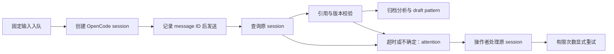

# Evolution 生产增量：配置、运行与恢复

多 Git 工作区、统一 `serve` 调度、模型补充取证和业务实验适配器的当前用法见
[多仓业务运行指南](EVOLUTION_MULTI_REPO_RUNBOOK_CN.md)。本文说明后台研究、通知与审批的运行和恢复。

后台挖掘和审批桥复用原来的 Evolution 数据库、门禁和 OpenCode 工作台。
已有 `/evolve-discover`、`/evolve-research`、`/evolve-candidate` 不需要改用新流程。
新入口 `/evolve-production` 用于显式批量调度、查询和请求专家评审。

## 1. 最少配置与启动

1. 在原平台 YAML 的 `evolution.production` 中按需启用 `worker`、`approval` 或 `validation`。
   最小字段与 webhook/邮件配置集中见[实际运行配置](../configs/evolution/README.md#2-按需后台研究专家通知业务验证)。
   启用多个能力时合并到同一个 `production` 对象，无需额外配置文件。
2. 共享 YAML 可先用 `worker: {}`，目录、模型和已配置本地端口自动继承原 OpenCode 配置。
   仅在无法自动解析时补 `url` 或 provider/model；`url` 是 OpenCode server 地址，模型凭据仍由 OpenCode 管理。
   如果 OpenCode 需要认证，`authorization_env` 填环境变量名，变量值是完整 Authorization 头。
3. 需要审批时，把 Discovery 的 owner 标识映射到真实企业 principal 和邮件地址或消息目标。
   配置企业网关地址、回调签名密钥环境变量，以及 SMTP TLS 或 webhook 二选一。
   网关签名密钥至少 32 字符；通知凭据同样从环境读取，不写入 JSON 或 Git。
4. 重启统一 MCP HTTP 服务和 OpenCode MCP 连接，使注册配置生效。
   运行以下命令检查本地配置；它不探测模型、不发通知，也不宣称外部服务可用。

```bash
hmopt-evolve production-status
hmopt-evolve doctor
```

5. 多仓流程使用统一调度，仍读取同一平台 YAML：

```bash
hmopt-evolve serve
# 需要同时投递已排队的专家通知时，改用（会发送真实邮件或 webhook）：
# hmopt-evolve serve --notifications
```

`serve --once` 只执行一个调度周期。仅处理独立研究队列或单独投递通知时，才使用
`worker` / `notify --watch`；多仓总任务仍需 `serve` 推进，同一组件无需重复启动。
以上命令自动读取已有 `HMOPT_MCP_CONFIG`；不同实例用 `--config /absolute/configs/app.yaml` 显式选择。
以下 `kernel` 为示例项目名，使用时替换为实际已登记项目 ID。
Windows 使用相同参数，替换为本机绝对路径；请由现有进程管理器管理服务重启和日志。
启动 worker 本身不会遍历新历史、替人审批、启动优化实现或发布 Skill。

## 2. 工作台使用

```text
/evolve-discover kernel
# 直接选择当前队列至多100条 pending 历史；无需手工复制 ID
/evolve-production mine kernel
# 或者精确选择；两种用法任选其一
# 从实际返回的未处理 source ID 中选择一批，不使用示例占位符作为真实 ID
/evolve-production mine kernel <source-id-1> <source-id-2>
/evolve-production status <返回的 mining_campaign_id>
/evolve-production groups kernel
/evolve-research kernel synthesize <选定的 source-id-1> <source-id-2>
```

一批最多 200 个历史 source。队列冻结真实 Git packet、分析版本、Skill 内容和模型配置。
每个 source 在独立 OpenCode researcher session 中分析；工具和委派权限关闭，模型只输出结构化结果。
Skill 与 Python 校验保持相同的 what/how/why、双侧源码引用、修改行覆盖、before 命中/after 排除要求。
单个 packet 默认预算 256 KB；超出预算、上下文不足或无效结果明确进入 attention/needs_context。
不会截断输入后伪装为完整分析，也不会为了清空队列自动生成 pattern。

后台输出是 **draft pattern**。后续仍需综合研究、独立 review（对综合 pattern）、curator 激活、
扫描、candidate-assessment 和专家确认。分组建议采用机制文本 Jaccard 相似度，最多检查每页 500 个 source、
返回 100 对；它不是 embedding 聚类或语义等价证明，跨页关系不在覆盖范围内。

```text
/evolve-research kernel assess <candidate-id>
/evolve-production request-review <candidate-id>
```

后者表示明确请求专家评审，创建冻结的 `approval_request` 和 `notification`，工作台只入队。
通知进程按照配置的责任目录投递；模型无权指定 principal、收件人或审批决定。
专家在企业网关登录后查看证据，明确选择 confirm/reject 并写明理由。

```text
/evolve-queue kernel
/evolve-candidate <已经确认的 candidate-id> status
/evolve-candidate <已经确认的 candidate-id> full
```

批准后服务产生不可变 `approval_id` 和 `continuation`，dossier 可以查询；这些 ID 可用于后续工作台取用。
continuation 的 `automatic_execution=false`：用户仍明确选择 full 或具体阶段。
确认候选不等于批准方案，更不等于放行实现或真机验证。

## 3. 状态与故障恢复



- 多进程通过 SQLite 事务统一限制并发，默认 2，最大 16。不同配置的 worker 不能同时消费活动任务。
  变更模型、目录、并发等配置前，先完成或取消并 retire 旧任务，再以新配置创建 campaign。
- 断线/重启后读取原 session 和预分配 message ID，不自动重发已进入 sending 的请求。
  租约代数、记录版本和原分析版本阻止旧 worker 提交。已经完成的分析不会重复生成 pattern。
- timeout/attention/cancelled 如果仍有未结束的远端 session，会继续占用容量。
  `/evolve-production cancel <campaign-id>` 只阻止结果入库，不声称已经停止远端计算。
- 相同输入、Skill 和配置的 campaign 会复用同一工作项；取消共享工作项会影响引用它的 campaign，
  status 会显示相同 job ID。不要用多个 campaign 作为重复重试手段。

```bash
# 查看返回的真实 job ID 和版本；等待其旧调度租约过期后处理
hmopt-evolve mining-retire <job-id> --worker-stopped
# retire 会请求 OpenCode 中止该 session，并确认 idle 后释放容量
hmopt-evolve mining-retry <job-id> --version <current-version>
```

`--worker-stopped` 表示操作者已确认旧发送进程停止，防止暂停的旧进程随后恢复发送；
租约过期本身不能证明该进程已停止。处理完毕后可以重新启动 worker。
显式重试最多 3 次模型尝试，保留之前的 session/message/失败输出摘要。
packet 超预算需人工拆分研究，不能用重试绕过；needs_context 通过工作台补充调查。
模型返回内容即使被校验拒绝也保留输出 evidence，不能只保留成功样本。

通知状态为 pending → sending → sent/uncertain。进程在发送中崩溃会保留 sending，重启不会自动重发。
SMTP 无法保证 exactly-once；webhook 接收端应使用 Idempotency-Key 去重。
投递前重新检查候选版本、pattern 和审批有效性；过时通知标为 `obsolete`，不占发送次数。
修改 pattern 后需要重新请求评审，旧通知不会被当作当前评审继续投递。
失败记录的 `error_type` 和 `smtp_code` 可用于定位认证、连接或 SMTP 错误，不保存服务器敏感响应。
`sent` 只表示投递调用成功，不代表专家已收到、已读或批准。

```bash
hmopt-evolve retry-notification <request-id> --version <version>
```

如果仍为 sending，必须先确认上一个投递进程已经停止，再加 `--delivery-stopped`。
这个参数是操作者确认，不是后台进程探测。重发仍可能重复送达，但不会重复批准同一候选。

## 4. 企业网关接入协议

统一 HTTP MCP 服务在配置 `production.approval` 后增加：

| 接口 | 用途 |
|---|---|
| `POST /evolution/approval/context` | 网关用已登录 principal 读取冻结的候选/pattern 证据 |
| `POST /evolution/approval/decide` | 提交绑定证据摘要的结构化确认或拒绝 |

这两个接口独立校验企业网关 HMAC，不使用普通 MCP bearer key 代替专家身份。
stdio 只提供入队/查询工具；外部审批需要启动统一 HTTP 服务。
企业网关必须完成登录认证、CSRF 防护和身份映射，浏览器不能获得签名密钥。
`gateway_url/<approval_request_id>` 是企业网关需要实现的专家页面；HMOPT 本轮未附带自建 SSO 页面。

请求头：`X-Evolution-Timestamp` 为当前 Unix 秒，时间窗 ±300 秒；
`X-Evolution-Signature` 是以下 **实际 HTTP 正文字节** 的 HMAC-SHA256 十六进制值：

```text
POST\n<实际接口路径>\n<timestamp>\n<原始 JSON 正文>
```

路径参与签名，不能拿 context 签名重放为 decide。UTF-8 编码，正文不超过 64 KiB。
反向代理须保留此路径，服务和网关时钟应同步。

context 正文：

```json
{"approval_request_id":"返回的实际请求ID","principal":"已认证的稳定企业身份"}
```

decide 正文：

```json
{
  "approval_request_id": "返回的实际请求ID",
  "principal": "已认证的稳定企业身份",
  "context_sha256": "专家实际查看的64位证据摘要",
  "decision": "confirm",
  "note": "专家实际填写的理由，至少10个字符",
  "request_id": "网关为本次决定固定的唯一ID"
}
```

重复同一 request_id 和相同决定返回原结果；改变决定冲突。
401 为签名/时间窗无效，403 为 principal 不属于该责任人，409 为请求过期、证据/目录变化或决定冲突，
400 为原服务门禁不满足。不能用新版本偷偷重放旧批准。
签名验证后，认证摘要、原子状态转换、批准 receipt 和 continuation 同一事务落库。
邮件自然语言、已读、链接预览均不是批准。

## 5. 可复现质量评测

```bash
hmopt-evolve evaluate /absolute/labelled-evaluation.json
# 查看完整输入契约，不创建数据库
hmopt-evolve schema quality-evaluation
```

同一数据也可通过统一 MCP `evolution_evaluate(dataset, actor)` 提交。
`schema production-config` 和 `schema expert-decision` 同样可导出配置与回调契约。
`EvaluationSet` 定义在 `src/hmopt/evolution/quality_eval.py`，严格拒绝未知字段。
数据包含 name、task(history/applicability)、labels、predictions、model_id、method_sha256 和阈值。
labels 每项给出 case_id、family、split(development/holdout)、expected、input_sha256、expert、rationale；
predictions 给出 case_id、input_sha256、report_sha256。所有摘要必须对应当前 store 中真实存在的 evidence。
history 从归档的 HistoryAnalysis.outcome 推导分类；applicability 使用绑定 input_sha256 的 assessment envelope。

服务检查 case ID 唯一、预测与标签输入一致、代码家族及相同输入不跨 development/holdout。
holdout 默认至少 30 例且同时有正反例；precision ≥0.8、recall ≥0.7、覆盖率 ≥0.9，可在评测输入明确调整。
缺失或 needs_context 计入未回答和覆盖损失；正例未回答也计入端到端 recall 的漏检。
没有正预测时 precision 为 null，不能默认为 100%。
模型名与专家标签目前是操作者声明，不是 provider 签名或独立专家身份认证。
报告只说明该数据集结果；它不会自动激活 pattern、修改评分策略、批准补丁或宣称真机收益。

## 6. 验收边界

测试使用真实 Git/SQLite/HTTP/MCP 协议和明确标记的模型/投递 fixture。
连接真实模型、真实企业身份网关、真实通知通道与设备后，还需用独立标注集和 stock/feature A/B 做部署验收。
AST/CFG 匹配、跨页全历史语义聚类、自动真机资源池、原生 Skill Hub 自动发布仍是独立能力，
本轮生产调度与审批实现不代表这些能力已经存在。
