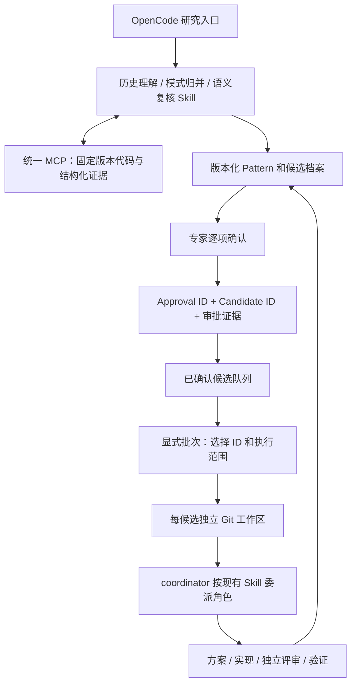

# Skill 驱动的 Evolution：设计与实施计划

2026-09-11。状态：P1–P4 已实现，协议和本地集成验收通过；生产模型质量与真机效果评测尚未执行。以已有统一 MCP、历史分析协议、候选状态机和 OpenCode 七角色为基础。

## 目标与使用路径

智能方法由 Skill 和现有 OpenCode 模型执行；Python 提供取证、受限检索、版本化存储、审批门禁和任务协调。
候选 ID 贯穿研究、专家决策、方案、实现、评审、验证；批准对象、依据、方法版本和结果可查询。
用户先查看已确认队列，再显式选取 ID 批量运行；审批动作本身不启动任务。



## 责任边界

| 层 | 负责内容 |
|---|---|
| Skill + 模型 | 理解修改、抽象机制、归并相似案例、生成搜索规则、逐项复核适用前提、形成方案和验证方法 |
| 通用 Python 服务 | 读取不可变代码、执行字面搜索、检查证据及结构、维护版本与状态、审批归档、批次恢复与 Git 隔离 |
| 专家 / 独立 reviewer / validator | 决策与评审责任；实际测试证据；服务不凭模型文字宣称真实收益 |

Skill 不扩大角色权限。默认 assistant 不变，只有显式配方允许 coordinator 委派。
既有方案评审、代码评审、正确性或 A/B 门保持有效。方法可演进，每次运行保留所用 Skill 内容摘要和快照。

## 实施顺序和验收

### P1：方法与证据协议

- 增加服务端解析的 Skill 快照：只读取配置工作台下已注册的本地 Skill，保留内容与摘要。
- 增加固定 Git 版本的分页代码证据接口，供 Agent 补读定义、调用者和目标上下文。
- 模式归并 Skill 消费已完成历史分析，产出包含多来源、前提、反例、指标理由的 draft；服务检查来源与历史正反例。
- 候选复核 Skill 对每项前提和反例提交满足/违反/未知及代码证据；新智能模式的候选在确认前必须有适用性复核结果。
- 使用现有 researcher/reviewer；新增方法不引入领域角色，也不新配第二套模型。

验收：错误引文、不同版本、遗漏条件、未知条件、重复请求、过期结果不能成为有效确认依据；Skill 修改后旧方法快照仍可读取。

### P2：审批档案与队列

- 每次明确确认或拒绝生成不可变 approval 记录，关联 candidate、审批前后版本、上下文摘要、actor、理由和请求证据。
- 保留现有本地可信操作者 CLI 和批量确认单；结果给出逐项 decision/approval_id/candidate_id。
- 提供按 profile、owner、阶段筛选并分页的候选队列，区分已确认、可执行、已完成、拒绝和阻塞。
- 提供候选 dossier：当前状态、来源、pattern、审批记录、研究结果、执行分发和审计证据引用。大证据按摘要另取。
- 历史审批可由已有请求证据重建关联；不得伪造原记录没有保存的身份认证信息。

验收：确认和拒绝分别可查；批量单留空/失败不混入已确认列表；后续阶段仍可追溯原审批；旧基线和未确认项不进入可执行队列。

### P3：按 ID 的受控批次与隔离

- 批次仅接受明确候选 ID 集合与有界执行范围，冻结开始时版本与审批关联。
- 服务端为每个候选保留批次归属和进度；其他 worker/批次不能重新领取；分发也要求匹配批次和 worker。恢复仍须确认原子会话已停止，这不是进程监管器。
- 执行目标使用批准基线的独立 detached Git worktree，主检出保持不变；不自动合并或推送优化补丁。
- 任务包绑定实际目标工作区、方法快照和候选档案，后续阶段复用此工作区。
- OpenCode coordinator 通过批次 next/block 协议推进现有执行 Skill；服务以真实候选状态判断完成，模型不能自行填“已验证”。block 只接受执行方明确的停工确认，并更新候选版本使旧任务失效。
- 中断用 batch ID 恢复；阻塞项保留原因，其他独立候选可继续；撤销/重试需明确动作，运行中的旧执行不能因超时自动被另一个执行替代。

验收：两项来自同一基线的候选分别完成修改，互不污染；批次重放与恢复不重复执行；未过评审不能验证；源仓库或方法绑定不匹配时拒绝执行。

### P4：统一入口、配置与验证

- 所有工具通过 `src/hmopt/api/` 的统一注册入口同时提供 HTTP/stdio；更新 doctor、setup 和 golden。
- 工作台提供候选队列/档案查看、方法研究、显式批次创建/续跑入口；沿用已有单配置文件和模型配置。
- 更新快速使用文档，明确当前协议验证、真实模型运行与真实设备收益的区别。
- 验证真实本地 Git + SQLite 门禁、MCP 传输、方法快照与 OpenCode 配方合同，保留 LF。

## 当前交付边界

本轮实现面向已有 OpenCode 的显式受控执行。外部消息投递、企业身份认证和无人值守模型服务需要真实部署连接，沿用审批桥设计，不伪造回执或发送消息。
受限字面检索仍作为低成本入口；语义适用性由 Agent 的有证据复核处理。不会把 LLM 输出当作形式化证明或已测量收益。
真实生产语料上的召回率、正确率和单位有效模式成本需要独立评测；代码/协议测试不替代该评测。

## 已实现模块与接口

| 能力 | 实现 | 统一主 MCP |
|---|---|---|
| 逐提交代码理解 | `change_analysis.py` + evolution-mining Skill | `evolution_history_analysis` / `evolution_submit_history_analysis` |
| 方法冻结与源码补读 | `methods.py` | `evolution_code_context` / `evolution_evidence` |
| 跨提交归并、独立评审、候选复核 | `research.py` + pattern-synthesis / candidate-assessment Skills | `evolution_prepare_research` / `evolution_submit_research` |
| 审批归档与队列 | `catalog.py` + 现有 `service.transition` / review-sheet | `evolution_candidates` / `evolution_dossier` |
| 批次与工作区隔离 | `batch.py` + evolution-batch / evolution-execution Skills | `evolution_create_batch` / `evolution_batch_next` / `evolution_batch_block` |
| 按门分发与执行 | 既有 `workflow.py` / service，新增方法和批次绑定 | `evolution_dispatch` / `evolution_submit` / `evolution_validate` |

新工具仍在 `src/hmopt/api/evolution_mcp_service.py` 注册，由主 MCP 统一挂载；加上后续生产和多仓增量，现有 38 个 Evolution 工具和 5 个内核索引工具。
后台调度、通知与认证回调、质量评测见 [生产使用指南](EVOLUTION_PRODUCTION_RUNBOOK_CN.md)。
不增加 provider、不增加服务端口。setup 会检查新增的命令和 Skill，doctor 会检查统一注册表。

## ID 与状态流转示例

```text
history source IDs → research_id → pattern_id@version
                                   ↓ scan
                              candidate_id (v1, discovered)
                                   ↓ 有引用的 applicability assessment
                              candidate_id (v2, discovered)
                                   ↓ 责任人明确 confirm
                              approval_id → 审批上下文 SHA / 理由 / actor / v2→v3
                                   ↓ 用户选定候选 ID
                              execution_batch_id → 每项审批 ID / 目标门 / worker
                                   ↓ 独立 worktree + execution method SHA
                              candidate_id → plan_approved → implemented
                                           → code_approved → validated 或阻塞
```

每次确认/拒绝都有独立 receipt。候选版本会因复核、工作区绑定、门禁和显式停止更新，不能长期缓存示例版本号。
审批上下文保存为内容寻址证据，后续实现不会覆盖“当时批准了什么”。旧数据仅从原审计事件重建实际保存的字段。
actor/worker 是可信本地操作者标签，不是企业认证身份，也不代表服务能确认真实人员或进程已退出。

## 实际操作

沿用 [快速开始](EVOLUTION_QUICKSTART_CN.md) 的一个配置文件与现有主 MCP。原有 setup 无需增加配置字段；
升级工作台代码后重启主 MCP，使新工具与命令被发现。新安装执行 setup 和 doctor。

```text
/evolve-discover pilot
/evolve-research pilot synthesize <已完成-source-id-1> <已完成-source-id-2>
/evolve-research pilot review <新-pattern-id@version>
# 策展人激活草案后，显式 scan 或新发现批次
/evolve-queue pilot pending
/evolve-research pilot assess <candidate-id>
# 责任人刷新候选版本并通过现有 CLI / 确认单作出决定
/evolve-queue pilot approved
/evolve-batch pilot full <candidate-id-1> <candidate-id-2>
/evolve-batch resume <execution-batch-id>
```

单提交模式可直接进入策展，不强制跨源归并；新代码分析生成的模式均要求候选适用性复核。
`approved` 队列保留当前可执行阶段的已确认项，`ready` 进一步排除当前基线/占用阻塞；查看所有终态用 `all`。
批次领取后，其他入口必须带同一 batch_id/worker_id 才能分发；已有当前分发包的候选先完成原阶段再加入批次。
旧基线在单仓库入口会阻塞，显式批次可从已批准的不可变基线创建隔离工作区，再检查其状态。

调用 `evolution_dossier(candidate_id)` 可获取完整索引，较大的源码、审批上下文、研究报告和方法按 SHA 读取。
关联记录分页显示 has_more；通用 `evolution_list` 可继续分页。CLI 也支持：

```bash
python -m hmopt evolve --config /absolute/config.json queue /absolute/source --state approved
python -m hmopt evolve --config /absolute/config.json dossier <candidate-id>
```

## 验收与生产效果评测分开记录

协议测试使用临时真实 Git 仓库、SQLite、官方 MCP HTTP/stdio 客户端；研究输出和测量数值是明确标注的测试输入。
覆盖引用篡改/遗漏/未知、过期输入、独立评审、审批重放与旧档案恢复、工作区隔离、批次冲突/恢复和原有门禁。
模型生产效果评测应在目标代码库选择独立样本，记录来源覆盖、独立专家确认率、有效模式/候选成本、验证通过率、
真实 A/B 收益和回归率；不得把本地协议通过率当成语义准确率。后续生产增量已提供并发挖掘 Worker；
后续多仓增量已提供业务构建/真机命令适配器、资源互斥与不确定执行恢复；自动分布式设备资源池仍未实现。
配置与验收范围见 [多仓指南](EVOLUTION_MULTI_REPO_RUNBOOK_CN.md) 和 [生产使用指南](EVOLUTION_PRODUCTION_RUNBOOK_CN.md)。

### 本轮验收记录

- Evolution 全套测试及 OpenCode golden：617 passed，4 skipped，耗时 473.62 秒。四项跳过涉及当前 Windows 环境不允许创建符号链接。
- 最终批次范围/占用/旧任务失效加固后，重跑 service、workflow、新 Skill 流程、模式归并、统一 HTTP/stdio 与 golden：132 passed，耗时 140.63 秒；包含新增的范围门禁、并发预留与独立分发占用测试。
- CLI queue/dossier 在临时真实 Git 仓库完成调用检查。
- 现有 `127.0.0.1:49174` 临时 OpenCode 验收实例经空闲确认、资产更新和实例重载，实际识别 5 个 Evolution 命令；发现入口是 researcher，研究/批次/执行入口是 coordinator，队列入口是 assistant；主 MCP 状态 connected。
- Ruff、Skill registry lint 与 Git diff 检查通过；变更文本保持 LF。

真实 OpenCode 检查覆盖命令发现和主 MCP 连接；新研究及批次接口通过真实 MCP 客户端执行。这里没有声称已完成真实模型的新语料端到端挖掘或真机收益验证。
