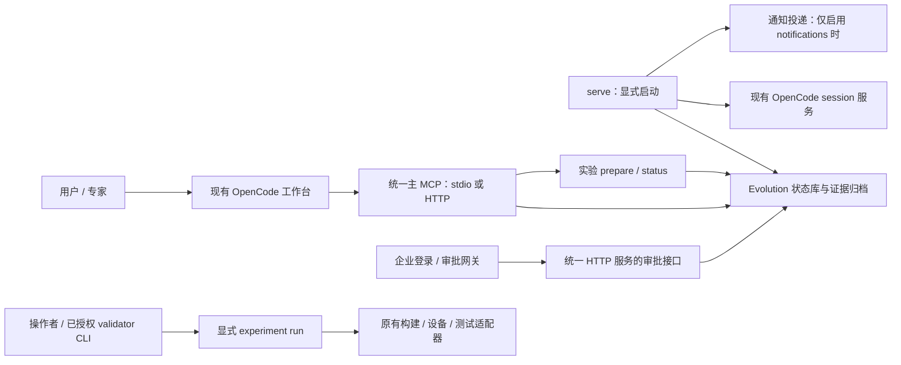
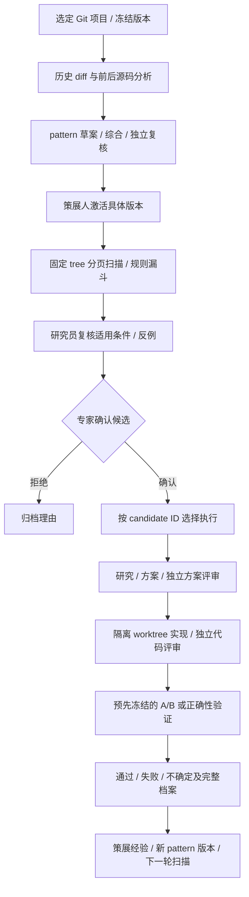
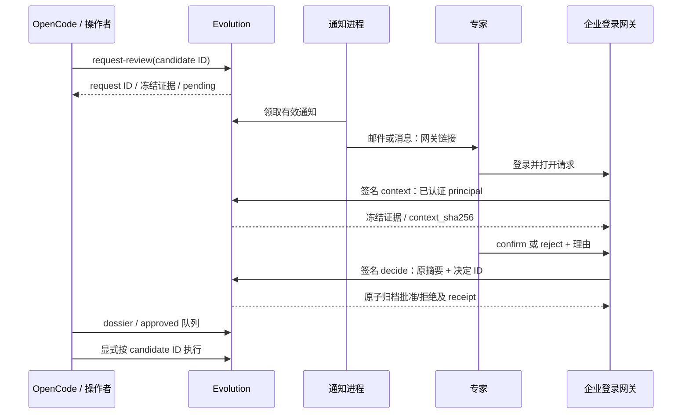

# Evolution 配置使用文档

本文是 Evolution 的统一操作手册，覆盖接入、日常工作台使用、专家审批、业务验证、经验沉淀和恢复。
适用于由多个 Git 仓库组成的业务 repo；业务根目录不必是 Git 仓库。
先完成最小接入，再按实际需要启用后台研究、邮件和构建/测试适配器。
架构原理见[《Evolution 设计》](EVOLUTION_DESIGN_CN.md)，代码细节见
[《Evolution 实现》](EVOLUTION_IMPLEMENTATION_CN.md)；日常使用无需再查旧版分散指南。

## 目录

- [1. 三步接入](#quickstart)
- [2. 最小配置与复用关系](#configuration)
- [3. 工作台、MCP 和后台进程](#mcp)
- [4. 从发现到实施的日常流程](#workflow)
- [5. 历史挖掘、pattern 与漏斗](#research)
- [6. 专家邮件与批复](#approval)
- [7. 业务验证接入](#validation)及 [lmbench 原始结果](#lmbench)
- [8. Team Memory 与 Skill Hub](#learning)
- [9. 故障、取消与续跑](#recovery)
- [10. 模式与候选质量评估](#quality)
- [11. 业务验收](#acceptance)

<a id="quickstart"></a>
## 1. 三步接入：登记范围 → 连接原主 MCP → 工作台启动

前提是原 HMOPT/OpenCode 工作台和模型已经可以使用。下面命令在 HMOPT 工作台根目录执行；
所有 `<...>` 均须替换为本次返回的实际 ID、版本或本机路径，示例中的角色名也须替换为实际人员。
路径含空格时加引号；Windows 使用 `C:/...`。已安装环境无需重复安装。

**第一步：在原平台 YAML 登记关注的 Git 仓库与责任人。**

```bash
python -m pip install -e '.[validation]'
python -m hmopt evolve setup-workspace --project kernel --project memory=foundation/memory --owner pilot-owner
```

业务根继承 `PROJECT_REPO_PATH`，内核 checkout 继承 `KERNEL_REPO_PATH` 或平台 `project.repo_path`。
没有配置业务根时追加 `--source-root /absolute/business-repo`；内核位置也可显式写成
`--project kernel=kernel/main`。不在工作台根目录时追加 `--workbench /absolute/hmopt`。
setup 只在原 YAML 追加配置并生成连接片段，不启动挖掘、不修改模型、不发送邮件。
已有 `evolution` 节时直接编辑该节。手工编辑的最小完整片段如下：

```yaml
evolution:
  source_workspace:
    workspace_id: business
    projects:
      kernel:
        owners: {"**": kernel-owner}
      memory:
        path: foundation/memory
        owners: {"**": memory-owner}
    selected: [kernel, memory]
```

把两个 owner 替换为真正负责对应范围的人。setup 的单个 `--owner` 是首次统一负责人；
生成后可按上面片段拆分到每个项目，也可按路径 glob 细分。只试点单仓时可使用
`python -m hmopt evolve setup --owner actual-owner`，已有单仓 profile 无需迁移才能运行。

**第二步：把生成的连接片段应用到已有主 MCP，并检查。**

保留原 provider 和其他 MCP。主 MCP 仍指向同一平台 YAML，默认 `configs/app.yaml`，
Docker 使用 `configs/app.docker.yaml`；用已有 `HMOPT_MCP_CONFIG` 指定它。
本地入口是 `python -m hmopt.api.mcp_stdio`；远程沿用现有统一服务的 `/mcp`。
重启主 MCP/工作台连接后执行：

```bash
python -m hmopt evolve doctor
python -m hmopt evolve production-status
```

doctor 检查本地配置、路径和可检查的组件；它不探测真实模型、不发送通知、不运行设备。
“配置检查通过”不能作为业务闭环通过的结论。

**第三步：在 OpenCode 工作台显式启动。**

```text
/evolve-workspace start
/evolve-workspace status <返回的-run-id>
```

先用 `/evolve-workspace advance <run-id>` 单步推进。无后台 worker 时，使用 `/evolve-discover kernel`
处理该项目的历史待办，按返回的原批次 ID 续做；memory 同理。完成本轮待分析项后，用
`/evolve-workspace retry <run-id> <project-id>` 恢复因缺 worker 进入 attention 的项目，再 advance。
需要后台批量处理，在同一 YAML 的 `evolution.production` 添加 `worker: {}`，按第 3 节启动
现有 OpenCode session 服务，再运行 `python -m hmopt evolve serve`。
普通聊天保持 assistant，不会隐式启动总任务、审批或实现。

<a id="configuration"></a>
## 2. 只维护一份平台配置

平台 YAML 是运行配置；Plan、manifest、报告和 task.json 是每次任务的工件，无需手工维护为全局配置。
无需复制 Evolution JSON。配置中的新增字段仅用于原平台无法表达的仓库选择、专家目录及业务适配器。

| 内容 | 复用来源及含义 |
|---|---|
| 平台 YAML | `HMOPT_MCP_CONFIG`；未指定时沿用默认平台配置 |
| 业务 repo 根 | `PROJECT_REPO_PATH`，兼容 `KERNEL_WORKSPACE_PATH` |
| kernel checkout | `KERNEL_REPO_PATH`，回退平台 `project.repo_path` |
| 其他 Git 仓库 | `source_workspace.projects.<id>.path`，相对业务根 |
| 工作台、模型 | 现有 OpenCode 工作台及其模型配置，凭据仍由 OpenCode 管理 |
| 验证工件 | 原 `storage.artifacts.root_dir` / `storage.artifacts_root` |
| Evolution 状态 | 工件目录旁的 `evolution/`，独立状态库，默认 `data/evolution/` |
| Agent 任务空间 | 工作台 `.opencode/local/workspaces/`，保存 capsule/dispatch/各阶段工件 |
| 构建、刷机、测试凭据 | 业务适配器继承原有进程环境 |
| 并发、分页、超时 | 代码默认值；有实际测量需要时再覆盖 |

**`.env` 文件需要由原有启动方式加载进进程环境。Python 不会自动加载任意 `.env.xx`。**
Docker 沿用原 env-file/Compose 配置；直接运行 Python 时使用原 shell 或服务管理器的环境注入。
修改 YAML 后重启读取配置的主 MCP 和调度进程；修改变量后也要确保新进程继承了新值。
显式选择另一份配置：

```bash
python -m hmopt evolve --config /absolute/hmopt/configs/app.yaml doctor
python -m hmopt evolve doctor --json
```

旧 JSON、`HMOPT_EVOLUTION_*` 仍兼容，显式旧变量会覆盖文件值，doctor 会报告覆盖项。
迁移时先保留状态/工件/任务路径、workspace_id 和项目身份，确认 CLI/MCP 读到相同档案，再移除旧覆盖。
setup 不迁移旧数据库。已有运行后不要为“整理名字”随意改 workspace_id/项目 ID。

`selected` 是允许挖掘、扫描的明确范围；框架不会自动发现其他仓库、执行 repo sync 或修改未选源码。
Git checkout 可以是普通 `.git` 目录、worktree 的 `.git` 文件或 repo 管理的元数据；项目路径须是
准确的 checkout 根，位于业务根内且不经过重定向。仅参与构建的依赖这样登记：

```yaml
# 合并进现有 source_workspace；保留已有 kernel/memory 配置
projects:
  build_tools:
    path: tools/build
    owners: {"**": build-owner}
dependencies: [build_tools]
```

dependencies 只冻结版本，不挖掘、扫描或产生候选；与 selected 不重叠。它也使用统一项目结构，须登记 owners。
总任务记录所选项目和依赖的 Git SHA。即使本轮 `/evolve-workspace start kernel` 只研究 kernel，
其他已配置 selected 项目仍作为构建上下文冻结。未声明的构建依赖不受版本门保护，必须明确补登记。

可按需给项目补 `hotspots`：包含真实 `path`、`symbol`、`weight` 和目标 `revision`。
它复用 profiler 数据参与候选排序；版本不匹配会拒绝，未配置时仍能按代码规则筛选。
本实现不自动持续采集 profiler，也不会把缺失热点或预估收益当成实测数据。

<a id="mcp"></a>
## 3. 工作台、主 MCP 和后台进程怎样连接



Evolution 注册在 `src/hmopt/api/` 的统一主 MCP 中，不需要新增 Evolution MCP 服务。
本地主 MCP 的生成片段使用当前 Python 运行 `-m hmopt.api.mcp_stdio`，并设置原 `HMOPT_MCP_CONFIG`。
远程主 MCP 需在**服务端**配置、重启；配置、Git checkout、工作台和工件路径必须在服务端可见。
生成片段不会上传本机目录，不要同时添加第二个主 MCP 造成状态库混用。
Unix/容器现有 HTTP 启动脚本仍是 `bash scripts/run_mcp_server.sh`，默认端口 7331。
外部专家回调必须接入这个 HTTP 服务；仅 stdio 不提供可被企业网关调用的 HTTP 地址。

后台研究的最小附加配置，合并进原 `evolution`：

```yaml
production:
  worker: {}
```

worker 从工作台 `opencode.json`/`opencode.jsonc`、显式 `OPENCODE_CONFIG` 或
`OPENCODE_CONFIG_CONTENT` 继承 researcher 或顶层模型；本地 `server.port` 已配置时同时继承地址。
动态端口/远程服务才补 `worker.url`；无法解析模型时补 `provider_id`、`model_id`，服务不会猜测。
`worker.url` 是支持 session/prompt_async/message API 的 OpenCode 服务，不能填写 `HMOPT_LLM_BASE_URL`。
需要认证时 `authorization_env` 引用包含完整 Authorization 头的环境变量；模型密钥不复制到 Evolution。

```bash
python -m hmopt evolve serve
```

serve 是前台调度进程，可由原服务管理器托管；默认每 3 秒推进已创建的多仓任务、独立扫描和研究队列。
`serve --once` 只执行一轮；它不自动创建总任务、不实现补丁、不执行设备/构建、不发送通知。
只有显式 `serve --notifications` 才同时投递已排队的专家通知。
单独处理历史队列可用 `worker`，单独投递可用 `notify --watch`；同一组件无需重复启动。
Ctrl+C 停止轮询，远端 session 仍需按实际状态检查。变更 worker 配置前按第 9 节处理活动任务。

<a id="workflow"></a>
## 4. 从发现到实施：日常工作台流程



以下是命令顺序示意，每步使用实际返回的 ID；不是一次粘贴就跳过人工门的脚本：

```text
/evolve-workspace start kernel memory
/evolve-workspace status <run-id>
/evolve-research kernel synthesize <source-id-1> <source-id-2>
/evolve-research kernel review <pattern-id@version>
```

综合研究至少选择两份已完成历史分析；独立 review 通过后仍由策展人检查并激活：

```bash
python -m hmopt evolve activate-pattern '<pattern-id@version>' --actor curator --note '已核对来源、适用条件、反例和匹配范围。'
```

```text
/evolve-workspace scan kernel
/evolve-queue kernel pending
/evolve-research kernel assess <candidate-id>
/evolve-production request-review <candidate-id>
/evolve-queue kernel approved
/evolve-candidate <已确认的-candidate-id> full
```

未配置专家通知时，用第 6 节的责任人确认单替代 request-review。新复核会更新候选版本，确认前应刷新档案。
扫描只使用启动时的 active pattern 快照；后来激活的新版本需新建扫描，不会偷偷改变旧任务。
`awaiting_review` 表示发现阶段到达人工处理边界，不代表所有历史分析完成，更不代表优化通过。
`no_active_patterns` 表示尚无可使用的模式，候选为零是正常结果。

历史按第一父链分页采集；下一轮默认从逻辑项目及 revision 选择器的归档 cursor 增量读取。
历史采集完成和语义分析完成分开计数，上一轮未完成研究仍可挂入新任务。
需要重新遍历时明确执行 `workspace-start --request-id <新ID> --full-history`；
分支重写导致 cursor 不再属于目标祖先时，先处理旧任务，再创建明确的全历史任务。

**批准后按 ID 取用。** 假设本次返回 candidate `C`、审批请求 `R`、批准记录 `A`、实验 `E`：
这四个字母只是下图示意，实际存储 ID 是服务生成的不透明标识，不能手造或从名称推算。


```bash
python -m hmopt evolve dossier <candidate-id>
python -m hmopt evolve show <candidate-id>
python -m hmopt evolve audit <candidate-id>
```

服务状态是执行依据，capsule 是交接载体；修改文件中的状态文字不会批准任务。
`request_id` 是一次请求的稳定幂等 ID，相同 ID 只可重放相同输入；候选/审批/实验 ID 是归档实体 ID。
涉及版本的命令先读取当前 `version`，不要套用上次截图或确认单的版本。

| 要做什么 | OpenCode 输入 |
|---|---|
| 完整执行一个已确认候选 | `/evolve-candidate <id> full` |
| 只查询 | `/evolve-candidate <id> status` |
| 只推进当前允许阶段 | `/evolve-candidate <id> stage` |
| 只研究 | `/evolve-candidate <id> research` |
| 研究、方案和独立方案评审 | `/evolve-candidate <id> plan` |
| 只实施 / 代码评审 / 验证 | `/evolve-candidate <id> implement` / `review` / `validate` |
| 明确选择同仓批准项，最多十项 | `/evolve-batch kernel full <id-1> <id-2>` |
| 续跑一个已知批次 | `/evolve-batch resume <execution-batch-id>` |

full 复用 researcher → architect → 独立 reviewer → implementer → 独立 reviewer → validator，
按服务门禁连续取得下一阶段；缺证据、人工决定或运行权限时保留当前状态。
目标 checkout/worktree 位于 HMOPT 工作台之外时，按现有 OpenCode 策略处理 external_directory 和
`git -C` 等路径权限；setup/doctor 不会代替这些运行时授权，也不会放宽角色的源码编辑权限。
批次串行执行，每个候选使用批准基线的隔离 Git worktree，保留 claim、方法快照和进度；恢复前确认旧子会话停止。
一个项目的批准不授权修改另一个项目；跨仓修改应分别形成范围与审批。流程不自动 merge/push。

<a id="research"></a>
## 5. 历史挖掘、pattern 和漏斗如何操作

交互试点用 `/evolve-discover kernel`，每轮最多分析五个提交，未完成时用
`/evolve-discover kernel <原批次ID>` 续跑。证据优先读取实际 before/after 源码和 diff，提交说明仅作辅助。
Agent 输出 what/how/why、原因的证据/推断区分、适用前提与反例；Python 检查引用、版本、修改行覆盖、
before 命中/after 排除及输出结构。无法证明时保留 `needs_context`，不强制提取模式。

后台按明确范围入队，与交互方式复用相同证据门：

```text
/evolve-production mine kernel
/evolve-production mine kernel <source-id-1> <source-id-2>
/evolve-production status <mining-campaign-id>
/evolve-production groups kernel
/evolve-research kernel synthesize <选定的-source-id-1> <source-id-2>
```

前两条任选一种：省略 source ID 只选择当前 pending 队列至多 100 项，不自动翻遍后续页面；
显式 campaign 最多 200 项。每个 source 独立 OpenCode researcher session，固定 Skill、输入和模型配置。
worker 默认并发 2，最多 16；基础 packet 默认上限 256 KB，默认最多 3 轮补充取证、累计 128 KB。
补充 read/search 只访问对应提交的 before/after Git 对象，不允许任意 shell 或磁盘读取。
reported token 预算是轮间检查，不是 provider 硬上限；未上报用量时成本就是未知。

大文件可保留完整变更 hunk 和行号、省略明确标记的未修改部分；模型可补读定义或上下文。
超大 diff、缺失、二进制等证据不足仍是未解决项。旧未完成 packet 可用 MCP
`evolution_history_analysis(refresh=true, expected_version=<当前分析版本>)` 重新取证；不覆盖已完成分析。
原始失败输出和取证请求也归档，不能只保留成功样本。

groups 是基于机制文本 Jaccard 的词汇检索建议，单页最多检查 500 项、返回 100 对；
它不代表全历史语义聚类。synthesize 由 Agent 比较多个实例；review 使用独立研究者判断一致性和反例；
curator 激活后才用于扫描。研究模板 `seeds` 不等于可直接激活的生产模式。

扫描固定 Git tree、pattern 版本和覆盖范围，按文件/模式分区分页；所有页命中都归档，Top-N 只是展示选择。
漏斗先做可执行规则筛查及去重，再结合真实热点排序，由 assess 引用固定版本源码逐项确认机制、前提和反例。
规则主要是路径和字面条件，不应描述为完整 AST/数据流证明；LLM 判断也不能替代独立复核和最终验证。
`complete` 是遍历结束，`coverage_complete` 才表示没有对应跳过项。大文件/特殊文件/编码跳过须保留统计，
同一文件跨 pattern 分区的跳过计数可能重复，不能解读为去重文件数。

| 需求 | 统一 MCP 工具 | CLI 或工作台对应 |
|---|---|---|
| 项目/状态/推进/恢复 | `evolution_workspace` | `/evolve-workspace`、`workspace-start/status/control` |
| 分区扫描与恢复 | `evolution_scan` | `scan-start/next/control` |
| 历史准备、提交、补充源码 | `evolution_history_analysis`、`evolution_submit_history_analysis`、`evolution_code_context` | `/evolve-discover` |
| 综合、review、适用性研究 | `evolution_prepare_research`、`evolution_submit_research` | `/evolve-research` |
| 后台入队与控制 | `evolution_start_mining`、`evolution_mining_control` | `mine-campaign`、`mining-status/cancel/retire/retry` |
| 候选队列与档案 | `evolution_candidates`、`evolution_dossier` | `/evolve-queue`、`dossier` |
| 专家评审入队 | `evolution_request_approval` | `request-approval` |
| 提交评审/实现与验证 | `evolution_submit`、`evolution_validate` | `decide`、`validate` |
| 实验准备/查询 | `evolution_experiment`（prepare/status） | `experiment-prepare`、`show --kind experiment` |
| 实验执行/退役 | 无执行 MCP；操作者或已授权 validator CLI | `experiment-run/retire` |
| 规范摘要/质量 | `evolution_digest`、`evolution_evaluate` | `check-contract`、`evaluate` |

工具名使用当前工作台暴露的服务前缀，并始终绑定同一连接和状态库。不要混用两个实例的 ID。

<a id="approval"></a>
## 6. 专家邮件、身份和批复闭环

### 6.1 最少配置与真正的收件人

源码路径匹配 `owners` 得到 owner，例如 `kernel-owner`；它是业务责任标识。
`contacts` 再将该标识映射到认证身份 `principal` 与投递目标 `target`。路径规则可用 `mm/**` 配具体 owner，
再用 `**` 兜底；匹配优先采用更具体的规则。模型不选择专家或填写收件人。
企业目录/负责人名单由操作者提供，不会从 git author、提交邮箱或“看起来像专家”的名字自动推断。

以下片段合并到原 `evolution` 节；已有 production 时将其中的 approval 合并进去，
启用多个能力时只保留一个 production 和一个 approval 键。
地址均为说明用 `.invalid` 示例，必须替换为实际企业服务。

```yaml
production:
  approval:
    contacts:
      kernel-owner:
        principal: "your-tenant:kernel-expert-id"
        target: "kernel-expert@example.invalid"
      memory-owner:
        principal: "your-tenant:memory-expert-id"
        target: "memory-expert@example.invalid"
    gateway_url: https://approval.example.invalid/evolution
    signing_key_env: HMOPT_APPROVAL_GATEWAY_KEY
    smtp_host: smtp.example.invalid
    smtp_sender: hmopt@example.invalid
    smtp_username: hmopt@example.invalid
    smtp_password_env: HMOPT_SMTP_PASSWORD
```

默认 SMTP 为隐式 TLS，端口 465。若企业服务要求 STARTTLS，则在 approval 下再加：

```yaml
smtp_security: starttls
smtp_port: 587
```

STARTTLS 先协商 TLS 再登录；失败停止，不降级明文。无需账号认证的受控 TLS 中继可同时省略
smtp_username 与 smtp_password_env；这两个字段必须配对。`*_env` 填变量名，实际密钥从部署环境注入。
签名共享密钥至少 32 字符。Compose 已透传标准 `HMOPT_APPROVAL_GATEWAY_KEY`、`HMOPT_SMTP_PASSWORD`；
采用其他变量名时，操作者还须在部署环境透传相应名字，不能仅改 YAML。

消息 webhook 与 SMTP 二选一。改用 webhook 时删除全部 SMTP 字段，并在同一 approval 下配置：

```yaml
webhook_url: https://notification.example.invalid/evolution
webhook_authorization_env: HMOPT_NOTIFICATION_AUTHORIZATION
```

无需认证可省略 webhook_authorization_env；此时 contacts.target 填消息系统识别的实际目标。
非本机服务使用 HTTPS，URL 不携带用户名、密码或签名参数。审批请求默认有效 3 天，确有需要才调整 expires_seconds。

### 6.2 入队、发信、查看结果

候选完成必要 assess 后，在工作台执行 `/evolve-production request-review <candidate-id>`，或者：

```bash
python -m hmopt evolve request-approval <candidate-id> --request-id <本次评审请求的唯一ID>
python -m hmopt evolve notify
python -m hmopt evolve show <返回的-approval-request-id> --kind notification
```

request-approval 冻结候选版本、pattern、证据摘要和联系人目录，产生 approval_request/notification。
它只入队；`notify` 才实际发送一批，默认最多 20 项。长期投递用 `notify --watch`，或已有 serve 改用
`serve --notifications`，不必启动两份投递器。邮件包含候选信息、证据摘要和专家页面链接。
投递前再次检查证据、目录和有效期；过时请求标为 obsolete，应重新请求评审。
sent 只表示 SMTP/webhook 调用成功，不代表已读、批准或最终送达。



### 6.3 企业登录页面与回调接入

企业系统需要提供 `gateway_url/<approval_request_id>` 页面，完成登录、CSRF 防护和稳定 principal 映射。
HMOPT 提供后端协议，没有内置企业 SSO 页面，也没有通过 IMAP 自动识别邮件自然语言回复。
专家点击链接后应选择 confirm/reject 并写理由；直接回复“同意”、邮件已读、链接预览都不会批准。

统一 HTTP 服务配置 approval 后提供 `POST /evolution/approval/context` 与 `POST /evolution/approval/decide`。
它们验证企业网关 HMAC；普通 MCP bearer token 不能替代专家身份。签名密钥仅在网关后端和服务端保存。
context 正文示意如下，两个值来自实际请求与已认证会话：

```json
{"approval_request_id":"实际返回的请求ID","principal":"已登录专家的稳定企业身份"}
```

decide 必须使用专家实际查看的摘要；以下是协议示意，不是可用于审批的真实记录：

```json
{
  "approval_request_id": "实际返回的请求ID",
  "principal": "已登录专家的稳定企业身份",
  "context_sha256": "context接口返回的64位摘要",
  "decision": "confirm",
  "note": "专家填写的具体理由，至少10个字符",
  "request_id": "网关为本次决定固定的唯一ID"
}
```

`X-Evolution-Timestamp` 为 Unix 秒，允许 ±300 秒；`X-Evolution-Signature` 为下面字节序列的
HMAC-SHA256 十六进制值。JSON 先编码为 UTF-8；计算签名与发送必须使用完全相同的正文原始字节：

```text
POST\n/evolution/approval/decide\n<timestamp>\n<实际 JSON 正文字节>
```

context 使用自己的实际路径签名，不能重用 decide 签名。正文最大 64 KiB，代理应保留应用看到的路径，
两端时钟同步。网关用已认证会话取 principal，不能信任浏览器表单自己填写的身份。
相同 request_id、相同决定重放返回原结果；更改决定或上下文会冲突。主要响应含义：

| HTTP | 处理 |
|---|---|
| 401 | 校验签名、原始正文、路径及时间窗 |
| 403 | 已登录 principal 不是此次候选配置的专家 |
| 409 | 请求过期、候选/pattern/目录已变或幂等决定冲突，重新读取当前档案 |
| 400 / 422 / 413 | 原服务门不满足 / 结构错误 / 正文过大 |

批准在同一事务保存身份凭据摘要、候选晋级、receipt、approval_id 和 continuation。
`continuation.automatic_execution=false`，工作台仍由用户明确选 full/单步/批次；批准候选不等于批准方案。

### 6.4 尚未接企业网关：责任人确认单

```bash
python -m hmopt evolve review-sheet --output /absolute/review-sheets --owner kernel-owner
python -m hmopt evolve apply-sheet /absolute/returned/review.json --actor kernel-owner
```

由实际责任人阅读返回目录中的 review.md，只修改 review.json 各项的 decision（confirm/reject/空）和 note。
candidate、version、context 不能改；过期冲突应重新生成。也可使用工作台显示的带当前版本的 owner CLI。
单项确认也可由真实 owner 明确执行：

```bash
python -m hmopt evolve decide <candidate-id> confirm --actor kernel-owner --version <当前版本> --request-id <本次决定请求ID> --note '已核对适用性、证据与范围，同意进入方案阶段。'
```

CLI actor 是受信操作者声明，不是企业身份认证；生产身份审计使用上面的签名网关。

<a id="validation"></a>
## 7. 方案、代码和业务验证怎么接

architect 的 Plan 冻结基线、允许修改文件、机制、风险和验证策略；独立 reviewer 对规范化摘要作方案批准。
implementer 在批准 worktree 内实现，提交实现 revision 和 diff；另一身份的 reviewer 审阅代码后才允许验证。
多仓 Plan 还要绑定 `workspace_manifest_sha256`。源码/任务文件写着 approved 不会绕过服务门。

无需手填全局测试 JSON。使用以下命令查看并校验本次任务的真实工件：

```bash
python -m hmopt evolve schema plan
python -m hmopt evolve check-contract plan /absolute/task/plan.json
python -m hmopt evolve schema correctness-policy
python -m hmopt evolve schema correctness-report
```

性能 Plan 冻结 metric name/unit/direction/primary、收益与回归阈值、minimum_pairs、device/workload 及环境摘要。
correctness-policy 放在 Plan.validation，冻结预期失败复现与候选检查要求，不能套用性能收益百分比。
schema 只输出字段契约，check-contract 只校验/计算规范摘要，二者不会生成真实运行证据。

### 7.1 调用原有构建、刷机、测试脚本

在 `evolution.production` 中只需增加业务适配器 argv：

```yaml
validation:
  command: ["/absolute/python", "/absolute/your_business_adapter.py"]
```

首项是可执行文件绝对路径，默认工作目录为业务根、超时 3600 秒；参数以 argv 传入，不经过 shell 拼接。
适配器调用已有业务工具链并等待两侧测试完成。不是把现有单侧 build 命令改名就构成 A/B。
同一状态库默认 resource_id=business-validation，验证串行；仅独立设备才显式设置不同 resource_id。
代码评审通过后，由独立 validator 准备并执行：

```bash
python -m hmopt evolve experiment-prepare <candidate-id> --request-id <本次实验准备请求ID>
python -m hmopt evolve experiment-run <返回的-experiment-id>
```

prepare 只归档请求，run 才运行构建/设备适配器，仍遵守原工作台运行权限。
适配器继承环境并读取以下四项；用 experiment ID 关联外部流水线，避免重复创建同一工作：

| 环境变量 | 协议 |
|---|---|
| `HMOPT_EXPERIMENT_REQUEST` | 不可变 JSON：批准策略、基线/候选 revision、执行 worktree、业务 manifest |
| `HMOPT_EXPERIMENT_RESULT` | 适配器必须写入的 result.json 路径 |
| `HMOPT_EXPERIMENT_ID` | 本次实验稳定 ID |
| `HMOPT_TARGET_REPO` | 当前候选实际执行 Git worktree |

result 支持 `{"report": <ABReport或CorrectnessReport>}`、`{"lmbench_manifest": <LmbenchManifest>}`、
或 `{"ic_compare": <比较结果>, "ic_manifest": <ICManifest>}` 三类结果。
lmbench 原始 xlsx 放入本实验目录；转换器归档原始来源后走同一验证门。stdout 不作为验收结果，
日志可保存到实验目录。只提交异步远端任务成功不能退出并声称实验完成。

多仓报告每侧提供 `project_revisions`：键是 manifest 的 repo_id，值是该侧实际构建 Git SHA。
baseline 必须完整等于冻结 manifest；feature 仅把本候选仓库替换成已评审实现 revision，其他 selected
及 dependencies 不得漂移。缺项、额外漂移、错误 target、策略不符均拒绝。这依赖可信业务采集器，
不是硬件签名认证；实际构建来源、镜像和设备必须由业务链路可核查地采集。

<a id="lmbench"></a>
### 7.2 lmbench：先选指标，再读真实原始结果

方案评审前，由 architect/validator 根据实际瓶颈选择主指标和 guardrails，保存本次任务 profile，例如：

```json
{
  "kind": "lmbench_paired_suites",
  "metrics": [{"name":"syscall_latency","system":"大核","tool":"lmbench-lat",
    "metric":"lat_sys","command":"lat_syscall null","units":"microseconds"}]
}
```

字段必须对应真实 xlsx 行，示例不能直接当成所有任务默认指标。执行：

```bash
python -m hmopt evolve schema lmbench-profile
python -m hmopt evolve check-contract lmbench-profile /absolute/task/lmbench-profile.json
```

把返回规范 sha256 写入 Plan.validation.measurement_profile_sha256，记录 capsule，独立评审冻结。
结果出来后不能更改 benchmark command 或挑选有利行。绑定 profile 后，无来源 ABReport 不能绕过原始转换门。
使用已有 AutoTest/Flash/Build 流程采集明确 stock/feature 镜像，保留源码 revision、镜像 hash、
run_token、设备、环境、工作负载和 raw xlsx。最少三组独立 suite pairs，并满足方案要求；同一 workbook
里的 valueN 先汇总为 suite 均值，不能伪装成跨镜像独立样本。

已接适配器时直接返回 lmbench_manifest；手动采集模式由 validator 根据真实运行整理 manifest：

```bash
python -m hmopt evolve schema lmbench-manifest
python -m hmopt evolve convert-lmbench <candidate-id> /absolute/task/manifest.json --artifacts-root /absolute/collected-results --output /absolute/task/ab-report.json
python -m hmopt evolve show <candidate-id>
python -m hmopt evolve validate <candidate-id> /absolute/task/ab-report.json --actor validator-alice --version <当前版本> --request-id <本次验证请求ID>
```

convert 规范化并存证，validate 才判定 pass/fail/inconclusive。重复 token/文件、缺列、来源哈希、
环境/版本或 profile 不一致须修正真实来源，不填占位值通过门禁。IC 使用
`convert-ic <candidate-id> <compare.json> <manifest.json> --output <report.json>` 后走同一 validate。
correctness 提交真实基线复现与候选检查报告，不需要伪造 A/B 延迟收益；simulation 结果不能晋级成熟经验。

<a id="learning"></a>
## 8. 结果归档与 Team Memory / Skill Hub

通过、失败、拒绝和不确定结果均保留候选档案与审计记录；失败也是下一轮避免误判的证据。
`quality` 查看当前归档统计，策展人依据实例修改 pattern 后需导入新版本、复核、激活，再创建新 scan。

```bash
python -m hmopt evolve list --kind skill
python -m hmopt evolve quality
python -m hmopt evolve promote <skill-id> staging --actor curator --version <skill当前版本> --request-id <本次策展请求ID> --note '已独立核对真实验证、来源和适用范围。'
```

原生导出选择已真实验证的本条经验；经过独立 curator 推进 staging 后，准备可共享的短内容 JSON，
字段为 title、body、applies_when、invalidated_by，可选 target_slug。正文须明确证据、适用条件和失效条件，
不能把完整敏感源码直接包装成公共知识。已有且不重叠的两个 root 接收原生投影：

```bash
python -m hmopt evolve export-native-memory <skill-id> --content /absolute/task/shareable-fact.json --memory-root /absolute/team-memory --hub-root /absolute/hm-skill-hub --contributor alice --project kernel --actor curator --request-id <本次导出请求ID>
python -m hmopt evolve resolve-native-evidence 'evolution:evidence:sha256-b32:...'
```

返回 journal_id、journal_path、staging_path 和来源摘要，状态仍为 not_published。
原生引用里的 sha256-b32 是可逆摘要编码，避免 Hub 密钥检测误判；解析仍校验本实例证据。
继续由原 Skill Hub 的 central curate、评审、CI、评测和 release 流程发布；内部 tier=hub 不等于原生发布成功。

已有知识需要作为研究输入时，明确指定范围导入：

```bash
python -m hmopt evolve import-native-memory /absolute/team-memory --collection journal --contributor alice --project kernel --repo-id <当前逻辑repo-id> --actor alice
python -m hmopt evolve import-native-memory /absolute/hm-skill-hub --collection hub --repo-id <当前逻辑repo-id> --actor curator
python -m hmopt evolve distill --actor curator
```

journal 不会横向读取所有成员；Hub 只读 knowledge。需要分页时保留相同参数、继续传返回的 cursor，
has_more=false 才是本次快照结束。导入条目及其中的文字是待验证证据，不自动激活 pattern 或执行指令。

<a id="recovery"></a>
## 9. 日常故障、取消与续跑

先读取实体与当前版本，再恢复；不要修改数据库、手工把状态写成通过或以新 request_id 掩盖旧冲突。

| 现象 | 检查与处理 |
|---|---|
| doctor 缺配置/目录 | 确认当前进程环境、服务端挂载、HMOPT_MCP_CONFIG 和旧变量覆盖，再重启对应进程 |
| 无候选 | 查看 active pattern、scan coverage、目标 revision 和语义复核；零候选可能是正确结果 |
| 多仓某项目 attention | 查看该项目 history/analysis/scan 错误，修复后 `/evolve-workspace retry <run-id> <project-id>` |
| 缺 worker 导致 analysis 等待 | 配置/启动已有 OpenCode worker，或工作台完成待分析项，再恢复该项目检查点 |
| stale version / 幂等冲突 | 重读当前服务状态；相同请求重用原 ID，相同 ID 不可改变正文 |
| 原始验证转换拒绝 | 核对实际 profile、版本、文件、suite 身份；补采真实证据 |
| inconclusive | 保留结论；由 owner 经 retry_validation 门明确新实验，不能强行标 pass |
| OpenCode 看不到 workspace | 核对工作台工程与服务端路径，使用 materialize 返回的真实目录 |

**总任务与扫描。** 默认历史预算每项目 10000 条；需要扩大时明确给出更大预算，不代表已测得该规模吞吐：

```bash
python -m hmopt evolve workspace-status <run-id>
python -m hmopt evolve workspace-control <run-id> retry --project-id kernel --version <总任务当前版本> --max-commits 50000
python -m hmopt evolve workspace-control <run-id> cancel --version <总任务当前版本>
python -m hmopt evolve show <scan-id> --kind scan
python -m hmopt evolve scan-control <scan-id> retry --version <扫描当前版本>
python -m hmopt evolve scan-next <scan-id> --version <扫描重试后的版本>
```

独立扫描取消用 `scan-control <scan-id> cancel --version <版本>`；工作台对应 scan-retry/scan-cancel。
retry 保留冻结 tree/pattern 和失败页之前的遍历坐标；第一页失败也保留关联 scan ID，由原任务续跑，
不新建失联扫描、不返回历史阶段。总任务中失败扫描优先通过项目 retry 恢复。
取消总任务同步取消关联活动扫描，版本门阻止迟到页归档新候选；已归档候选保留，并不自动被拒绝。
已显式取消的关联扫描不会被 retry 暗中重新启动：取消旧总任务，再明确创建新任务。
控制操作遇到正在执行的项目步骤会拒绝并发更改，等该步骤结束后重读状态。

**后台研究。** 断线先查原 session/message，sending/uncertain 不自动重发。
attention/cancelled 若仍有远端 session，会继续占用容量；取消 campaign 只使结果失效，不证明远端已停。

```bash
python -m hmopt evolve mining-status <campaign-id>
python -m hmopt evolve mining-cancel <campaign-id>
python -m hmopt evolve mining-retire <job-id> --worker-stopped
python -m hmopt evolve show <job-id> --kind mining_job
python -m hmopt evolve mining-retry <job-id> --version <retire后的当前版本>
```

先确认旧 worker 发送进程停止、其租约过期；retire 会请求 OpenCode 中止 session，确认 idle 后释放容量。
`--worker-stopped` 是操作者确认，租约过期本身不是停止证明。最多三次模型尝试，保留失败证据；
packet 超预算需人工拆分研究，不能不断重试绕过。相同输入/方法/config 的 campaign 可能共享 job，
取消共享 job 会影响引用它的其他 campaign，status 会显示相同 ID。
变更 worker 模型/目录/并发等配置前先完成或取消并 retire 旧任务，再用新配置新建 campaign。

**通知。** pending → sending → sent/uncertain；崩溃留下的 sending 不自动重发。
先检查 notification 的 error_type、smtp_code 及实际投递端，再按当前版本处理：

```bash
python -m hmopt evolve retry-notification <notification-id> --version <当前版本>
```

仍为 sending 时确认旧投递进程停止后加 `--delivery-stopped`。SMTP 无法保证 exactly-once，重发可能重复；
webhook 接收端应用 Idempotency-Key 去重。投递重试不会重复批准；过期/obsolete 请求应重新申请评审。

**实验。** 超时/失败保留 attention 和资源占用，不能仅凭时间过去释放可能仍忙碌的设备。
确认本地子进程及远端构建/设备执行都已停止，读取当前 experiment 版本后：

```bash
python -m hmopt evolve show <experiment-id> --kind experiment
python -m hmopt evolve experiment-retire <experiment-id> --version <当前版本> --execution-stopped
```

新的实验需明确 prepare；已有 inconclusive 验证报告时先由 owner 走 retry_validation，再准备新实验。
服务防止已退役执行迟到提交，但业务侧仍须真实停止工作。状态库、证据目录和任务空间应一起备份，
避免只搬数据库造成摘要对应工件缺失；不要在活动进程运行中直接复制 SQLite 主文件作为完整备份。

<a id="quality"></a>
## 10. 评估“挖得准、筛得准”，再扩大规模

`quality` 是归档统计；独立标注评测使用下列输入协议，不启动真实模型，也不会替评测集生成预测：

```bash
python -m hmopt evolve schema quality-evaluation
python -m hmopt evolve evaluate /absolute/labelled-evaluation.json
```

评测输入包括 task（history/applicability）、labels、predictions、model_id、method_sha256 和阈值。
标签含 case_id、family、split、expected、input_sha256、expert、rationale；预测关联相同输入和实际
归档 report_sha256。摘要必须在当前 store 存在，不允许贴模型回答但缺失原始代码来源。
代码家族和相同输入不能跨 development/holdout；默认 holdout 至少 30 例且同时有正反例，
precision ≥0.8、recall ≥0.7、覆盖率 ≥0.9，可在本次评测契约明确调整。
needs_context/缺失回答计入覆盖损失，正例未回答计入漏检；没有正预测时 precision 为 null，不能称 100%。
专家标签和模型名称当前是操作者声明，不是 provider 签名；评测通过不自动激活 pattern 或批准候选。

<a id="acceptance"></a>
## 11. 最小业务验收清单

建议先选择两个目标仓库，各完成一项真实任务，再扩大历史和并发。保留以下可回查证据：

1. **配置一致**：CLI、主 MCP、serve 看到相同 store；只研究 selected，dependencies 版本被冻结。
2. **真实模型研究**：至少一项实际 diff 的分析、引用、反例和失败/未回答处理；可重查原 session 与报告。
3. **真实候选**：模式经复核激活、扫描覆盖可解释、候选适用性有源码引用；不靠演示种子制造成功。
4. **真实专家决定**：责任映射正确，实际投递与登录回调跑通；旧版本、错误身份和重复回调被正确处理。
5. **真实实现门禁**：明确 candidate/approval ID，方案与代码独立审阅，worktree 与修改范围一致。
6. **真实验证**：实际 baseline/feature 版本及依赖、原始结果、预先冻结指标都可回查；记录 pass/fail/inconclusive。
7. **恢复与沉淀**：至少演练一次安全续跑/取消；经验进入可审阅 staging，尚未发布的内容不写成已发布。

本地 Git/SQLite/MCP/HTTP 测试通过证明实现契约能工作；真实模型、企业网关/邮件和真机 A/B
仍需上述业务验收。当前没有自动全历史语义聚类、完整 AST/数据流证明、自动真机资源池或原生 Skill Hub
自动发布；这些边界不会因为 worker 启动或 doctor 通过而消失。收益以实际归档结果为准。
