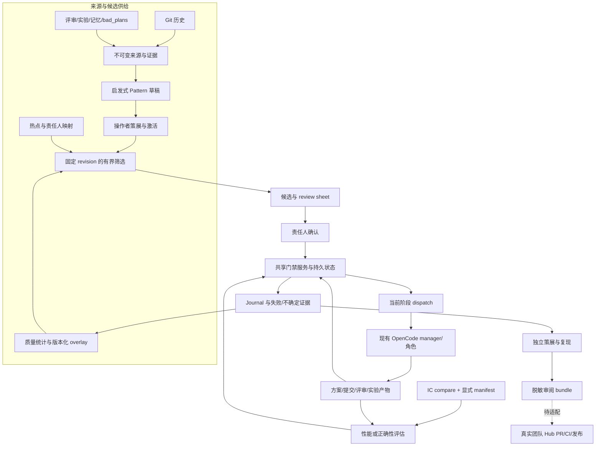
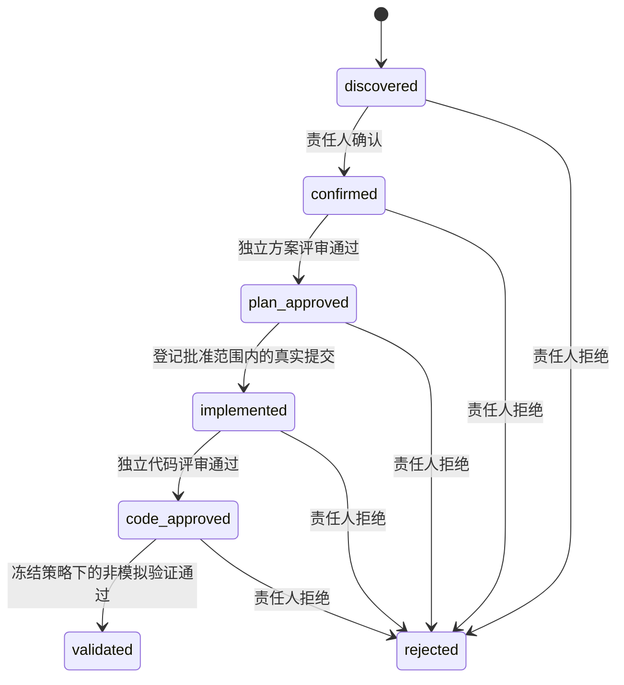

# HMOPT Evolution v2：通用优化平台方案与实施计划

状态：本地能力与平台接入契约已实现，生产接入待验收。基准日期：2026-09-10。

本文是吸收另一版设计后的正式实现方案，补充并修订 [v1 设计](C:/Users/irtos/ryan/workspace/hm-kernel-llm-opt/docs/EVOLUTION_PLATFORM_DESIGN_CN.md) 和 [原路线图](C:/Users/irtos/ryan/workspace/hm-kernel-llm-opt/docs/EVOLUTION_ROADMAP_CN.md)。取舍依据见 [设计对比评审](C:/Users/irtos/ryan/workspace/hm-kernel-llm-opt/docs/EVOLUTION_DESIGN_COMPARISON_CN.md)，命令与接入示例见 [v2 操作指南](C:/Users/irtos/ryan/workspace/hm-kernel-llm-opt/docs/EVOLUTION_V2_OPERATIONS_CN.md)。本文中的“已实现”指本仓库已有相应代码及本地验证路径，不表示已经在真实目标内核、设备集群或团队 Hub 上完成生产验收。

## 1. 目标和范围

平台围绕“挖掘 → 筛选 → 确认 → 实施 → 验证 → 沉淀”构建可复用能力。内存、性能、同步、资源管理和可靠性是使用场景；它们共享来源、候选、审批、执行、验证及知识治理机制，不分别复制平台。

本次演进解决 v1 中四个连接问题：平台已有记录如何成为可追溯的候选供给；责任人如何批量审阅；已有 OpenCode 角色与 IC 产物如何进入同一门禁；验证结果如何反哺排序并形成可审阅的知识出口。同时补入纯正确性验收，避免将所有任务强行表示为性能提升。

平台长期目标是提高“有限人力、模型和设备预算内获得的有效优化产出”，而不是提高生成代码量。当前交付以可运行、可检查、可恢复的本地协议为基础；“超大规模生产验证”是借鉴的方法和后续验收方向，不能用外部系统的成果代替 HMOPT 的实际数据。

## 2. 吸收借鉴后的设计决策

| 另一版设计的有价值部分 | 本版吸收方式 | 同时保留的约束 |
|---|---|---|
| 内部历史与 Git 一起参与挖掘 | 增加 memory、review、experiment、decision 来源及 bad_plans 适配 | 非 Git 记录不伪造提交；出处、内容版本、技术否决与资源/测量原因分开 |
| 独立 Pattern 资产 | 保留版本化 Pattern、结构化问题/诊断/配方、出处与适用前提 | 当前蒸馏只生成启发式草稿；种子、关键词或历史合入不直接授予执行权 |
| 责任人 review sheet | 同时导出 JSON 决定表和 Markdown 视图 | 只允许编辑 decision/note；权威上下文来自持久记录，写回调用原门禁 |
| 具体可执行 brief | 新增候选阶段派发记录、task/prompt/handoff 文件与 OpenCode 协议 | 不覆盖单例任务；旧阶段文件不能继续授权新阶段 |
| 现有 IC 比较报告 | 通过显式采集 manifest 转换逐对原始计数，再送统一验证器 | 不信任 aggregate/PASS，不自动读取 previous 目录；缺配对或缺目标不能通过 |
| precision/yield 质量反馈 | 按规则版本统计责任人决定、最新报告、全部尝试和执行类型 | 确认率不叫精度；模拟、坏报告、不确定结论分别计数 |
| probation/overlay | 操作者设置规则版本的绝对排序系数，绑定质量快照 | 不每轮重复乘权重；不因少量决定自动退役或扩大权限 |
| 晋升信号与 Hub 出口 | 导出已策展证据的脱敏审阅清单，明确待映射和待发布状态 | 当前不是原生 Hub 安装包；不自动 PR、合入、发布或安装 |
| 12 个启动种子 | 形成只读研究模板，包含证明义务、反例和验收方向 | 不自动激活，不将结构线索当成已发现缺陷 |
| 分阶段和预算运行 | 提供有检查点的 discovery 批次、明确 partial/failed 与覆盖状态 | 批次停在人工审阅前；时间预算不是取消执行器，不代表全库吞吐承诺 |

不采用三种混淆：`validated` 不等于 landed；责任人拒绝不等于全局技术反模式；知识沉淀不能覆盖原来的成功、失败或未验证结论。

## 3. 总体架构

### 3.1 平台层次

1. **证据层**：保存来源、方案、提交差异、评审、原始报告及派发文件。身份和内容摘要共同构成证据链；文档内容不作为工具指令执行。
2. **发现层**：冻结目标 revision，按预算处理历史和内部来源，只对已激活规则筛选，输出候选、排序理由和覆盖信息。
3. **控制层**：共享服务决定责任人、方案评审、实施范围、代码评审及验证是否满足条件。CLI、MCP、表格和 Markdown 均不能另设一套状态真相。
4. **执行接入层**：以阶段化任务文件连接既有 manager 和角色。派发持久化与真实 Agent 执行分开记录；Python 服务不内置新的自主执行引擎。
5. **评价层**：冻结性能或正确性策略，接收完整证据后重算裁决。转换器负责映射，不能替验证器宣布成功。
6. **学习治理层**：从记录和原始报告重算质量，保留版本、原因和分母，通过人工 overlay、召回与策展反馈下一轮。

当前接口以类型模型和服务函数实现；尚未交付统一 `ScenarioSpec`、插件注册 SDK 或任意第三方执行器自动发现机制。

### 3.2 实现映射

| 模块 | 职责和已交付结果 |
|---|---|
| [store.py](C:/Users/irtos/ryan/workspace/hm-kernel-llm-opt/src/hmopt/evolution/store.py) | SQLite WAL、版本记录、内容寻址证据、幂等请求、事件、历史游标与结果抑制 |
| [mining.py](C:/Users/irtos/ryan/workspace/hm-kernel-llm-opt/src/hmopt/evolution/mining.py) | 有界 Git 读取、第一父链历史分页、历史草稿、字面规则/热点/责任人筛选及覆盖统计 |
| [sources.py](C:/Users/irtos/ryan/workspace/hm-kernel-llm-opt/src/hmopt/evolution/sources.py) | 非 Git 来源契约、工作区白名单导入、内容谱系、逐项错误隔离、启发式蒸馏与处理标记 |
| [discovery.py](C:/Users/irtos/ryan/workspace/hm-kernel-llm-opt/src/hmopt/evolution/discovery.py) | 固定 revision 的分阶段发现批次、预算、检查点、恢复代次和结果摘要 |
| [service.py](C:/Users/irtos/ryan/workspace/hm-kernel-llm-opt/src/hmopt/evolution/service.py) | 候选状态、身份声明检查、文件范围、提交和评审摘要、两类验收、知识捕获与晋升 |
| [workflow.py](C:/Users/irtos/ryan/workspace/hm-kernel-llm-opt/src/hmopt/evolution/workflow.py) | 审阅表导入导出、可恢复派发、无覆盖文件发布、OpenCode 任务投影 |
| [validation.py](C:/Users/irtos/ryan/workspace/hm-kernel-llm-opt/src/hmopt/evolution/validation.py) | 性能策略、配对 A/B、方向感知收益、区间与护栏判定 |
| [correctness.py](C:/Users/irtos/ryan/workspace/hm-kernel-llm-opt/src/hmopt/evolution/correctness.py) | 正确性策略、基线复现、候选必需检查、本地/硬件/模拟执行声明 |
| [reports.py](C:/Users/irtos/ryan/workspace/hm-kernel-llm-opt/src/hmopt/evolution/reports.py) | 显式 IC manifest 校验、逐对计数转换、原始输入与转换报告的证据关联 |
| [learning.py](C:/Users/irtos/ryan/workspace/hm-kernel-llm-opt/src/hmopt/evolution/learning.py) | 质量重算、人工绝对 overlay、已策展证据复核和脱敏审阅导出 |
| [seeds.py](C:/Users/irtos/ryan/workspace/hm-kernel-llm-opt/src/hmopt/evolution/seeds.py) | 12 个不可执行研究模板，供策展和后续评测集建设 |
| [cli.py](C:/Users/irtos/ryan/workspace/hm-kernel-llm-opt/src/hmopt/evolution/cli.py)、[mcp.py](C:/Users/irtos/ryan/workspace/hm-kernel-llm-opt/src/hmopt/evolution/mcp.py) | 同一服务的操作者入口与本地 Agent 工具；MCP 不开放 owner/curator 决策 |
| [demo_v2.py](C:/Users/irtos/ryan/workspace/hm-kernel-llm-opt/src/hmopt/evolution/demo_v2.py) | 在新建临时仓库演示来源到 journal 的协议，明确区分功能冒烟与模拟 IC 数据 |

## 4. 核心对象与一致性契约

| 对象 | 必须绑定的身份/内容 | 变更语义 |
|---|---|---|
| `ChangeRecord` | Git 提交、父提交、路径、差异、出处 | 现有历史对象不可变；截断必须显式保留 |
| `EvidenceRecord` | 声明的 repo_id、来源类型、相对 URI、内容与摘要、可选相关 revision/原因 | 内容变化产生新 source_id；同位置通过 location_id 关联多个版本 |
| `Pattern` | pattern_id/version、问题/诊断/配方、规则、前提、风险、来源 | 草稿经策展激活；新版本不覆盖旧证据；退役不自动回退到更旧活跃版本 |
| `Candidate` | 仓库位置与 revision、源码摘要/锚点、Pattern 版本、责任人、命中依据 | 未批准快照可重筛更新；批准后不静默改写 |
| `ReviewSheet` | sheet_id、候选版本、持久上下文摘要、原始条目集合 | 仅 decision/note 可编辑；每项重新经过服务校验 |
| `Plan` / `Review` | 候选、基线、作者、精确 allowed_paths、冻结策略；评审绑定 subject_digest | 摘要不匹配、同人违规评审、策略漂移不通过 |
| `Implementation` | 基线、实现提交、实际差异、路径集合、patch 摘要和证据 | 必须为批准基线的后继提交；包含重命名源路径的范围检查 |
| `Dispatch` | 候选阶段/版本/摘要、发起人、输出位置、文件内容和摘要 | 先占位后发布；相同合法请求可恢复；旧阶段请求不能重新取得执行许可 |
| 验证报告 | 候选/实施、冻结策略、基线与候选产物、环境、原始样本或检查 | 裁决由服务重算；模拟、失败、不确定结果保留并封存 |
| `Skill` / `Overlay` / `Bundle` | 来源证据、规则版本、质量快照、策展结论和导出状态 | 知识、排序和发布是不同对象；导出不改变候选验证结论 |

SQLite 保存记录版本和内容摘要。候选转换、验证、晋升、overlay 和派发认领使用其明确的乐观锁/幂等协议；相同请求 ID 配不同参数必须拒绝。来源导入、蒸馏等采用内容身份和处理标记，不声称所有写入口都有完全相同的事务和参数契约。

原始 JSON 证据可以通过摘要取回并校验，Git 差异亦保存独立摘要。此机制验证“当前内容与当时记录一致”，不能证明输入的作者、设备或外部系统声明真实，也不是外部不可篡改审计系统。

## 5. 来源、蒸馏与发现批次

### 5.1 将已有平台经验纳入证据

工作区导入只读取明确白名单：`.opencode/memory`、`.opencode/plans`、`.opencode/reviews`、`.opencode/experiments`、`.opencode/bench/results`，以及 state 目录中约定的 bad_plans 文档。支持 Markdown、文本和 JSON；模板、README、隐藏项、符号链接/重解析点等有明确跳过或拒绝处理。不扫描凭据配置，也不执行文档中的命令。

来源原因区分 `technical_rejection`、`resource_limit`、`measurement_failure`、`accepted`、`unknown`。资源不足和测量失败仍是运营证据，但不自动成为技术反模式。来源元数据由输入或明确格式提供；不能将一次普通拒绝推断为缺陷证明。

工作区导入首先冻结有界文件清单及原始文件摘要，随后通过持久 `source_cursor` 按同一 manifest 分页。翻页时重新读取并核对文件，文件变化必须报告，不能混入旧快照；快照创建后新增文件进入下一次新快照。导入游标与蒸馏页检查点分别保存，避免恢复后不断重读第一批记录。

源身份包含声明的 repo_id 和相对 URI，利于追踪来源位置；当前 Git 候选与历史游标仍使用本地仓库路径。这不是已完成的跨克隆、跨团队统一身份系统，二者的迁移与关联需在生产接入阶段处理。

### 5.2 蒸馏保持低风险和可解释

当前蒸馏器提取技术叙事中的有界代码线索，每条来源最多生成有限数量的草稿；每个草稿明确“尚未证明是问题、修复或上下文示例”。草稿包含出处、未决前提和验收选择要求，不推断可执行修复。来源发生变化时产生新的不可变证据，默认蒸馏分页通过处理标记向前推进。

12 个种子用于研究任务和评测素材，不是默认启用的 Matcher。例如重复原子读取可能承载进度保证，循环内锁可能仍是必需同步，MMIO 操作可能具有不可合并副作用；这些约束必须成为策展和方案评审的证明义务。

后续 LLM 蒸馏接入应输出同样的类型对象、出处和 unknown，不获得直接激活权限；离线启发式与真实模型调用应能独立统计。

### 5.3 Discovery 的运行和恢复

`DiscoveryConfig` 冻结仓库、目标 revision、来源工作区/身份、责任人、热点、页数、文件数、Top-K 和阶段调度预算。批次依次执行解析 revision、Git 增量挖掘、内部来源导入、蒸馏、筛选，保存已完成阶段和每阶段结果，最终停在 `awaiting_review`。

批次运行状态与候选审批状态分开：`running` 表示当前工作者在处理发现批次；`partial` 表示还有可继续的有界页面；`requires_attention` 表示来源变化、损坏或需要修复；`requires_partition` 表示硬上限或源码覆盖不足，需要调整输入后新建批次；`failed` 保存失败阶段；`awaiting_review` 只表示发现阶段处理完成。它不确认、派发、实现或验证候选。需要修复/分片的结果不能靠重复恢复同一批次伪装成向前推进。

同一批次的配置摘要不可变。恢复时使用代次和版本检查，旧工作者不能覆盖新代次的检查点。恢复仍在运行的批次必须先核实旧工作者已停止；当前没有跨进程心跳租约，也不具备强制取消外部命令的协议。时间预算控制阶段之间是否继续调度，不承诺在预算到达瞬间中止正在进行的 Git 调用。

来源分页、未处理记录和错误必须显式呈现；重复导入不能让前一页永远占满预算。即使导入和蒸馏可继续推进，源码匹配仍是有界扫描，尚无完整的可恢复文件分片游标。匹配覆盖不足或 Top-K 截断不能被表述为“全库无机会”。

## 6. 责任人审阅与执行状态机

验证失败、不确定或模拟尝试保留在 `code_approved` 并封存报告，不产生新的可执行 handoff。不确定结果可由责任人说明原因后重新开放测量，保留旧尝试、原提交和原策略；这不允许重新设计或更换实现来复用旧评审。当前未实现完整的新方案/新实现 attempt 图及自动重试次数预算。

Review sheet 同时保存责任人可读内容与不可变上下文。导入只接受 confirm/reject/空决定，每项独立通过原服务转换，输出 applied、skipped、error 或 conflict。修改 owner、revision、源码摘要或候选版本不能改变权威记录。重复提交的确定性请求 ID 不重复生效；已提交项修改决定后重试会冲突。

计划拒绝和代码评审拒绝会阻止推进，但当前不是独立持久化的“评审拒绝状态机”；拒绝意见应作为产物或 journal 证据保存。不得把写出 `decision: approve` 的 Markdown 当成服务已批准。

## 7. OpenCode 接入：四个阶段、每次刷新

本次复用现有 manager、research、plan-reviewer、coder、code-reviewer、tester。新增 [evolve-candidate 命令](C:/Users/irtos/ryan/workspace/hm-kernel-llm-opt/.opencode/commands/evolve-candidate.md)，并在 [manager](C:/Users/irtos/ryan/workspace/hm-kernel-llm-opt/.opencode/agents/os-opt-manager.md) 和 [handoff 协议](C:/Users/irtos/ryan/workspace/hm-kernel-llm-opt/.opencode/skills/handoff-contract.md) 中提供 Evolution 分支。旧非 Evolution 任务保持既有流程。

### 7.1 派发文件和恢复协议

每个候选阶段/版本有独立派发目录及数据库记录。`handoff.json` 是服务证据包，`brief.md` 是角色边界和具体工作要求，`task.json` 是现有 Pipeline 可读取的任务投影。

派发先持久化 reservation，再发布不可变文件，最后记录 staged。文件采用不覆盖的原子发布，task.json 在 prompt/handoff 后发布；重试能补齐缺失文件，已存在但内容改变的文件不会被覆盖。发布前后均核对候选版本。派发记录和导出文件不是执行租约，staged 不表示 Agent 已运行。

MCP `evolution_dispatch(candidate_id, actor, request_id)` 的输出位置由服务固定在自身 dispatches 目录内；不允许 Agent 指定任意写入目录。操作员 CLI 可以选择显式输出位置。对同一已认领阶段改换输出或身份会冲突；新阶段使用新的请求和目录。

### 7.2 角色和产物

| 服务阶段 | handoff 角色 | 现有角色和必要产物 | 源码权限 |
|---|---|---|---|
| confirmed | architect | source researcher 完成机制验证和 Plan，独立 plan reviewer 评审；两者合并提交方案门禁 | 不允许修改 |
| plan_approved | implementer | code agent 实现已评审方案，返回不可变 commit 与差异 | 仅 exact allowed_paths |
| implemented | reviewer | code reviewer 独立评审真实实现及其摘要 | 不允许修改 |
| code_approved | validator | tester 按冻结策略产出 ABReport 或 CorrectnessReport | 不允许修改 |

用户提供绝对 task 路径后，manager 读取任务及关联文件，调用 `evolution_show` 和 `evolution_handoff`，核对候选、版本、角色、仓库、基线、摘要、范围和策略，再真实调用 delegate。每次子角色返回后先提交服务门禁；如有下一角色，则调用 `evolution_dispatch` 获取新阶段文件，重新刷新 handoff 后继续。架构阶段内进入独立方案评审前也需刷新。

运行进度和新产物写入明确的 attempt 目录；task/brief/handoff 保持不可变，不更新 `.opencode/state/current_task.json` 或 current_prompt 单例。拒绝用老任务文件执行新角色，也不通过改变本地 status 推进服务状态。

Python 负责暂存和校验，真实 Agent 委派由外部 OpenCode runtime 执行。MCP 连接、delegate 工具、worktree 隔离或执行能力缺失时，需报告具体限制，不能把生成 brief 当作运行成功。责任人、重测授权、策展和发布仍是操作者行为，角色之间的常规继续不额外增加人工确认。

## 8. 验证方案与既有 IC 产物接入

### 8.1 性能验收

方案评审冻结主指标及护栏，包括名称、单位、方向、最低改善、最大回退、最少配对数和环境。ABReport 绑定基线/候选 revision、镜像摘要、设备、工作负载配置、环境、原始配对样本及功能结果。

评价器计算方向归一化的逐对百分比。主指标需要正向均值，且双侧 95% Student-t 区间下界达到阈值；护栏采用平均回退上限。至少三对样本，较大样本数使用保守临界值。缺数据或不一致可以是不确定结论，明确功能失败或护栏回退是失败；两者不能计作通过。

统计模型不消除热漂移、样本相关、实验选择偏差、测量器误差或工作负载不代表性。生产应冻结实验顺序、采样和重复规则，保存全部尝试，再以实际数据校准功效、阈值和适用统计方法。

### 8.2 IC 转换契约

转换输入必须由操作者或可信采集器显式指定，包括原 compare 对象和 `ICManifest`。manifest 绑定候选、方案/实现摘要、compare 内容摘要、层级/目标、两个不同结果目录、基线/候选构建身份及环境，不能借用隐式 previous 结果。

转换器核对 success、存在时的底层 returncode、比较层级及名称、每个 case/round/step 的唯一配对、两侧目标确实找到、计数为范围内精确非负整数。它从 `reports` 中提取 baseline/candidate 原始值，重新形成 ABReport；aggregate 与人工 verdict 不能决定验收。

原始 compare、manifest 和转换结果保留同一证据链。转换器以完整报告摘要登记 `report_conversion`，验证服务据此复核候选/方案/实现绑定及原始来源的存在和摘要，将 `source_evidence` 写入验证记录与事件。报告内容改变后不会自动继承原转换来源。服务也允许普通采集器提交没有 IC 转换记录的 ABReport，因此该关联不是对所有报告来源的认证或 IC-only 强制策略。转换本身不推进 candidate 状态，也不使报告更有资格通过硬件验收。

当前 IC 适配只支持冻结策略中唯一一个指令数指标、minimize 方向及适当单位。若计划有其他护栏，必须由支持那些指标的采集器提供完整 ABReport，不能为兼容转换器而移除护栏。适配器不自行启动 IC 测量、检查实际设备或证明镜像对应某次构建。

### 8.3 正确性验收

Plan.validation 支持独立 `CorrectnessPolicy`，冻结必需检查、基线复现检查以及 local/hardware 执行类型。基线必须在约定的 reproducer 上失败，候选必须通过全部 required checks，并保留产物和证据摘要。未执行、skipped、基线不能复现、环境不同等不能自动成为成功；功能回归或候选必需检查失败会产生 fail。

正确性通过可以在已批准的本地执行环境完成，不要求虚构性能收益；它与硬件性能验证在报告、质量统计和导出中分别标记。当前不是任意形式化证明框架，也未提供组合“正确性主验收 + 全部性能护栏”的通用复合 evaluator。

检查 evidence_sha256 和运行元数据目前仍由采集者声明。检查字段与摘要合法不等于独立验证日志真实存在、内容证明检查执行过；可信采集、日志解析与执行认证属于生产适配工作。

## 9. 学习、排序和知识出口

### 9.1 重算质量，保留分母

质量报告按 Pattern 版本读取候选事实和验证证据，重新解析报告并计算裁决，核对候选、提交、策略和缓存结果，并复核验证时冻结的 IC 原始来源引用。后续新增转换映射不会替换历史验证所绑定的来源。它区分最新报告与全部测量尝试，按 performance_hardware、correctness_local、correctness_hardware 分类，单列 simulation、invalid、inconclusive 和未报告。

责任人确认率使用已决定的独立候选为分母，最终拒绝优先；当前 `true_precision` 明确未知，因为尚无独立适用性真值标签。一次确认后再拒绝不能同时算两条独立决定。质量报告不把 journal 中一句“成功”当成有效实验，也不把重复请求变成多个候选。

当前质量报告是本地记录的累积快照，带内容摘要；尚无完整按时间窗口、团队、场景切片的统计系统，也没有将所有实际模型/构建/设备成本自动采集到账本。不能把“候选通过数”直接解释为已合入收益或生产节省。

### 9.2 Overlay 和能力自进化的实际含义

操作者可给某个 Pattern 版本设置 active/probation、0..1 的绝对 factor、理由以及绑定的质量快照。筛选基于基础分重新乘本次 factor，避免每轮重复衰减；probation 将命中送工作台。更新需版本与幂等检查。

本版反馈闭环实际由四部分构成：历史结果抑制重复建议、经验召回、质量报告支持人工调整、独立策展后增加/更换规则。没有自动训练模型、自动改写规则、自动选择退役阈值或自行扩大执行权限。自动调整必须先经留出集和对照验证。

### 9.3 Journal、策展与 bundle

六种知识信号继续进入 journal：验证结果、失败原因、有效配方、专家决定、结构事实、知识纠正。它们引用历史、平台来源或候选证据；捕获本身不产生晋升资格，纠正记录也不自动使旧条目失效。

非模拟验证通过并经独立策展后可进入本地 staging。进入本地 hub 还需要多个已策展上下文及不同产物对的复现记录；这些是当前规则使用的独立性代理，不能独立证明实验在不同生产条件下成立。

Bundle 导出前复核真实通过报告、方案/实现评审、差异证据、独立策展和知识绑定。输出 `proposals.jsonl`、`review_checklist.md`、`manifest.json`，只保留必要的摘要引用和有限元数据，默认不携带源码、配方全文、私有绝对路径、参与者身份或设备信息。

这是 **adapter-neutral review manifest**：`native_hub_package=false`、`published=false`、`merged=false`。它不是可安装技能，摘要也无法代替可共享的技能正文。实际团队 Hub schema、审阅说明、原生目录结构、PR/CI、版本发布和安装分发仍需适配；本版没有向任何外部 Hub 写入内容。

## 10. 已交付、接入待验收与后续能力

| 状态 | 内容 | 当前验证边界 |
|---|---|---|
| 已交付本地能力 | 来源快照/草稿、发现批次、review sheet、持久派发、两类验证、IC 转换、质量/overlay、脱敏 bundle、CLI/MCP | 通过本地类型、门禁、坏输入、恢复与临时 Git 测试验证 |
| 已交付接入协议 | OpenCode 显式任务路径、角色映射、MCP 刷新/提交/新阶段派发 | 已核对 Pipeline 任务载体；尚未据此声明外部 runtime 完成真实模型闭环 |
| 已交付演示 | demo-v2 串联来源、策展、审阅、四阶段任务文件、真实临时 Git diff、模拟 IC 转换、验证和 journal | 仅临时 Python 功能冒烟实际执行；性能数字、镜像和参与者身份为 fixture |
| 接入待验收 | 实际团队记录、真实 target repo、负责人映射、OpenCode MCP 配置、IC 采集器与设备流程 | 需完整保留来源和失败分母；目前无真实目标优化收益证据 |
| 后续规模能力 | 跨仓库身份/多分支采集、文件分片覆盖、语义/AST judge、持久执行队列、worktree/设备租约、身份认证 | 当前本地预算和检查点不等价于分布式生产系统 |
| 后续知识治理 | 校准过的自动调整、留出集、原生 Hub bundle/PR/CI、发布/失效/撤回 | 当前是人工决定与脱敏导出，不是自动发布或技能安装 |

## 11. 分阶段落地计划与退出条件

阶段按依赖及验收推进，不以未经容量实验支持的天数承诺交付。每个阶段都应产生可复核产物、全部尝试分母和明确未完成项。

### M0：本地协议整合与负例验收（本次交付）

- **交付**：上述模块、统一 CLI/MCP、正式设计与操作指南、demo-v2，以及覆盖状态冲突、来源篡改、模拟隔离、发布恢复和不覆盖文件的测试。
- **退出条件**：本地源 → 草稿 → 策展 → 候选 → 责任人决定 → 四阶段产物 → 验证 → journal 可重放；坏输入和不一致证据不能推进状态；崩溃后可恢复明确进度。
- **不计入**：真实 LLM 生成质量、内核收益、设备容量、Hub 发布成功。

### M1：小范围真实平台接入

- **责任**：平台维护者提供服务部署和隔离配置；模块责任人提供归属及适用性判断；执行器维护者接入 OpenCode；测试维护者提供可信报告样本。
- **交付**：真实 repo/来源清单、MCP 配置、角色身份约定、隔离 worktree、冻结策略样例、真实 IC 或正确性采集 manifest、原始产物解析器。
- **退出条件**：有限范围候选完整走过授权及门禁；所有实验能从原始数据重算，未完成和失败显式记录；未越界修改、无单例覆盖、无模拟进入真实结果；责任人能解释接受或拒绝原因。
- **衡量**：确认率、独立适用性人工标签、无效测量率、人工审阅时间、真实验证通过率、单候选模型/构建/设备成本。样本小只能说明接入可用，不能证明整体精度。

### M2：覆盖、恢复与资源调度

- **依赖**：M1 的真实数据、失败分类和运行开销。
- **交付**：稳定 repo 身份迁移、多分支/评审事件游标、文件分片 manifest、已处理项补位、每 Pattern/团队配额、短事务与 outbox、worker 认领/心跳/取消、worktree 和设备租约、备份恢复。
- **退出条件**：明确证明覆盖或明确报告缺口；在解析、模型、构建、设备和提交边界做故障注入，无重复实际执行或丢失已接受转换；恢复点和恢复耗时可测。
- **容量实验**：给定提交/文件大小、Pattern 数、冷热缓存、设备和并发，测吞吐、P95/P99、失败率及成本。5 万提交/10 分钟之类仅可作为待测目标，不能由线程数推导。

### M3：语义质量与受控学习

- **依赖**：M1/M2 形成独立标签、完整实验谱系及可回放语料。
- **交付**：版本绑定的语义索引/AST 前提检查、可弃权 judge、跨目标留出集、不同分母和窗口的质量档案、有效期/恢复/复核采样机制、受预算约束的 LLM 蒸馏。
- **退出条件**：新召回和排序相对基线提升有效候选或降低成本；无效建议率、漏检、误停率、校准误差和执行成本均报告，自动 probation 不能仅以“触发过一次”为验收。
- **权限**：学习策略可以建议优先级和新规则草稿，不能跳过责任人、独立评审、冻结验证或自行获得源码写权。

### M4：团队知识发布与持续运营

- **依赖**：真实 Hub 的 schema、策展、CI 和发布协议已确认。
- **交付**：审阅 bundle 到原生技能的适配、经批准的可共享正文、私有数据检查、复现评测、PR/CI、版本发布及安装、失效撤回；合入/部署记录独立于验证。
- **退出条件**：来源、评审、验证、发布和使用效果可追溯；技能升级不静默套用旧 overlay；撤回能阻止新任务继续使用失效版本；团队发布和执行身份可以认证授权。
- **持续运营**：负责人有效候选数、真实收益和回退、跨上下文复现、长期成本、知识复用有效率优先于新增 Pattern 数量。

## 12. 规模、真实性和执行边界

当前是有界单机实现。Git 历史按第一父链采集，合并差异不能代替完整评审图。活跃规则一次最多 256 个，服务注册版本读取和匹配保留数量有上限；扫描按文件/字节/时间预算执行。Top-1000 匹配之后的结果抑制或 overlay 不能找回已经被截断的低分候选，当前仍可能遗漏补位机会。

| 当前预算 | 默认或硬上限 | 超限时的含义 |
|---|---|---|
| 非 Git 单文档 / 导入页 | 单文档 256 KiB；一页最多 1000 条、16 MiB；发现批次默认每页 200 条、8 MiB | 不能截断后当完整证据；返回页面或需处理状态 |
| 工作区来源 manifest | 最多 10000 个文件、100000 个目录项、64 MiB 原始内容 | 硬上限触发 requires_partition；不是全工作区覆盖 |
| 源码筛选 | 默认 5000 个树条目，可配置至 50000；默认单文件 1000000 字节、累计 blob 64 MiB | 报告 coverage；不具备跨页文件扫描恢复 |
| 规则和候选 | 单次最多 256 活跃 Pattern；最多保留 1000 个匹配；批次默认 Top-20 | 限制产出与内存，不能承诺召回完整 |
| Review sheet | 最多 1000 条、文件 32 MiB | 应拆分审阅批次，不能通过减少字段绕过摘要 |
| Discovery 调度 | 默认 120 秒、每类分页阶段每次最多 5 页；参数有类型和范围限制 | 在有界阶段之间停止，不保证即时取消当前外部命令 |
| IC 转换 / Bundle | IC 最多 10000 对；等价转换报告最多 32 份来源；导出最多 1000 条已策展知识 | 超限明确拒绝或要求拆分，不隐式裁剪验收数据 |

内部来源单文档、单批字节和条数均有上限；预算超限、损坏来源和未扫描范围必须保留状态。源码覆盖不全时不应宣称“所有文件都匹配完毕”，没有激活规则也不能被解释为仓库不存在优化机会。

SQLite 单写者串行，部分操作在事务内进行 Git 检查或生成产物；质量和词面召回仍可能全表扫描。已有版本和恢复协议不能代替数据库迁移、外部对象存储、灾备以及多节点吞吐验收。

本地 actor 是调用方声明，不同字符串不证明不同人。MCP 工具不开放 owner/curator 动作，但本机同权限进程仍可能访问 CLI/数据库。生产需把身份、授权、代码执行、设备操作和可信采集放在独立边界内。来源相对路径和允许文件检查也不能替代 OS 沙箱。

`hardware_verified` 的当前含义是报告的硬件声明满足内部检查，不是设备远程证明。正确性 local/hardware 声明亦同。未接入可信构建/采集之前，不能由 JSON 推断某镜像确实来自某提交、设备执行过指定测试或证据日志未被伪造。

## 13. 验证记录与设计核对

本版回归应包括：来源去重/新版本/白名单/分页、发现检查点与覆盖、审阅上下文篡改、独立身份与批准范围、派发占位/崩溃/过期/不覆盖、原始 IC 配对与来源绑定、正确性基线复现、策略漂移、质量分母与模拟剔除、overlay 幂等、导出脱敏及来源完整性。具体命令和本轮结果由操作指南记录，避免把计划中的验收项目当作已完成实验。

demo-v2 的数字具有明确 simulation 标识，hardware_executed、agent_started、merged、published 均为 false。模拟测试能证明协议边界和分支运行，不能证明真实优化收益；模拟知识晋升和 bundle 导出应被拒绝。

交付时应逐项保持以下一致性：

1. 文档所称“自动运行”只能指已接通的工具/manager 调度步骤，不能指 Python 内置了未经实现的 Agent 引擎。
2. 文档所称“完成扫描”必须对应明确覆盖，不能把一个有界批次结束当成全库覆盖。
3. 文档所称“有效验证”必须区分模拟、声明的本地执行、声明的硬件执行及未来可信采集。
4. 文档所称“质量提高”必须有独立标签或实验对照，不能由确认率、种子数量或手动降权推断。
5. 文档所称“知识发布”必须有真实目的地版本与发布证据，不能由本地 tier=hub 或导出 manifest 推断。

以上边界与当前实现能力相符；尚缺的生产能力已分配到 M1–M4 的交付物和退出条件，不以文档描述替代实现或验收。
