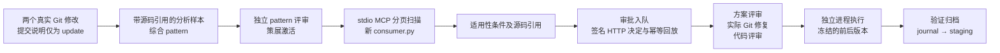

# Evolution 全流程走查与修复记录

日期：2026-09-14。基线：`opencode` 分支 `b2fd5bb`。

## 范围与验收口径

本次检查共享配置、多个指定 Git 仓库、历史源码取证、pattern 综合与评审、
扫描与适用性评估、专家通知与认证回调、方案/代码门禁、实验执行及经验归档。
保留现有 OpenCode 角色、Skill、统一 MCP 与 SQLite 证据库，不增加另一套工作流。

测试分为全量基线巡检和修改后的定向回归，结果见下表。
本地测试使用临时 Git 仓库、真实 SQLite、真实 stdio MCP、进程内 HTTP 和本地测试进程。
模型输出、专家选择和角色评审是明确的测试样本；SMTP 使用替身，无真实外部邮件发送。
不把这些结果解释为真实 LLM 的诊断准确率、企业 SSO 验收或真机性能收益。

## 修复的问题

| 问题 | 原来的影响 | 本次处理 |
|---|---|---|
| 独立扫描进入 attention 后缺少控制入口 | 错误解决后仍无法续跑，只能重新开始 | 统一 `control_scan`，提供版本绑定的 retry/cancel；复用原 MCP 工具，补 CLI 和工作台入口 |
| 项目重试遗留 resume_stage/error | 历史阶段失败过一次后，后续分析失败可能错误回到历史阶段 | 重试清除旧恢复信息；扫描异常明确记录恢复阶段 |
| 首个扫描页失败可能丢失 run 与 scan 的关联 | 扫描成为孤立任务，取消 run 时找不到它 | 创建或重放 scan 时，在同一事务中绑定项目检查点 |
| 取消 run 没有取消扫描 | 后台仍可能继续扫描、生成候选 | 同一事务级联取消关联扫描；归档候选前校验扫描版本，拒绝迟到写入 |
| 独立 scan 可绕过工作区选仓检查 | 直接调用可能扫描未选择的仓库 | 与已有扫描服务保持一致，必须属于明确选择的 Git 项目 |
| SMTP 只支持隐式 TLS | 部分企业 587/STARTTLS 服务无法接入 | 增加唯一必要字段 `smtp_security`；STARTTLS 在登录前完成，失败不降级明文 |
| 通知未复核当前候选/pattern | 已变更或失效的证据仍发给专家；旧请求可能阻塞新请求 | 发送前复核版本、状态及摘要；过时通知进入 obsolete；去重包含 pattern 摘要 |
| 邮件错误无法定位 | 只能看到 uncertain，不知道认证或连接问题 | 记录安全的错误类型及 SMTP 数字码；不保存可能含敏感信息的服务器原文 |
| 新字段影响旧审批摘要 | 升级可能使未改变传输行为的审批全部失效 | 默认 SSL 保持原目录摘要算法；实际切换安全模式才改变配置摘要 |
| Docker 未传入审批与 SMTP 标准密钥引用 | 主机设置了变量，容器里仍不可用 | 透传两个标准环境变量，继续支持配置中的环境变量引用 |
| Relay 编码测试依赖 PATH 中的 python3 | 本机命中 Microsoft Store 占位程序，返回 9009，未实际检验编码 | 测试使用当前 `sys.executable`；只在该测试内允许解释器名称，不改变生产白名单 |

重试和取消复用一个服务实现，删除总任务中手写扫描重置逻辑。
没有新增业务 JSON 配置文件，没有复制原来的模型、构建或设备配置。
取消保留已经归档的候选及审计记录，不等同于撤销专家决定或删除证据。

## 贯穿式用例

新增 `tests/test_evolution_workflow_walkthrough.py`，把此前分散验证的接口串成一个流程：

实例为字符串转整数：旧代码 `int(raw) if raw else 0` 对空白字符串报错，
修复使用 `raw.strip()` 判断是否为空。新调用点明确约定空白输入返回 0。
适配器实际读取两个 Git revision 并执行，检查空白复现、空字符串、有符号数字、
带空格数字和无效输入；报告使用实际源码哈希和观测结果摘要。
期待基线复现失败、修改后复现通过、回归通过，并明确 `hardware_verified=false`。

同一用例通过 MCP 查询候选、审批 ID 和实验 ID，验证报告进入候选档案；
策展后经验进入 staging，重复执行已完成实验不会重跑测试进程。
这条路径没有跳过适用性评估、专家确认、方案评审或代码评审。

新增 `tests/test_evolution_workflow_recovery.py` 覆盖实际故障续跑、旧版本控制拒绝、
首个扫描页失败、跨 worker 恢复、取消后的迟到写入、未选仓隔离、
CLI/MCP 版本一致性、STARTTLS 顺序、失效通知及旧审批兼容。

## 测试记录

| 检查 | 实际结果 |
|---|---|
| 全量基线：`tests/` 与 `hm-skill-hub/tools/tests/` | 1249 passed、1 failed、6 skipped；失败为上面的 Relay 解释器问题 |
| 最终代码集中回归：恢复、workspace、production、transport、interfaces、experiments、walkthrough、platform config、Windows Relay | **123 passed，0 failed，0 skipped**，包括已修复的 Relay 用例 |
| 两个新增测试文件 | 15 项场景，包含在上述 123 项中；贯穿式流程实际通过 |
| Evolution 包、统一 Evolution MCP 注册及新增测试的 Ruff 检查 | 通过 |
| Git 差异与换行检查 | `git diff --check` 通过；16 个变更/新增文件均无 CRLF、无 UTF-8 BOM |

全量初测的 6 项跳过来自：两个索引测试模块缺少可选 LlamaIndex 依赖，
另四项符号链接测试缺少本机 Windows 权限。它们不作为测试通过计数。
索引依赖和权限补齐后的对应验证仍待实际执行。
最终回归保留一条 Starlette/AnyIO 的依赖弃用提示，没有测试失败。

全量初测与最终集中回归是两次不同范围的运行；没有把定向结果写成“修改后又跑过全量”。
日志与 JUnit 存放于本机临时目录 `hmopt-workflow-review-ff2be4b4aea1405c904c90cd6ce81677`。
`results.xml` 对应全量初测，`final.xml` 对应最终 123 项回归，`doctor.log` 对应实际本机准备检查。

## 当前部署状态与能力边界

对本机默认 `configs/app.yaml` 实际执行了只读 `doctor --json`。
MCP 38 个工具注册检查通过；当前未登记发现项目，未配置所需工作台目录，
`ready_for_discovery=false`。本轮没有替用户猜测业务 Git 范围、责任人或外部服务地址。
运行前仍需按现有共享 YAML 配置这些业务信息，见配置目录 README 和多仓运行指南。

框架的字面规则匹配负责缩小范围，语义适用性仍由带引用的研究与专家确认负责。
测试不证明大规模模型产出质量；需用业务历史和带标签候选评估精度、召回及成本。
企业审批页面/SSO 网关由企业系统接入，当前不解析自由文本邮件作为批准。
性能验收仍需要真实构建、刷机与 A/B 原始测量；本次本地正确性通过不能代替它。
通过一次本地闭环也不自动获得 Skill Hub 发布权限，仍沿用原有策展门禁。
