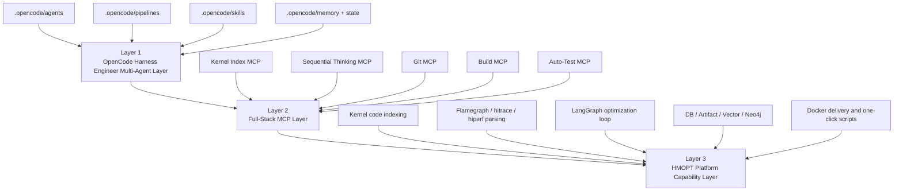
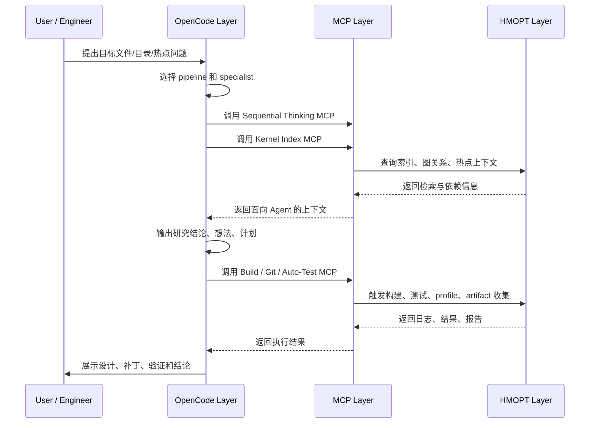

# HMOPT / OpenCode 三层整体设计与目录代码说明

## 1. 文档目的

这份文档用于快速说明当前仓库的整体设计、核心能力、模块边界、典型工作流，以及各目录和关键代码文件的职责。

如果把整个系统讲清楚，最容易理解的方式是按三层来看：

1. OpenCode Harness Engineer 多 Agent 协同层
2. Full-Stack MCP 接入层
3. HMOPT 平台能力层

这三层共同组成了一个面向内核代码分析、性能证据理解、优化方案规划、验证执行和 Docker 交付的完整平台。

## 2. 一句话概览

这个仓库的定位，不只是一个“代码检索服务”，也不只是一个“性能分析工具”，而是一个以 OpenCode 为前端控制面、以 MCP 为统一接口层、以 HMOPT 为后端能力底座的内核优化工作台。

可以把它理解成：

- 上层负责“怎么组织人机协作和多 Agent 工作流”
- 中层负责“怎么把能力标准化暴露给 OpenCode”
- 下层负责“真正完成索引、检索、运行时分析、验证、交付”

## 3. 三层架构总览

## 4. 第一层：OpenCode Harness Engineer 多 Agent 协同层

### 4.1 这一层解决什么问题

这一层主要解决“如何组织分析和优化工作”的问题，而不是直接做内核分析计算。

它负责：

- 接收用户目标
- 识别目标属于哪个子系统
- 选择合适的 specialist agent
- 强制 research-first 工作流
- 约束方案生成、计划审批、代码实现、独立 review、验证和长期记忆沉淀

它的设计目标是把一次零散的人机对话，变成一个有阶段、有产物、有记忆的工程流程。

### 4.2 这一层的核心目录

- `.opencode/agents/`
- `.opencode/pipelines/`
- `.opencode/skills/`
- `.opencode/docs/`
- `.opencode/memory/`
- `.opencode/state/`
- `src/hmopt/opencode/`
- `configs/pipeline_profiles.yaml`

### 4.3 关键角色

#### `kernel-pipeline-starter`

入口 agent，负责把短任务扩展成完整 pipeline 上下文。

主要工作：

- 读取 pipeline preset
- 读取 skill pack
- 读取 bootstrap docs
- 生成 `.opencode/state/current_task.json`
- 生成 `.opencode/state/current_prompt.md`
- 把任务交给 manager agent

#### `os-opt-manager`

控制面调度器，负责路由和阶段纪律。

主要工作：

- 根据目标路径、关键词、语义判断任务类型
- 把任务分派给 reclaim、hyperhold、sync、workqueue 等 specialist
- 要求先研究后优化
- 在 plan、implementation、review 三个阶段间切换

#### Specialist Agents

典型包括：

- `kernel-source-research`
- `memmgr-reclaim-research`
- `hyperhold-io-opt`
- `basic-mechanism-sync-opt`
- `wq-threadpool-opt`

这些 agent 负责：

- 建立子系统理解
- 输出设计文档
- 提炼热点路径
- 生成优化想法并排序
- 产出批准后的实施计划

#### `kernel-code-agent` 与 `kernel-reviewer`

分别负责：

- 根据已批准计划实施最小补丁
- 进行独立审查，关注并发、生命周期、回归风险和验证完整性

### 4.4 这一层的“持久化产物”

这层最大的价值之一，是所有关键结论都会沉淀为仓库内可追踪文档，而不是停留在聊天记录中。

输出通常写入：

- `.opencode/docs/*.md`
- `.opencode/plans/*.md`
- `.opencode/reviews/*.md`
- `.opencode/bench/*.md`
- `.opencode/memory/*.md`

### 4.5 这一层的代码支撑

Python 侧真正支撑这层的文件很少，重点是：

- `src/hmopt/opencode/pipeline.py`

这个模块负责：

- 读取 `configs/pipeline_profiles.yaml`
- 组装 pipeline prompt
- 初始化 `.opencode/` 工作空间
- 推导 target memory 路径
- 写入当前任务状态

换句话说，这一层以 Markdown 资产为主，以 `pipeline.py` 作为自动化装配器。

## 5. 第二层：Full-Stack MCP 接入层

### 5.1 这一层解决什么问题

这一层解决“OpenCode 如何标准化调用底层能力”的问题。

它把索引、思考、Git、构建、手机测试这些能力，统一包装成 MCP 服务暴露给 OpenCode 或其他 MCP client。

这层是控制面和能力底座之间的桥梁。

### 5.2 这一层的服务列表

| MCP 服务 | 主要用途 | 关键文件 |
| --- | --- | --- |
| Kernel Index MCP | 基于索引和图关系做代码检索、实现理解、影响分析、热点上下文检索 | `src/hmopt/api/mcp_service.py`, `src/hmopt/api/mcp_server.py`, `src/hmopt/api/mcp_stdio.py` |
| Sequential Thinking MCP | 结构化思考、分步推理、假设管理、会话恢复 | `src/hmopt/api/seq_mcp_service.py`, `src/hmopt/api/seq_mcp_server.py` |
| Git MCP | Git 状态、diff、branch、commit 等操作 | `src/hmopt/api/git_mcp_service.py`, `src/hmopt/mcp_server_git/server.py` |
| Build MCP | 触发 Docker 内/跨容器构建 | `src/hmopt/api/build_mcp_service.py`, `src/hmopt/api/build_mcp_server.py` |
| Auto-Test MCP | 通过 `hdc` 驱动手机侧脚本并回收结果 | `src/hmopt/api/auto_test_mcp_service.py`, `src/hmopt/api/auto_test_mcp_server.py` |

### 5.3 Kernel Index MCP 是这一层的核心

Kernel Index MCP 暴露了 3 个最重要的工具：

- `kernel_index_code`
- `kernel_symbol_graph`
- `kernel_hotspot_context`

这 3 个工具面向不同的问题：

- 看实现细节
- 看 caller/callee 和依赖关系
- 看运行时热点相关的代码上下文

它们底层都会进入 `retrieve_kernel_index_context()`，再调用 `retrieve_code_context()`。

### 5.4 MCP 层的协议形态

当前支持三种形态：

- 标准 `streamable-http`
- 标准 `stdio`
- 兼容历史的 `POST /tools/call`

这使得它既能服务 OpenCode 本地模式，也能服务远程模式，同时兼容旧的内部调用方式。

### 5.5 为什么这一层重要

如果没有 MCP 层，OpenCode 只能直接读源文件，得到的是词法级上下文。

有了这层之后，OpenCode 能拿到：

- 向量检索结果
- Neo4j 关系扩张结果
- 基于场景的重排结果
- symbol 路径和行号
- 热点和调用链上下文

因此从“读文件”升级成了“基于索引和关系图理解代码”。

## 6. 第三层：HMOPT 平台能力层

### 6.1 这一层解决什么问题

这一层是真正的后端能力底座，负责“把内核代码、运行时证据和验证动作真正跑起来”。

这一层包括：

- 内核代码索引
- 运行时证据解析
- Flamegraph / hitrace / hiperf 分析
- hotspot 排名与代码对齐
- LLM agent 执行闭环
- DB、artifact、vector、Neo4j 持久化
- Docker 化部署和一键交付

### 6.2 Kernel Code Index 能力

核心目录：

- `src/hmopt/indexing/`
- `src/hmopt/analysis/static/`

其中最关键的实现链路是：

1. `build_kernel_index()`
2. `index_kernel_code()`
3. `CodeIndex -> TextNode`
4. 写入 LlamaIndex 向量存储
5. 可选写入 Neo4j property graph

相关关键文件：

- `src/hmopt/indexing/llamaindex_pipeline.py`
- `src/hmopt/indexing/clangd_indexer.py`
- `src/hmopt/indexing/clangd_client.py`
- `src/hmopt/analysis/static/indexer.py`
- `src/hmopt/analysis/static/psg.py`

### 6.3 Runtime Evidence 与 Flamegraph 分析能力

核心目录：

- `src/hmopt/analysis/runtime/`
- `src/hmopt/analysis/runtime/traces/`
- `src/hmopt/indexing/runtime_ingestion.py`

主要负责：

- 解析 `flamegraph`
- 解析 `hitrace`
- 解析 `hiperf`
- 生成 metric、hotspot、call stack 相关结构
- 把运行时热点和代码符号对齐
- 建 runtime index 供后续检索使用

其中 flamegraph 相关实现尤其重要，因为它支持：

- 符号计数
- 每线程热点
- call stack 提取
- name map 保存
- 对比多个 flamegraph 文件的差异

### 6.4 HMOPT 自动化闭环

核心文件：

- `src/hmopt/orchestration/graph.py`
- `src/hmopt/agents/*.py`

当前执行闭环由 LangGraph 编排，主流程大致是：

1. 初始化 run
2. 静态分析与 repo snapshot
3. baseline profiling
4. evidence 汇总
5. conductor 决策
6. coder 生成 patch
7. apply patch
8. build/test verify
9. reviewer 评审
10. candidate profiling
11. evaluate
12. report

这是一套“研究和执行结合”的自动化 loop。

### 6.5 数据与存储

核心目录：

- `src/hmopt/storage/db/`
- `src/hmopt/storage/vector/`
- `src/hmopt/storage/artifact_store.py`

系统持久化的主要对象包括：

- `runs`
- `artifacts`
- `metrics`
- `hotspots`
- `graphs`
- `patches`
- `evaluations`
- `agent_messages`
- `vector_embeddings`

可以把它理解为：

- DB 记录结构化元数据
- Artifact Store 记录落盘文件
- Vector Store 记录 embedding
- Neo4j 记录图关系和图检索所需结构

### 6.6 Docker 化部署与交付

核心目录：

- `docker/`
- `docker-compose.yml`
- `scripts/docker_oneclick.sh`
- `docs/Docker_OneClick_Delivery.md`
- `docs/Quick_Start_English.md`

这一层支持：

- 单容器交付
- Neo4j 容器内启动
- 离线镜像打包和分发
- 一键启动、索引、MCP、API、Git MCP、Build MCP、Sequential Thinking MCP

这使得它不只是一个开发仓库，也具备“可交付平台”的形态。

## 7. 端到端典型流程

下面是一条从需求到优化产物的典型路径：

## 8. 功能说明

### 8.1 面向 OpenCode 的工作流能力

- 任务 intake 和分层路由
- 子系统研究优先
- 方案排序和审批门控
- 长期记忆与 bootstrap docs
- review 和 validation 输出模板化

### 8.2 面向工程分析的检索能力

- 内核代码语义索引
- symbol 定位和实现片段抽取
- caller/callee 图扩张
- 热点相关代码上下文拼装
- runtime + code 混合查询

### 8.3 面向运行时证据的分析能力

- Flamegraph 解析
- Hitrace 解析
- Hiperf 解析
- hotspot 排名
- call stack 结构化
- hotspot 与代码符号/路径对齐

### 8.4 面向执行和验证的能力

- 自动 patch 生成
- build/test 验证
- rerun profile
- review 决策
- report 输出
- dataset 导出

### 8.5 面向交付的能力

- Docker 一键启动
- 离线镜像交付
- Neo4j 内置
- OpenCode 远程 MCP 配置样例
- 本地 MCP 与远程 MCP 双模式

## 9. 目录与代码说明

### 9.1 顶层目录说明

| 目录 | 作用 |
| --- | --- |
| `.opencode/` | OpenCode 面向的人机协同工作区、agent 资产、记忆与状态 |
| `agent/` | 旧版或草稿型 OpenCode agent 文本，历史资产，当前主工作流以 `.opencode/agents/` 为准 |
| `configs/` | YAML 配置、prompt、pipeline profile |
| `docs/` | 架构、MCP、流程、交付、设计说明 |
| `examples/` | OpenCode MCP 配置样例与最小配置样例 |
| `scripts/` | 启动、索引、打包、服务、手机测试等脚本 |
| `src/hmopt/` | Python 主代码 |
| `tests/` | 当前自动化测试 |
| `docker/` | Docker 相关辅助文件 |
| `data/` | 默认数据、索引、artifact 存储位置 |

### 9.2 `src/hmopt/` 子目录说明

| 目录 | 作用 |
| --- | --- |
| `api/` | FastAPI 与 MCP 服务入口 |
| `opencode/` | OpenCode pipeline session 装配器 |
| `indexing/` | code index、runtime index、query routing、MCP hybrid retrieval |
| `analysis/` | 静态分析、运行时分析、相关性排序 |
| `orchestration/` | LangGraph 工作流编排 |
| `agents/` | Python 侧执行 agent |
| `storage/` | DB、artifact、vector 存储 |
| `tools/` | build/test/perf/git 适配器 |
| `core/` | config、LLM、run context、错误定义 |
| `datasets/` | 结果导出 |
| `evaluation/` | 比较、报告、benchmark 相关 |
| `sequential_thinking/` | 顺序思考服务的 model 与 service |
| `mcp_server_git/` | Git MCP 具体实现 |

### 9.3 建议重点阅读文件

如果同事只想快速建立理解，建议按下面顺序看：

1. `README.md`
2. `docs/OpenCode_Multi_Agent_Design_and_Implementation.md`
3. `docs/OpenCode_MCP_Integration_Guide.md`
4. `src/hmopt/cli.py`
5. `src/hmopt/opencode/pipeline.py`
6. `src/hmopt/api/mcp_service.py`
7. `src/hmopt/indexing/llamaindex_pipeline.py`
8. `src/hmopt/indexing/clangd_indexer.py`
9. `src/hmopt/orchestration/graph.py`
10. `src/hmopt/analysis/runtime/traces/flamegraph_parser.py`
11. `src/hmopt/storage/db/models.py`
12. `scripts/docker_oneclick.sh`

