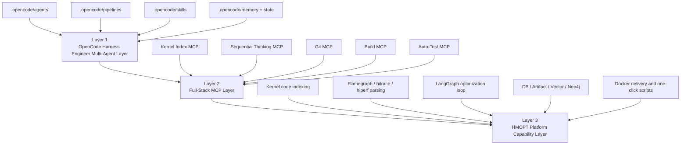
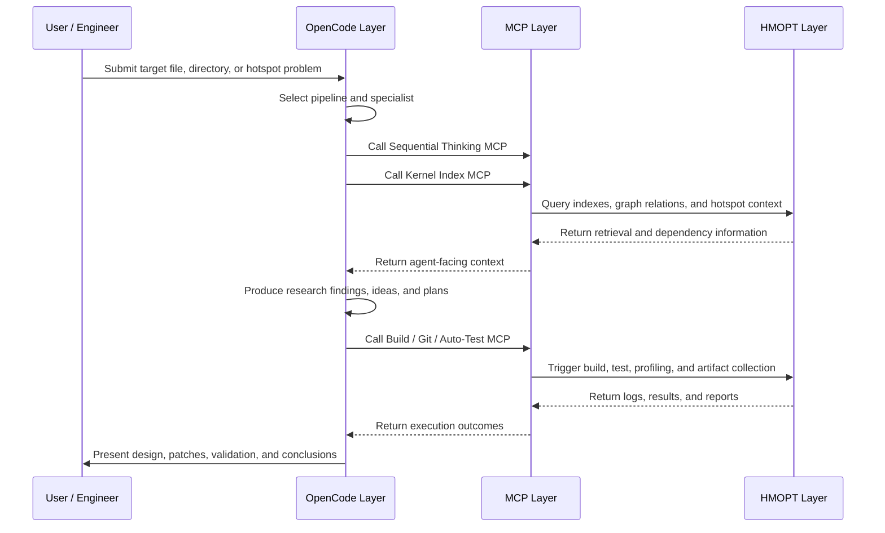

# HMOPT / OpenCode Three-Layer Architecture and Codebase Guide

## 1. Purpose of This Document

This document is intended for internal teammates who need a practical and easy-to-read explanation of the current repository.

It explains:

- the overall design
- the main capabilities
- the architectural boundaries
- the end-to-end workflow
- the directory structure and major code modules

The most natural way to understand this repository is to view it as a three-layer system:

1. OpenCode Harness Engineer Multi-Agent Layer
2. Full-Stack MCP Integration Layer
3. HMOPT Platform Capability Layer

Together, these layers form a complete workspace for kernel analysis, runtime evidence interpretation, optimization planning, validation execution, and Docker-based delivery.

## 2. One-Sentence Summary

This repository is not only a code retrieval service and not only a performance analysis tool. It is a kernel optimization workbench in which OpenCode acts as the control plane, MCP acts as the standardized integration layer, and HMOPT acts as the backend capability platform.

In simple terms:

- the top layer decides how work is organized
- the middle layer standardizes capabilities for OpenCode
- the bottom layer performs indexing, analysis, validation, and delivery

## 3. Three-Layer Architecture Overview

## 4. Layer 1: OpenCode Harness Engineer Multi-Agent Layer

### 4.1 What This Layer Solves

This layer solves the problem of how analysis and optimization work should be organized. It does not directly perform kernel analysis computations.

Its responsibilities are:

- accepting user goals
- identifying the relevant subsystem
- selecting the right specialist agent
- enforcing research-first workflow discipline
- structuring ideation, plan approval, implementation, independent review, validation, and long-term memory accumulation

The goal is to turn an ad hoc conversation into a staged engineering workflow with durable artifacts.

### 4.2 Core Directories in This Layer

- `.opencode/agents/`
- `.opencode/pipelines/`
- `.opencode/skills/`
- `.opencode/docs/`
- `.opencode/memory/`
- `.opencode/state/`
- `src/hmopt/opencode/`
- `configs/pipeline_profiles.yaml`

### 4.3 Key Roles

#### `kernel-pipeline-starter`

This is the entry agent. It expands a short request into a full pipeline context.

Main duties:

- read the pipeline preset
- load the required skill packs
- load bootstrap documents
- generate `.opencode/state/current_task.json`
- generate `.opencode/state/current_prompt.md`
- hand off the staged task to the manager agent

#### `os-opt-manager`

This is the control-plane orchestrator.

Main duties:

- classify the task based on path, keywords, and semantics
- route work to reclaim, hyperhold, synchronization, or workqueue specialists
- enforce research before optimization
- move the task across planning, implementation, and review phases

#### Specialist Agents

Typical specialists include:

- `kernel-source-research`
- `memmgr-reclaim-research`
- `hyperhold-io-opt`
- `basic-mechanism-sync-opt`
- `wq-threadpool-opt`

These agents are responsible for:

- building subsystem understanding
- writing design documents
- identifying hot paths
- generating and ranking optimization ideas
- producing approved implementation plans

#### `kernel-code-agent` and `kernel-reviewer`

These two agents are responsible for:

- implementing minimal patches from approved plans
- conducting independent review focused on concurrency, lifecycle safety, regression risk, and validation completeness

### 4.4 Durable Artifacts in This Layer

One of the main strengths of this layer is that important conclusions are persisted in the repository instead of being left inside temporary chat history.

Typical outputs are written to:

- `.opencode/docs/*.md`
- `.opencode/plans/*.md`
- `.opencode/reviews/*.md`
- `.opencode/bench/*.md`
- `.opencode/memory/*.md`

### 4.5 Python Support for This Layer

The Python support behind this layer is intentionally small. The main implementation is:

- `src/hmopt/opencode/pipeline.py`

This module is responsible for:

- loading `configs/pipeline_profiles.yaml`
- building the staged pipeline prompt
- initializing the `.opencode/` workspace
- inferring target memory paths
- writing task state files

In other words, this layer is mainly a repository-resident workflow workspace, with `pipeline.py` acting as its assembler.

## 5. Layer 2: Full-Stack MCP Integration Layer

### 5.1 What This Layer Solves

This layer solves the problem of how OpenCode can call backend capabilities in a standardized way.

It wraps indexing, structured thinking, Git, build, and phone-side test execution as MCP services that can be consumed by OpenCode or other MCP clients.

This layer is the bridge between the control plane and the backend platform.

### 5.2 Service Inventory

| MCP Service | Primary Use | Key Files |
| --- | --- | --- |
| Kernel Index MCP | Code retrieval, implementation lookup, impact analysis, hotspot-aware code context | `src/hmopt/api/mcp_service.py`, `src/hmopt/api/mcp_server.py`, `src/hmopt/api/mcp_stdio.py` |
| Sequential Thinking MCP | Structured reasoning, step-by-step thought flow, assumption tracking, session recovery | `src/hmopt/api/seq_mcp_service.py`, `src/hmopt/api/seq_mcp_server.py` |
| Git MCP | Git status, diff, branch, commit, and related operations | `src/hmopt/api/git_mcp_service.py`, `src/hmopt/mcp_server_git/server.py` |
| Build MCP | Triggering containerized or cross-container build execution | `src/hmopt/api/build_mcp_service.py`, `src/hmopt/api/build_mcp_server.py` |
| Auto-Test MCP | Driving phone-side test scripts through `hdc` and collecting results | `src/hmopt/api/auto_test_mcp_service.py`, `src/hmopt/api/auto_test_mcp_server.py` |

### 5.3 Kernel Index MCP as the Core Service

The Kernel Index MCP exposes three central tools:

- `kernel_index_code`
- `kernel_symbol_graph`
- `kernel_hotspot_context`

These tools target different use cases:

- implementation understanding
- caller/callee and dependency graph analysis
- hotspot-driven code context retrieval

Under the hood, all of them eventually route into `retrieve_kernel_index_context()` and then `retrieve_code_context()`.

### 5.4 Supported Protocol Shapes

The MCP layer currently supports three forms:

- standard `streamable-http`
- standard `stdio`
- backward-compatible `POST /tools/call`

This allows the repository to serve OpenCode in both local and remote MCP modes while also preserving compatibility with older internal integrations.

### 5.5 Why This Layer Matters

Without the MCP layer, OpenCode can only read raw source files and build lexical understanding.

With this layer, OpenCode can receive:

- vector retrieval results
- Neo4j graph expansion results
- scenario-aware reranked results
- symbol locations with file and line metadata
- hotspot and call-stack-aware code context

That upgrades the system from file reading to indexed and graph-assisted code understanding.

## 6. Layer 3: HMOPT Platform Capability Layer

### 6.1 What This Layer Solves

This is the backend capability foundation. It is responsible for making kernel indexing, runtime analysis, validation, and delivery actually work.

This layer includes:

- kernel code indexing
- runtime evidence ingestion
- flamegraph, hitrace, and hiperf analysis
- hotspot ranking and code alignment
- LLM-assisted execution loops
- DB, artifact, vector, and Neo4j persistence
- Docker-based deployment and delivery

### 6.2 Kernel Code Indexing

Core directories:

- `src/hmopt/indexing/`
- `src/hmopt/analysis/static/`

The most important implementation flow is:

1. `build_kernel_index()`
2. `index_kernel_code()`
3. `CodeIndex -> TextNode`
4. persist into LlamaIndex vector storage
5. optionally persist into Neo4j property graph

Key files:

- `src/hmopt/indexing/llamaindex_pipeline.py`
- `src/hmopt/indexing/clangd_indexer.py`
- `src/hmopt/indexing/clangd_client.py`
- `src/hmopt/analysis/static/indexer.py`
- `src/hmopt/analysis/static/psg.py`

### 6.3 Runtime Evidence and Flamegraph Analysis

Core directories:

- `src/hmopt/analysis/runtime/`
- `src/hmopt/analysis/runtime/traces/`
- `src/hmopt/indexing/runtime_ingestion.py`

These modules are responsible for:

- parsing `flamegraph`
- parsing `hitrace`
- parsing `hiperf`
- producing metrics, hotspots, and call-stack structures
- aligning runtime hotspots to code symbols
- building runtime indexes for later retrieval

The flamegraph support is especially important because it already supports:

- symbol counting
- per-thread hotspot analysis
- call-stack extraction
- name-map persistence
- comparison across multiple flamegraph inputs

### 6.4 HMOPT Automated Execution Loop

Core files:

- `src/hmopt/orchestration/graph.py`
- `src/hmopt/agents/*.py`

The current execution loop is orchestrated with LangGraph. The main flow is roughly:

1. initialize a run
2. perform static analysis and repo snapshotting
3. run baseline profiling
4. build evidence
5. let the conductor decide
6. let the coder generate a patch
7. apply the patch
8. run build and test verification
9. run reviewer approval
10. run candidate profiling
11. evaluate results
12. generate the final report

This is a combined research-and-execution optimization loop.

### 6.5 Data and Storage

Core directories:

- `src/hmopt/storage/db/`
- `src/hmopt/storage/vector/`
- `src/hmopt/storage/artifact_store.py`

The main persisted entities are:

- `runs`
- `artifacts`
- `metrics`
- `hotspots`
- `graphs`
- `patches`
- `evaluations`
- `agent_messages`
- `vector_embeddings`

In practical terms:

- the relational DB stores structured metadata
- the artifact store persists files on disk
- the vector store persists embeddings
- Neo4j stores graph relationships and graph-backed retrieval context

### 6.6 Dockerized Delivery

Core directories and files:

- `docker/`
- `docker-compose.yml`
- `scripts/docker_oneclick.sh`
- `docs/Docker_OneClick_Delivery.md`
- `docs/Quick_Start_English.md`

This layer supports:

- single-container delivery
- Neo4j startup inside the platform container
- offline image packaging and handoff
- one-click startup for index, MCP, API, Git MCP, Build MCP, and Sequential Thinking MCP services

This means the repository is not only a development codebase, but also a deliverable platform package.

## 7. Typical End-to-End Workflow

Below is a representative path from request to optimization output:

## 8. Functional Description

### 8.1 OpenCode Workflow Capabilities

- task intake and routing
- subsystem-first research discipline
- ranked optimization ideation with approval gates
- long-term memory and bootstrap document reuse
- standardized review and validation outputs

### 8.2 Engineering Retrieval Capabilities

- semantic kernel code indexing
- symbol lookup with file and line metadata
- caller/callee graph expansion
- hotspot-aware code context assembly
- mixed runtime plus code queries

### 8.3 Runtime Evidence Capabilities

- flamegraph parsing
- hitrace parsing
- hiperf parsing
- hotspot ranking
- structured call-stack capture
- alignment from runtime hotspots to code paths

### 8.4 Execution and Validation Capabilities

- automated patch generation
- build and test verification
- reprofiling
- reviewer decisions
- report generation
- dataset export

### 8.5 Delivery Capabilities

- Docker one-click startup
- offline image handoff
- embedded Neo4j
- OpenCode MCP configuration examples
- both local and remote MCP modes

## 9. Directory and Code Guide

### 9.1 Top-Level Directory Guide

| Directory | Role |
| --- | --- |
| `.opencode/` | OpenCode-facing collaboration workspace, agent assets, memory, and task state |
| `agent/` | older or draft OpenCode agent assets; historical material, while `.opencode/agents/` is the current main workflow location |
| `configs/` | YAML config, prompt config, and pipeline profiles |
| `docs/` | architecture, MCP integration, workflow, delivery, and design documentation |
| `examples/` | OpenCode MCP examples and minimal config samples |
| `scripts/` | startup, indexing, packaging, service, and phone-test scripts |
| `src/hmopt/` | main Python source code |
| `tests/` | automated tests |
| `docker/` | Docker support files |
| `data/` | default storage location for data, indexes, and artifacts |

### 9.2 `src/hmopt/` Subdirectory Guide

| Directory | Role |
| --- | --- |
| `api/` | FastAPI and MCP service entrypoints |
| `opencode/` | OpenCode pipeline session assembler |
| `indexing/` | code indexing, runtime indexing, query routing, MCP-assisted retrieval |
| `analysis/` | static analysis, runtime analysis, and correlation logic |
| `orchestration/` | LangGraph workflow orchestration |
| `agents/` | Python-side execution agents |
| `storage/` | DB, artifact, and vector persistence |
| `tools/` | adapters for build, test, perf, and git |
| `core/` | config, LLM wrapper, run context, and core errors |
| `datasets/` | dataset export support |
| `evaluation/` | reports, comparison, and benchmark helpers |
| `sequential_thinking/` | models and service logic for sequential thinking |
| `mcp_server_git/` | concrete Git MCP implementation |

### 9.3 Recommended Reading Order

If a teammate wants fast orientation, the recommended reading order is:

1. `README.md`
2. `docs/OpenCode_Multi_Agent_Design_and_Implementation.md`
3. `docs/OpenCode_MCP_Integration_Guide.md`
4. `src/hmopt/cli.py`
5. `src/hmopt/opencode/pipeline.py`
6. `src/hmopt/api/mcp_service.py`
7. `src/hmopt/indexing/llamaindex_pipeline.py`
8. `src/hmopt/indexing/clangd_indexer.py`
9. `src/hmopt/orchestration/graph.py`
10. `src/hmopt/analysis/runtime/traces/flamegraph_parser.py`
11. `src/hmopt/storage/db/models.py`
12. `scripts/docker_oneclick.sh`

## 10. Current Characteristics and Boundaries

### 10.1 Current Strengths

- the three-layer structure is already visible in the implementation
- the boundary between OpenCode control plane and HMOPT execution plane is clear
- the MCP service family is complete
- the kernel index plus graph retrieval path is strong
- the flamegraph and runtime evidence path is connected end to end
- Docker delivery and offline deployment are supported

### 10.2 Current Engineering Style

The codebase still shows the characteristics of an actively evolving engineering platform:

- many compatibility paths
- many fallbacks
- some old and new assets coexisting
- strong core capabilities, with some local rough edges still present

That means it is already strong enough for internal demonstration, onboarding, and continued iteration, while still leaving room for future cleanup such as:

- documentation consolidation
- removing hardcoded configuration
- expanding automated tests for indexing and orchestration
- splitting very large modules such as `graph.py`

## 11. Recommended Presentation Narrative

A good way to present this repository to teammates is:

1. Start with the goal: this is a kernel optimization workbench, not a single-point tool.
2. Explain the three layers: OpenCode control plane, MCP integration layer, HMOPT capability platform.
3. Walk through one end-to-end flow: request, research, retrieval, planning, implementation, validation, report.
4. Explain the directory split: `.opencode` is the collaboration workspace, `src/hmopt` is the backend platform.
5. End with delivery: Dockerized startup, one-click services, and offline image handoff.

For new readers, the best path is to read this document first, then continue into the OpenCode and MCP integration documents.
