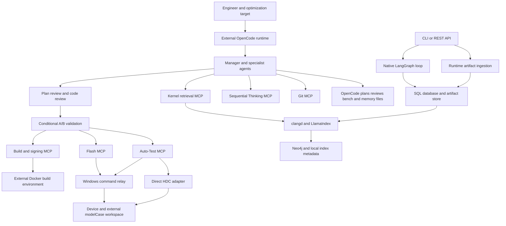
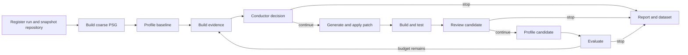

# HMOPT project understanding

Prepared on 2026-09-10 from branch `main`, commit `897c8bb` (2026-04-16).

This guide describes the checked-out implementation, its intended architecture, and the differences between them. It is based on reading the source, configuration, launch scripts, tests, design documents, and hidden OpenCode workspace. Findings explicitly identified as probes or test results were reproduced locally. Other implementation findings are based on source inspection. No kernel build, flash, device workload, live LLM request, or live index operation was performed.

**Baseline snapshot:** the assessment and test counts below describe the original commit, before the subsequent evolution implementation. That follow-up adds `hmopt.evolution`, isolates lightweight CLI/agent imports, fixes the prompt-template `name` collision and normalizes OpenCode manifest paths on Windows. The legacy preprocessing module is still missing. The current design, remaining boundaries and updated verification results are recorded in [the evolution design](EVOLUTION_PLATFORM_DESIGN_CN.md) and [the run guide](EVOLUTION_QUICKSTART_CN.md).

## 1. What this project is

HMOPT is a development workbench for analyzing and optimizing a separate `hm-verif-kernel` source tree. It brings together kernel source retrieval, performance evidence, LLM-assisted research and patch generation, independent reviews, kernel build/signing, device flashing, and instruction-count comparison.

The repository contains the workbench, adapters, prompts, and supporting services. The actual kernel, production build/signing scripts, Windows modelCase test workspace, device, model gateway, and populated indexes are external dependencies. The small files in `outputs/` are sample performance data; they do not demonstrate a measured kernel optimization.

Its intended closed loop is:

1. Understand the kernel source and its execution context.
2. Collect a reproducible baseline.
3. Identify a hot path and explain an optimization mechanism.
4. Review a proposed plan, implement a bounded change, and review the patch.
5. Build, sign, flash, and measure the candidate against stock.
6. Accept, revise, or reject using correctness and performance evidence.
7. Preserve artifacts and lessons for future work.

There are two different ways to organize that work in this repository. The original Python/LangGraph loop is an executable prototype. The newer OpenCode workflow is a detailed operating procedure executed by an external agent runtime. They share capabilities and concepts but are not two entry points into the same state machine.

## 2. Architecture and responsibility boundaries

The newer architecture is best understood as three layers:

| Layer | Responsibility | Main implementation |
|---|---|---|
| OpenCode workflow | Research, delegation, review gates, validation decisions, durable notes | `.opencode/`, `src/hmopt/opencode/pipeline.py` |
| MCP integration | Expose retrieval, thinking state, Git, build, flash, and testing capabilities | `src/hmopt/api/*_mcp_service.py` and server wrappers |
| HMOPT capabilities | Parse traces, index source, retrieve context, persist experiments, run the native loop | `analysis/`, `indexing/`, `storage/`, `orchestration/`, `agents/` |



The older architecture documents also use “three layers” for ingestion, analysis, and agentic optimization. That is a decomposition inside the backend, rather than the OpenCode/MCP/HMOPT deployment view above.

Important boundaries:

- An OpenCode task ID, an HMOPT SQL run ID, and an asynchronous MCP task ID are separate identifiers.
- MCP build/flash/test results are not automatically recorded as SQL experiments.
- OpenCode Markdown memory is separate from both SQL vector records and the Neo4j indexes.
- The native loop's PSG and the clangd-derived graph use different identities and extraction algorithms.
- Sequential Thinking stores reasoning supplied by its caller; it does not call an LLM itself.

## 3. Repository map

The Python scan found 108 files and 20,547 physical lines across `src`, `tools`, `scripts`, and `tests`: 93 source-package files, four Windows helper files, one Python script, and ten test files. Markdown, YAML, shell scripts, and the vendored lockfile are additional material.

| Location | What to understand there |
|---|---|
| `README.md` | Product intent and advertised entry points |
| `pyproject.toml` | Package `hm-verif-opt-platform`, version `0.0.1`, Python >=3.10, `hmopt` console command |
| `src/hmopt/cli.py` | Native run/analyze/index/query commands and OpenCode staging commands |
| `src/hmopt/core/` | Configuration normalization, LLM wrapper, run context |
| `src/hmopt/orchestration/` | Native LangGraph topology, evidence processing, runtime ingestion |
| `src/hmopt/agents/` | Native conductor, trace analyst, coder, reviewer, verifier, profiler, safety helper |
| `src/hmopt/analysis/` | Coarse static analysis, trace parsers, hotspot and correlation ranking |
| `src/hmopt/indexing/` | clangd LSP client, source extraction, LlamaIndex/Neo4j persistence and retrieval |
| `src/hmopt/storage/` | SQL models, hashed artifacts, local embedding records |
| `src/hmopt/evaluation/`, `datasets/` | Basic reports, metric deltas, dataset export |
| `src/hmopt/api/` | REST and six MCP service families |
| `src/hmopt/mcp_server_git/` | Vendored GitPython/MCP implementation and its separate packaging material |
| `src/hmopt/sequential_thinking/` | Thought, session, assumption, and reasoning-progress models |
| `src/hmopt/opencode/` | Profile loading and task/prompt file generation |
| `.opencode/` | Current agent procedures, commands, gates, templates, state, and memory |
| `agent/` | Older standalone research/manager prompts; some describe superseded handoffs |
| `tools/windows_relay/` | Windows HTTP relay, flash pipeline, instruction test runner, XLSX comparison |
| `scripts/` | Service launchers, Docker delivery, compile-log conversion, built-in phone workload |
| `configs/` | App/model/workload settings, workflow profiles, prompt templates, proposed KB configuration |
| `docs/` | Architecture, operational guides, design proposals, and historical implementation plans |

The source package is installed from `src/`. Merely being in the repository directory does not put it on Python's import path; an editable install or `PYTHONPATH=src` is needed. The normal environment is Linux for the backend/build side and Windows for the USB/device relay side.

## 4. The native Python optimization loop

The principal implementation is [orchestration/graph.py](C:/Users/irtos/ryan/workspace/hm-kernel-llm-opt/src/hmopt/orchestration/graph.py:1223).



`make_services()` creates a database session, artifact store, embedding client, local vector store, LLM wrapper, and agent/adaptor instances. `build_context()` allocates a UUID and run directory; `register_run()` creates the SQL row. The initialization node captures Git revision/remote/dirty status and a file-hash snapshot.

The static node scans source and stores a PSG artifact. Baseline profiling produces artifacts, metrics and hotspots. Evidence generation writes a JSON evidence pack and Markdown report containing metrics, selected hotspots, trace summaries and LLM interpretation.

The native agent responsibilities are:

| Component | Actual behavior |
|---|---|
| Trace Analyst | Formats metrics, source locations, call stacks and trace insights; generally makes one LLM call per hotspot; source excerpts are optional and off in the ordinary loop |
| Conductor | Receives a truncated metrics summary and best FPS; searches its textual response for `continue`; returns a fixed generic next action |
| Coder | Requests a unified diff using repository path and instructions; the ordinary loop does not pass source/evidence context into its optional context parameter |
| Verifier | Runs build and tests through adapters; it runs tests even after a failed build |
| Reviewer | Reviews evidence, diff and build/test log excerpts; parses `Decision: APPROVE/REJECT`; otherwise defaults from build/test success |
| Profiler | Delegates trace production to an adapter |
| SafetyGuard | Replaces occurrences of `api_key`/`password`-like labels; exposes an unused model-name policy heuristic |

The default adapter setting is `dummy=True`. Dummy build/test return success; the profiler emits identical synthetic frame, scheduler and sample-stack data. Patches are stored but application is skipped in this mode. This tests plumbing, not optimization effectiveness.

With dummy mode disabled, patching uses `patch -p1` directly in the configured kernel checkout. Shell build/test adapters execute configured shell commands. The shell profiler executes its command in the output directory but returns an empty artifact mapping, so it does not connect real profiler output back to the analysis loop yet. The fallback test command is `ctest || true`, which masks test failure.

The evaluator calculates candidate-minus-baseline deltas but selects the “best” candidate solely by `fps_avg`. Workload objective declarations do not drive this decision. Patches are not isolated in worktrees, failed/regressed changes are not automatically rolled back, and a retained “best” metric dictionary does not restore the corresponding source state.

Several serious defects currently prevent treating this topology as a reliable execution guarantee; see section 15, especially missing modules, artifact duplication and undeclared LangGraph state fields.

## 5. Artifact-only analysis and CLI behavior

[cli.py](C:/Users/irtos/ryan/workspace/hm-kernel-llm-opt/src/hmopt/cli.py:36) defines the public commands. These are the intended entry points, subject to the import blockers described later.

| Command | Behavior |
|---|---|
| `run` | Execute the configured native optimization loop |
| `optimize` | Same loop with an iteration-budget override |
| `analyze` | Set iterations to one and invoke the full loop; despite its baseline-oriented description, it can reach patch generation/application |
| `ingest-artifact` | Copy one file into the artifact store and register metadata |
| `report` | Read a run's status, metrics and hotspots |
| `analyze-artifacts` | Default: lightweight parsing/persistence; optional legacy analysis/patching path |
| `index-kernel` | Build source chunks, vectors and graph relationships |
| `index-runtime` | Embed a run's stored runtime evidence |
| `query` | Route an LLM-backed query across code/runtime/graph evidence |
| `serve-mcp`, `mcp-stdio` | Launch the kernel retrieval MCP interface |
| `list-pipeline-profiles` | Display the five OpenCode profiles |
| `start-pipeline` | Write a staged OpenCode task and prompt |
| `resume-pipeline` | Reload and display existing task and prompt files |

The default `analyze-artifacts` path calls `run_runtime_ingest()` and avoids LLM analysis, patch generation and live profiling. It stores input artifacts, parses supported formats, ranks hotspots, optionally associates symbols with an existing code index, records metrics, writes a deterministic evidence summary, and exports a dataset. It does not build a new static PSG. Repository snapshotting occurs only if the configured source path exists.

The legacy path calls `run_artifact_analysis()`, builds or reuses a PSG, and invokes the trace analyst. `--with-patch` enables conductor/coder and can apply the patch if dummy mode is disabled. Build verification and re-profiling are separately optional. Therefore the patch flag is not merely a request for a harmless text suggestion.

Artifact arguments use `kind:path` and split at the first colon. `framegraph` is accepted as an alias for `flamegraph`. Unknown kinds are stored without parsing.

## 6. The OpenCode workflow

The operational center is [os-opt-manager.md](C:/Users/irtos/ryan/workspace/hm-kernel-llm-opt/.opencode/agents/os-opt-manager.md:33). It is expected to make real delegation calls and advance through stages automatically, with all specialists returning results to the manager.

The canonical stage order is:

1. **Intake and routing:** establish target, objective, available evidence, relevant memory, and specialist.
2. **Research:** build a design model, identify hot paths, explain an instruction-count reduction mechanism, and prepare a plan.
3. **Plan review:** independently approve, request revision, or reject before implementation.
4. **Implementation:** make a minimal change within approved semantics and scope.
5. **Code review:** independently inspect correctness, locking, ownership, lifetime, races and performance tradeoffs.
6. **Conditional tester stage:** perform build/sign and stock-versus-feature validation if required or recommended by review.
7. **Decision and memory:** accept, iterate, or reject and preserve evidence and lessons.

Research specializations cover general kernel source, memory reclaim/allocator coupling, Hyperhold/swap I/O, synchronization mechanisms, and workqueues/thread pools. The plan reviewer, coder, code reviewer and tester are separate roles. The older `kernel-reviewer` and `kernel-pipeline-starter` files remain as compatibility/redirect assets.

All five YAML profiles use instruction count as the primary goal:

| Profile | Specialist bias | Declared validation |
|---|---|---|
| `generic_full` | Automatic | Plan review, code review, tester |
| `hyperhold_full` | Hyperhold I/O | Plan review, code review, tester |
| `memmgr_reclaim_full` | Reclaim and allocation | Plan review, code review, tester |
| `sync_review` | Locks, ownership and refcounts | Plan and code review |
| `workqueue_full` | Workqueues and thread pools | Plan review, code review, tester |

The instruction-count objective is a material departure from the older native loop's FPS acceptance rule. The operating procedure asks researchers to explain which repeated operations disappear, rather than assuming cleaner code or lower latency necessarily means fewer instructions.

The research funnel calls for five candidate ideas, filtering previously rejected mechanisms, ranking likely instruction savings against risk/cost, and developing the selected idea. Bad-plan files and target/subsystem/global memory are intended to prevent repeatedly proposing known failures. Some procedure text requests explicit approval of a selected idea; those are workflow instructions, not behavior implemented in Python.

Every stage passes a handoff containing target, primary metric, evidence baseline, hot path, precise files/functions, instruction-count hypothesis, correctness constraints, unresolved questions, upstream artifact paths, and the next action. Plans, independent reviews and validation evidence are intended to make decisions inspectable later.

### What the Python staging module actually does

[opencode/pipeline.py](C:/Users/irtos/ryan/workspace/hm-kernel-llm-opt/src/hmopt/opencode/pipeline.py:188) loads a dataclass-based profile, creates directories, generates a timestamp/profile/target task ID, and writes:

- `.opencode/state/current_task.json`: status `staged`, target, roles, primary metric, empty review/test/handoff fields, references and timestamps.
- `.opencode/state/current_prompt.md`: an English prompt naming the entry agent, documents, tools and workflow requirements.

It infers target/global memory filenames but does not create or read those notes. It does not implement stage transitions, check review decisions, validate handoff contents, or enforce test requirements. Profile settings such as `research_first` and `validation_mode` become prompt text; `artifacts_expected` is loaded but does not validate inputs.

`start-pipeline` uses the current working directory as the OpenCode workspace, independently of `project.repo_path`. `--launch-opencode` starts plain `opencode` without submitting the generated prompt. `resume-pipeline` reads saved files; it does not resume an executable workflow engine. New staging overwrites the same default current-task/current-prompt files.

The configured workflow language is currently `zh-CN`; Python prompt generation does not load that setting. Slash commands use `@` document inlining, whereas generated Python prompts list plain document paths. The two startup routes therefore do not establish identical context loading.

### Durable OpenCode artifacts

| Directory | Purpose |
|---|---|
| `.opencode/docs/` | Design models and subsystem context |
| `.opencode/plans/` | Optimization plans |
| `.opencode/reviews/` | Plan and code review decisions |
| `.opencode/patches/` | Patch artifacts |
| `.opencode/bench/` | Validation reports and comparison evidence |
| `.opencode/state/` | Current task, prompt, rejected ideas and idea queues |
| `.opencode/memory/` | Target/subsystem knowledge and global lessons |

The checked-in current task is an idle template. Target/subsystem memory directories are placeholders. Existing harness plan/review documents describe improvements to the workflow itself; they are not evidence of a completed and measured kernel optimization.

## 7. MCP services and external execution

Each service separates tool implementations from transport wrappers. Most expose streamable HTTP at `/mcp`; several also expose the legacy JSON `/tools/call` route. Kernel retrieval and sequential thinking additionally support stdio.

| Service | Default local port | Surface and function |
|---|---:|---|
| REST API | 8000 | Run submission/inspection, artifact analysis and query |
| Kernel retrieval MCP | 7331 | `kernel_index_code`, `kernel_symbol_graph`, `kernel_hotspot_context` |
| Sequential Thinking MCP | 7333 | Submit thoughts, get/list/reset sessions |
| Git MCP | 7334 | 13 repository tools: status/diffs/log/show, stage/unstage/commit, branch/checkout/init |
| Build MCP | 7335 | Build, async build/status, sign |
| Auto-Test MCP | 7336 | Direct phone test, Windows instruction test/async/status, comparison and relay health |
| Flash MCP | 7337 | 17 transfer/discovery/flash/boot tools, stock/feature shortcuts and async/status |
| Windows relay | 9100 | `/health`, `/devices`, `/exec` |

The retrieval MCP tools read an existing index; `kernel_index_code` does not initiate source indexing despite its name. Scenarios tune retrieval for general understanding, implementation, call graphs, impact analysis, hotspot debugging and patch planning.

Sequential Thinking records caller-provided thoughts, plans, assumptions, confidence, open questions, branches and progress. It supports per-session idempotency and recommendations such as advancing a step or resolving assumptions. Sessions live in process memory and disappear on restart.

Git tools use GitPython. Their default repository can be overridden by each call. `git_reset` unstages the index; it is not a hard working-tree reset. This MCP surface does not provide push, merge, fetch, worktree management or patch application.

Build MCP invokes external kernel build/sign scripts inside Docker, either by `docker exec` into an existing container or an ephemeral `docker run` with configured mounts. Device-specific build targets and debug/release defconfigs are mapped in the service. Results contain command, return code, stdout, stderr and timing; they do not automatically include an image manifest or image hashes.

Flash MCP sends commands to a Windows host with USB/device access. Its integrated helper transfers images with SCP, reboots into bootloader, waits for fastboot, flashes partitions, reboots, and waits for HDC discovery. HDC visibility is used as the boot-completion signal; it is not an application/workload readiness assertion.

The Windows relay executes an allowed executable name plus argv without a shell. It uses a single-threaded HTTP server, so a long operation occupies the server until completion. Its authority, authentication and retry behavior matter because it can operate the host and attached device; see section 15.

## 8. Device testing and instruction-count comparison

There are two different testing paths.

**Direct HDC:** `phone_test_run` chooses the target, optionally connects, pushes a built-in script or invokes a supplied remote script, and retrieves a result file. `basic_swipe.sh` issues swipes, records hardware instructions through hiperf, and writes a textual result. Some profiler failures become warnings in that result rather than a failed script exit.

**Windows modelCase:** Auto-Test MCP calls [instruction_test_pipeline.py](C:/Users/irtos/ryan/workspace/hm-kernel-llm-opt/tools/windows_relay/instruction_test_pipeline.py:349) through the relay. The helper validates the external test workspace, selects its virtual environment when present, wakes the device, invokes external `main.py`, and selects a timestamped report directory. It prefers newly created directories but can fall back to an existing directory timestamped within 60 seconds before test start or later. It propagates UTF-8 settings and can compare the result to an earlier baseline.

The OpenCode tester's intended sequence is feature build/sign, stock flash and settling, stock test, feature flash and settling, feature test, then comparison. Both tests must use equivalent device, workload and parameters. The prompt expects long-running asynchronous tasks and polling; it does not replace the external test system.

[report_compare.py](C:/Users/irtos/ryan/workspace/hm-kernel-llm-opt/tools/windows_relay/report_compare.py:422) provides the most concrete performance comparison implementation:

- It pairs XLSX reports by `(case, round, step)`.
- Scope can be total, process, thread, library or function. Deeper scope requires the relevant ancestor names.
- Matching duplicate names are summed.
- Function comparison uses inclusive `functionCount_total`, not self count.
- Delta is candidate minus baseline; a negative value means fewer measured instructions.
- Percentage change is delta divided by baseline, or null when baseline is zero.
- It preserves per-pair results, missing pairs, parse errors and target-found flags.
- Aggregates are sums; there is no variance estimate, significance test or workload normalization.

A caller must distinguish command completion, test success, comparison success, target presence, and optimization acceptance. These are separate pieces of evidence. In particular, a missing named target can be represented as zero with a false found flag; interpreting only the numeric decrease would be misleading.

## 9. Source indexing and graph construction

The newer code index uses [clangd_indexer.py](C:/Users/irtos/ryan/workspace/hm-kernel-llm-opt/src/hmopt/indexing/clangd_indexer.py:501) and [llamaindex_pipeline.py](C:/Users/irtos/ryan/workspace/hm-kernel-llm-opt/src/hmopt/indexing/llamaindex_pipeline.py:682).

The extraction sequence is:

1. Read translation units from `compile_commands.json`, respecting file limits and optional path aliases.
2. Start clangd through a custom JSON-RPC/LSP subprocess client.
3. Open documents and request their nested document symbols.
4. Flatten them into symbol records and source chunks, retaining path, qualified name, kind and line range.
5. Extract `contains` edges from nesting and `calls` edges from bounded clangd call-hierarchy queries.
6. Add lexical type/macro references and fallback call matches.
7. Produce deterministic file and relationship summaries.

If clangd or the compile database is unavailable, extraction falls back to ctags or a simple regex scanner. This is substantially less precise. The original PSG builder is coarser still: it keys nodes by unqualified names and searches the entire containing file for call-like tokens for each function. It does not provide an AST/CFG with per-function call-site fidelity.

LlamaIndex converts code and summaries into text nodes. Code bodies are clipped to 120 lines even though metadata retains the full symbol range. Symbol IDs include path, qualified name, start line and kind. Fingerprints and a manifest track changed and removed code nodes. Optional LLM enrichment adds summaries to a configured subset.

Neo4j stores code vectors under `CodeChunk`/`code_vector`, runtime vectors under `RuntimeChunk`/`runtime_vector`, and explicit symbol entities/relationships in its property graph. Local directories also hold LlamaIndex JSON stores, manifests and embedding metadata.

Incrementality is implemented, but symbol identity is sensitive to path relocation and shifted line numbers. The index is not namespaced by Git branch/revision. Lexical relationships can mistake comments, strings or same-named symbols for real semantic references. A file omitted after a parse error may be treated as removed by the manifest comparison.

## 10. Runtime parsing, hotspot scoring and correlation

| Input | Implemented interpretation | Output |
|---|---|---|
| Flamegraph/frame timeline JSON or CSV | Frame timestamps and durations | FPS, slow-frame ratio, p95 duration, jank windows |
| Hiperf-style embedded HTML/report structures | Symbol maps, process/thread data, call-order trees | Event counts, symbol costs, call stacks, process/thread/library summaries, runtime call graph |
| Hiperf sample JSON or collapsed stacks | Weighted stacks | Inclusive symbol costs and adjacent call-edge costs |
| Hitrace normalized JSON/CSV | Event durations and names | Latency quantiles and duration-based idle ratio |
| Sysfs normalized JSON/CSV | Read records, latency, bytes and status | Counts, errors, quantiles and per-node activity |

These parsers do not collectively implement every native binary `perf`, hitrace, proc or kernel-log format mentioned in the high-level design. Unknown artifact types are stored as files.

Frame FPS uses frame count over elapsed time. Drop rate counts durations above twice the target duration; jank windows use a threshold of 1.3 times target. The parser distinguishes actual frame timelines from profiler reports so an instruction report need not invent FPS.

Sample-stack cost is inclusive: each frame in a sample receives its weight. Consequently summing all symbol costs is not the same as counting sampled events once. The current Hiperf total-weight implementation sums inclusive costs and therefore grows with stack depth.

The hotspot algorithm combines raw cost with ten PageRank-like propagation iterations, damping 0.85, using a 0.6/0.4 weighting. The two components are not normalized to the same scale. Flamegraph top-symbol selection also applies absolute and relative thresholds before truncation.

The correlation layer performs exact symbol-to-PSG alignment and a simple global jank multiplier. It does not establish temporal causality or implement the detailed bottleneck classification described in the design documents. Call-stack preservation and hardcoded process scope also have defects described below.

Runtime evidence nodes come from SQL metrics/hotspots, full symbol-count artifacts, leaf-grouped call stacks and evidence packs. This preserves more context than just the top-N hotspot list. Runtime indexing is a separate operation from parsing and requires the embedding/model setup.

## 11. Retrieval and LLM behavior

There are two main retrieval interfaces:

**Evidence retrieval:** `retrieve_code_context()` combines vector hits, explicit focus symbols and bounded incoming/outgoing graph expansion. It ranks symbols using vector score, a focus bonus, graph distance, scenario-weighted relationship bonuses and degree. It returns symbols, scores, source metadata, snippets and edges. This is the backend for the three kernel MCP tools.

**Answer generation:** `route_query()` supports `auto`, `code`, `runtime`, `runtime_code` and `graph`. Code/graph use a graph-oriented query engine with vector fallback. Runtime uses a runtime vector index. Runtime-code analysis selects hotspots, formats runtime evidence and source context, and produces an answer for each focused symbol. Explicit `run_id` lets that path read runtime records directly from SQL. Auto mode uses supplied options and query keywords to select a route.

Prompts may come from text/Markdown/JSON files and contain query, runtime-context and code-context placeholders. Code context can use local snippets, an MCP retrieval agent, or a hybrid.

The MCP retrieval agent makes an initial tool request, then permits up to 20 model/tool rounds restricted to the retrieval tools. It speaks to the legacy `/tools/call` endpoint and to an OpenAI-compatible chat endpoint separately.

There are also two model-client families:

- The native `LLMClient` uses an OpenAI-compatible chat endpoint. Missing credentials or a request failure lead to a deterministic text fallback; after a failure the instance remains offline.
- The LlamaIndex wrappers support custom chat/embedding model names and require an API key. Indexing needs actual embeddings even when optional LLM enrichment is disabled.

The local embedding client's offline fallback is a 32-dimensional hash-derived vector. It is deterministic but does not encode semantic similarity. A successful offline plumbing run should not be interpreted as a functioning semantic retrieval experiment.

## 12. Storage, reproducibility and exported data

There are nine SQLAlchemy models in [storage/db/models.py](C:/Users/irtos/ryan/workspace/hm-kernel-llm-opt/src/hmopt/storage/db/models.py):

| Model | Intended record |
|---|---|
| Run | Repository/workload identity, status, timestamps, optional parent/device/toolchain |
| Artifact | Kind, content hash, file path, MIME, bytes, run association, metadata |
| Metric | Name, value, unit, scope, tags and run |
| Hotspot | Symbol, source lines, score, evidence IDs and call stacks |
| Graph | Graph kind/format and payload artifact |
| Patch | Run iteration, diff artifact and application status |
| Evaluation | Baseline association, deltas and correctness/performance flags |
| AgentMessage | Agent/model and prompt/output artifact references |
| VectorEmbedding | Stored JSON vector and reference/run metadata |

SQLite is the practical default. Bootstrap creates tables and applies an ad hoc missing-column migration; the optional raw SQL bootstrap uses SQLite's `executescript`, despite the engine helper also mentioning Postgres. There are no SQL foreign-key constraints or enforced experiment immutability. Several provenance fields exist in the schema without being populated by the ordinary loop; AgentMessage persistence is not wired into the native agent calls.

Artifacts are addressed by SHA-256 and written under `<artifacts_root>/<first-two-hash-characters>/<hash><extension>`. SQL rows point to those files. This is useful for content identity but currently fails on legitimate repeated content because each storage call adds a new row with the same primary key.

The local SQL vector store holds raw JSON vectors and uses exhaustive cosine search. It is distinct from LlamaIndex/Neo4j. The configuration field named `vector_store_path` does not create a separately managed database for that store.

Metric comparisons collapse records into dictionaries by metric name. Multiple iterations, scopes or tags can overwrite each other in summaries. Evaluations in the native loop belong to the same run; they are not fully separate immutable baseline/candidate experiments.

Dataset export writes a JSON array containing evidence, a selected large patch artifact and evaluation deltas. It is not a model-training pipeline, JSONL conversation dataset, or quality-filtered set of accepted optimizations. Report rendering is basic Markdown over stored records.

## 13. Configuration and deployment

[core/config.py](C:/Users/irtos/ryan/workspace/hm-kernel-llm-opt/src/hmopt/core/config.py:191) loads YAML, expands environment variables, merges selected includes and normalizes legacy field shapes into Pydantic models.

- `includes.model_server` supplies model settings, with local `llm` keys overriding included values.
- `includes.workloads` supplies the workload list.
- Storage accepts flat fields or nested `db`, `artifacts` and `vector_store` forms.
- Paths generally remain relative to the process working directory; included YAML paths are resolved against the main config directory.
- App configuration, service environment variables and OpenCode profile settings are separate configuration surfaces.

The checked-in app config contains machine-specific Linux paths and internal service endpoints. It enables Neo4j, configures a focus symbol, and includes a prompt path and compile-database path that need to exist in the actual deployment. Model YAML contains a placeholder token. Values are not sufficient evidence that those services or paths are available locally.

There are normalization inconsistencies: the sample `api_key_env` uses shell-style `$(...)` rather than a plain environment-variable name; placeholder/base-URL cleanup helpers are defined but unused; the YAML normalization can bypass the model's environment-key default by explicitly passing null. Merely setting an environment variable does not necessarily override an explicit YAML value.

Some accepted settings are not used to control execution: workload objective definitions do not drive native acceptance, `profiling_enabled` is not consulted by the native graph, and pipeline names do not select different graph implementations. The proposed `kernel_kb` block has no corresponding resolver implementation.

Docker packages the backend, clangd, Java and Neo4j, including support for offline Neo4j/APOC material. Build and signing still depend on the external build environment. The default delivery scripts and image configuration are oriented toward the original internal infrastructure.

Compose declares main HMOPT, Git MCP and Build MCP containers. The main container runs `tail -f /dev/null`; publishing its ports does not start its API/MCP applications. Host mappings include kernel MCP 7332→7331, REST 8001→8000, Neo4j HTTP 7475→7474 and Bolt 7688→7687.

`run_all_mcp_servers.sh` starts kernel, sequential-thinking, auto-test and flash services but not Git or Build. Conversely, the OpenCode pipeline wrapper starts Git/Build alongside other services but omits Flash. Neither Compose nor the native Docker delivery publishes Flash's 7337 port. These differences explain why a nominal “all” or “one-click” deployment is not yet a complete validation environment.

## 14. Verification performed for this review

The repository was clean before review. I used a temporary Python 3.12 environment outside the repository, with the dependencies needed for existing component tests and local probes. This was not a complete installed production stack. No application source or configuration was changed.

**Static parse:** all 108 Python files parsed without syntax errors. A Windows-path escape in a flash helper docstring emitted a SyntaxWarning. Parsing checks syntax, not imports or correctness.

**Existing tests:**

```text
python -m pytest tests --continue-on-collection-errors -q -p no:cacheprovider
    -k "not test_exec_command_not_found"

118 passed, 1 failed, 1 deselected, 1 collection error in 28.62s
```

- The failure is `test_initialize_pipeline_session_adds_memory_files_for_generic_profile`: Windows produces backslashes in memory paths while the assertion expects forward slashes.
- `test_prompting.py` fails collection because eager package imports reach the absent `hmopt.analysis.runtime.preprocess` module.
- The excluded test calls a real `fastboot devices` command. Other tested device operations were mocked or sent to canned localhost fixtures; real relay subprocess checks were loopback ping and a temporary Python Unicode-output script.
- These results substantiate component behavior, particularly relay/report handling. They do not validate a real kernel build, live device flash, production test workspace, LLM gateway or populated Neo4j index.

**Artifact probe:** using an in-memory SQLite database and temporary artifact directory, storing identical text twice reproduced an `IntegrityError` from the repeated artifact primary key.

**LangGraph state probe:** using the repository's `RunState` with installed LangGraph 1.2.11, a node returned `force_stop`, `verification_success` and `next_action`; all three were absent from the graph output because they are not declared state channels. A declared `iteration` value survived. This directly verifies the schema mismatch; the full native pipeline was not run around its missing imports.

Coverage is concentrated on OpenCode staging, compile-log transformations, reviewer/prompt behavior and Windows/service helpers. There are no dedicated tests for the full native loop, clangd ingestion, runtime parsers, Neo4j retrieval, SQL artifact reuse, or dataset quality. `tests/README.md` is stale and still says tests will be added later.

## 15. Confirmed limitations that affect interpretation

### Execution blockers and state integrity

1. **Missing modules prevent normal startup.** [flamegraph_parser.py:14](C:/Users/irtos/ryan/workspace/hm-kernel-llm-opt/src/hmopt/analysis/runtime/traces/flamegraph_parser.py:14) imports absent runtime preprocessing functions. Eager package imports propagate that failure into agents, orchestration and indexing. Separately, [cli.py:27](C:/Users/irtos/ryan/workspace/hm-kernel-llm-opt/src/hmopt/cli.py:27) imports absent `hmopt.models.hiperf_report`; those imported names are unused. Installing declared dependencies does not supply these missing project modules.

2. **Native control fields are not in the LangGraph schema.** [state.py:8](C:/Users/irtos/ryan/workspace/hm-kernel-llm-opt/src/hmopt/orchestration/state.py:8) omits `force_stop`, `verification_success`, `next_action` and several log-artifact IDs that nodes write and later read. The local probe confirmed field loss across graph execution. Intended verification/review stop branches therefore cannot be assumed reliable.

3. **Repeated artifacts conflict.** [artifact_store.py:47](C:/Users/irtos/ryan/workspace/hm-kernel-llm-opt/src/hmopt/storage/artifact_store.py:47) always inserts a row whose primary key is the content hash. Repeated logs or identical dummy baseline/candidate traces can fail, even within one run. There is no dedup lookup or separate run-to-blob association.

4. **The native real-adapter loop is incomplete.** Shell profiling returns no artifacts; apply failure does not itself stop verification; the default real test command masks failure; there is no patch rollback or source-state restoration. The conductor uses substring parsing and discards a model's detailed next-action prose in favor of a fixed instruction. These are implementation limitations, not merely deployment requirements.

5. **Status can overstate success.** The legacy artifact-analysis path overwrites its final run status with `succeeded` after report generation. Async build, flash and instruction-test workers also mark tasks succeeded when a Python function returns, even if its result contains a failing return code or `success:false`. Nested results must be inspected.

### Retrieval and evidence fidelity

6. **Custom-model context budgeting can remove prepared evidence.** [openai_like.py:22](C:/Users/irtos/ryan/workspace/hm-kernel-llm-opt/src/hmopt/indexing/openai_like.py:22) defaults unknown models to 8192 context tokens, while the model builder reserves 8192 output tokens. [route_query's budget](C:/Users/irtos/ryan/workspace/hm-kernel-llm-opt/src/hmopt/indexing/llamaindex_pipeline.py:1047) subtracts that output plus overhead, yielding zero. Explicitly prepared runtime/code contexts are then emptied. A downstream engine may still retrieve source, but the assembled runtime/MCP evidence is lost.

7. **The local code-index fallback still assumes Neo4j.** Storage construction permits local defaults, but code ingestion unconditionally runs a hash check using `vector_store.database_query`. That path expects a Neo4j-specific method unavailable on the ordinary local store.

8. **Runtime vectors are not isolated by run.** Neo4j uses a shared runtime label/index, runtime text-node IDs are not stable, and ordinary runtime vector retrieval has no run filter. Re-indexing can duplicate evidence and queries can mix runs. Runtime-code analysis with an explicit run ID has a better-scoped direct SQL path.

9. **Parser and correlation assumptions can distort evidence.** HTML preprocessing is hardcoded toward `sysmgr`, report parsing filters to PID 2, and event totals can be accumulated before that filtering. The correlation ranker drops call stacks when reconstructing hotspots. Sysfs status parsing loses explicit false/zero through an `or` chain. Some JSON readers call `.get()` before testing for a list, despite suggesting raw-list support.

10. **Indexes do not fully enforce provenance and compatibility.** Branch/revision namespacing is absent; transient parse omissions can delete old entries; relation-only changes can leave stale edges; embedding-model changes are not comprehensively checked. The custom clangd client's pipe polling is also not portable to native Windows.

### Workflow and tool contracts

11. **OpenCode gates are prompt-enforced.** The staging module does not validate review artifacts or prevent bypasses. The repository's own prior harness review acknowledges this. Rich instructions should not be mistaken for machine-enforced approval or acceptance.

12. **Tester examples do not match required tool inputs.** [kernel-tester-agent.md:55](C:/Users/irtos/ryan/workspace/hm-kernel-llm-opt/.opencode/agents/kernel-tester-agent.md:55) calls build/sign with no arguments, but the [Build MCP signature](C:/Users/irtos/ryan/workspace/hm-kernel-llm-opt/src/hmopt/api/build_mcp_service.py:428) requires `device`. PASS/FAIL rules based on delta overlap with the tester's under-1% INCONCLUSIVE rule without explicit precedence.

13. **Long-task behavior has unresolved contracts.** Instruction tests default to two hours while the relay caps command timeouts at one hour. Relay POST retries have no idempotency key, so a lost response can repeat an operation. Task registries are process-local and lack durable recovery or per-device ownership.

14. **REST optimize does not bind the requested baseline.** [main.py:107](C:/Users/irtos/ryan/workspace/hm-kernel-llm-opt/src/hmopt/api/main.py:107) accepts a run ID but starts a fresh configured native loop; the ID is only echoed as a baseline in the response.

### Access and data handling

15. **Service authority exceeds the available access controls.** Index and sequential-thinking HTTP services have optional bearer protection. REST, Git, Build, Flash and Auto-Test do not implement equivalent application authentication. Relay authentication is optional and its executable list includes Python with arbitrary arguments. A configured repository default is not a path confinement boundary; Docker socket access grants broad build-host authority.

16. **Credentials can enter outputs.** [llamaindex_pipeline.py:391](C:/Users/irtos/ryan/workspace/hm-kernel-llm-opt/src/hmopt/indexing/llamaindex_pipeline.py:391) prints Neo4j connection details including the password. SCP passwords can be present in echoed command argv. SafetyGuard replaces credential labels rather than reliably removing their values, and its model-policy helper is not invoked by the LLM client. The security design document is stronger than current enforcement.

## 16. Implementation maturity

| Area | Assessment from this checkout |
|---|---|
| OpenCode domain procedures | Detailed roles, artifacts, specialization and review discipline; execution depends on external runtime and prompt compliance |
| Windows relay and XLSX comparison | Substantial code with useful component tests; real hardware and production test workspace not validated here |
| Build/flash/test MCP adapters | Concrete implementations; environment-specific dependencies and inconsistent status/timeout/auth contracts |
| clangd/LlamaIndex/Neo4j retrieval | Substantial extraction, indexing and reranking logic; startup, local fallback, provenance and evidence-budget defects |
| Runtime parsing | Multiple implemented normalized formats; missing preprocessing module and fidelity issues |
| Native LangGraph optimization | Runnable design intent with dummy adapters, but presently blocked and not a dependable optimization loop |
| Experiment storage | Useful schema and artifact structure; dedup, per-iteration identity and provenance remain incomplete |
| Knowledge base | Design and example configuration; external KB/overlay resolver not implemented |
| Training/data feedback | Basic JSON export; no training, evaluation-driven learning or proven automatic improvement |
| Delivery | Linux/Docker and Windows relay pieces exist; launchers and port mappings are inconsistent |

The strongest current investment is in a domain-specific agent workflow and the practical tools surrounding kernel validation. The repository has moved beyond a minimal skeleton in several subsystems, but its package metadata, native loop, integration contracts and test coverage have not all advanced together.

## 17. How to work on this project with the right context

For workflow changes, start with [the manager](C:/Users/irtos/ryan/workspace/hm-kernel-llm-opt/.opencode/agents/os-opt-manager.md), [profiles](C:/Users/irtos/ryan/workspace/hm-kernel-llm-opt/configs/pipeline_profiles.yaml), and [staging implementation](C:/Users/irtos/ryan/workspace/hm-kernel-llm-opt/src/hmopt/opencode/pipeline.py). Verify generated prompts, slash-command inlining and real MCP schemas together; they are not currently interchangeable.

For retrieval changes, trace [clangd extraction](C:/Users/irtos/ryan/workspace/hm-kernel-llm-opt/src/hmopt/indexing/clangd_indexer.py) into [LlamaIndex persistence/query](C:/Users/irtos/ryan/workspace/hm-kernel-llm-opt/src/hmopt/indexing/llamaindex_pipeline.py), then the [MCP formatter](C:/Users/irtos/ryan/workspace/hm-kernel-llm-opt/src/hmopt/api/mcp_service.py). Preserve source identity, run/revision scope, complete enough code context, and the distinction between semantic and heuristic graph edges.

For runtime evidence, follow [orchestration/graph.py](C:/Users/irtos/ryan/workspace/hm-kernel-llm-opt/src/hmopt/orchestration/graph.py:1508) through parsers, metric/hotspot persistence and [runtime_ingestion.py](C:/Users/irtos/ryan/workspace/hm-kernel-llm-opt/src/hmopt/indexing/runtime_ingestion.py). Preserve units, event population, inclusive/self-count meaning, source location and call stacks at every transformation.

For validation, follow [Auto-Test MCP](C:/Users/irtos/ryan/workspace/hm-kernel-llm-opt/src/hmopt/api/auto_test_mcp_service.py) into the [Windows test helper](C:/Users/irtos/ryan/workspace/hm-kernel-llm-opt/tools/windows_relay/instruction_test_pipeline.py) and [report comparison](C:/Users/irtos/ryan/workspace/hm-kernel-llm-opt/tools/windows_relay/report_compare.py). Keep transport completion, process success, valid measurement and optimization acceptance separate.

Before claiming an end-to-end run works, the immediate dependency order is: restore missing project modules; verify imports and CLI help; repair state/artifact integrity; establish one reliable baseline/candidate measurement contract; align workflow/tool/deployment contracts; then validate the full path in the actual build/device environment. Those repairs were identified during this review, not performed.

Useful existing reading: [Three-Layer Architecture](C:/Users/irtos/ryan/workspace/hm-kernel-llm-opt/docs/HMOPT_Three_Layer_Architecture_EN.md), [Parse/Query Refactor](C:/Users/irtos/ryan/workspace/hm-kernel-llm-opt/docs/HMOPT_Parse_Query_MCP_Refactor.md), [OpenCode workflow](C:/Users/irtos/ryan/workspace/hm-kernel-llm-opt/docs/OpenCode_JKernel_Multi_Agent_Optimization_Workflow.md), and [Knowledge Base proposal](C:/Users/irtos/ryan/workspace/hm-kernel-llm-opt/docs/Kernel_Knowledge_Base_Design_CN.md). Read the implementation and current `.opencode/` procedures alongside these documents, since several older guides describe superseded or planned behavior.
