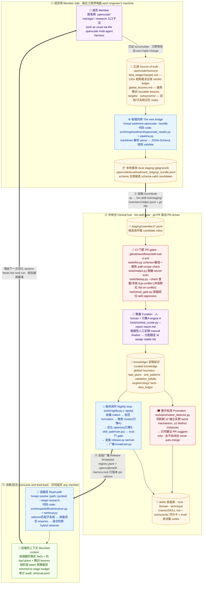
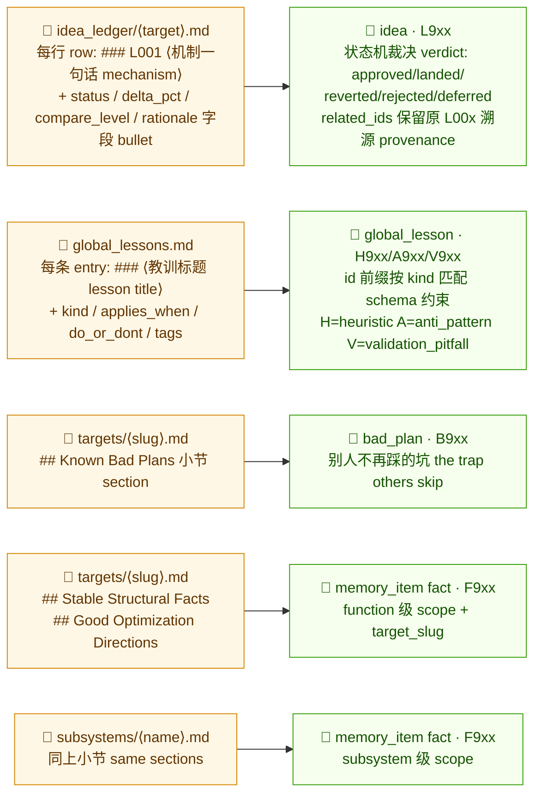
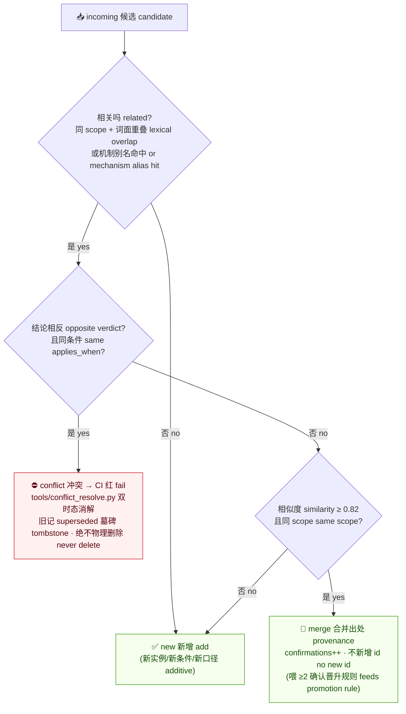
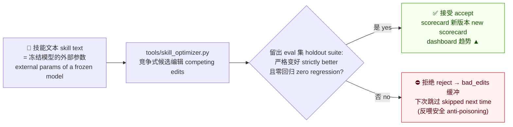
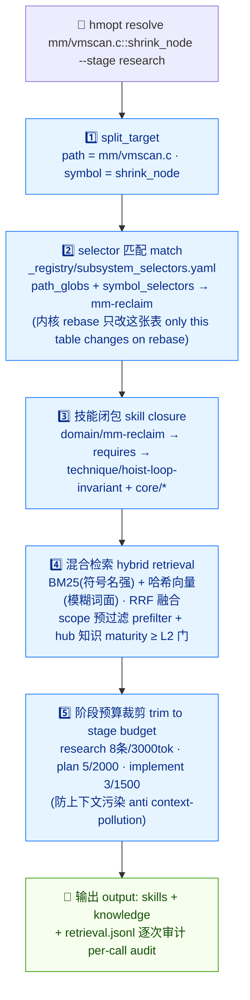
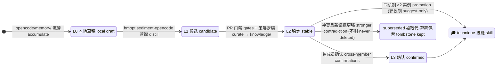
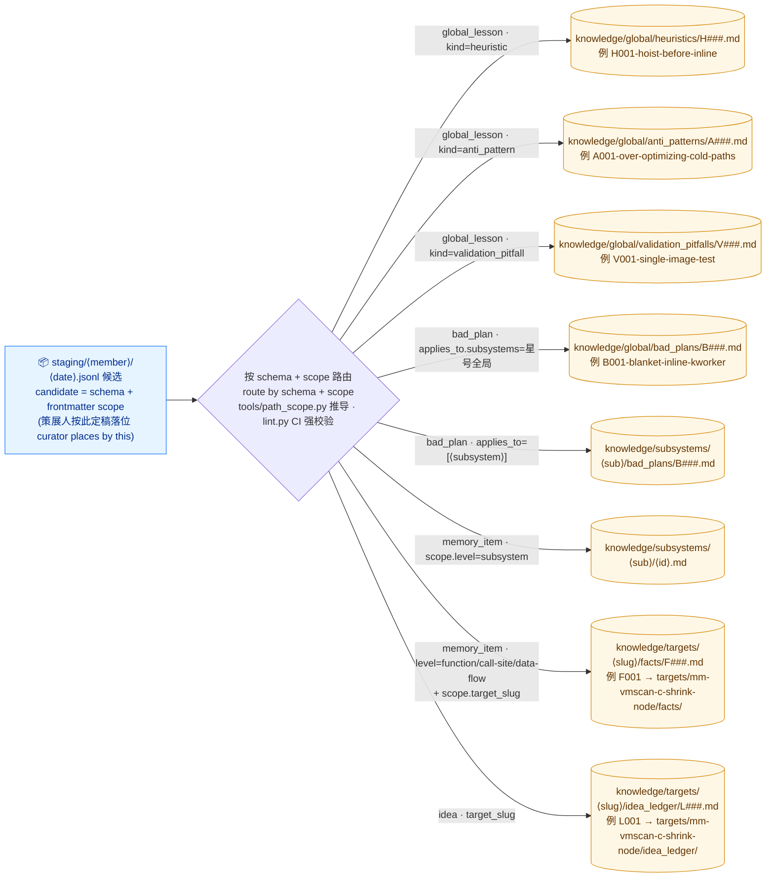
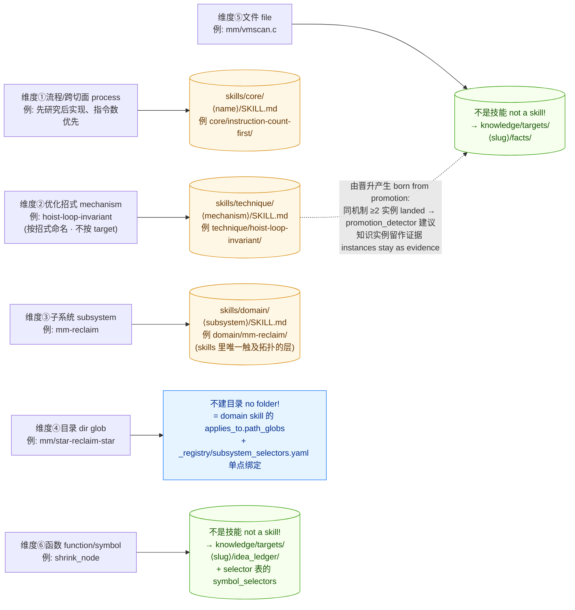

# Team Skill Hub — 全景机制图解 / Full Mechanism Atlas (中英双语 CN·EN)

> 一图看懂：角色 Roles · 动作 Actions · 目录 Directories · 代码 Code · 门禁 Gates · 闭环 Loop
> 配套交互版：`docs/skill_hub_flow_diagram.html`（浏览器直接打开 open in browser）

---

## 图 1 · 全景闭环 / The Big Picture Closed Loop

成员照常工作 → 一条命令蒸馏 → git PR 投稿 → 中央仓质检/策展/发版 → 下一个人自动受益。
Members work as usual → one distill command → contribute via git PR → hub gates/curation/release → the next member benefits automatically.



---

## 图 2 · 写路径映射 / Write-path Mapping（`.opencode/memory/` → hub 四大记录族 four record families）

`sediment-opencode` 的解析规则一览。模板里 HTML 注释中的示例行自动忽略 / template examples inside HTML comments are ignored.



---

## 图 3 · 中央仓双引擎治理 / Two Governance Engines

### 引擎 A：知识合并（追加式 append-only）/ Engine A: knowledge merge



### 引擎 B：技能优化（eval 门 monotone gate）/ Engine B: skill optimization



---

## 图 4 · 读路径内部 / Inside the Read Path（`hmopt resolve`）



---

## 图 5 · 一条经验的生命周期 / Lifecycle of One Piece of Knowledge



---

## 表 1 · 角色 × 动作 × 入口 / Role × Action × Entry Point

| 角色 Role | 时机 When | 动作/入口 Action / Entry | 看什么结果 What to observe |
|---|---|---|---|
| 👤 成员 Member | 研究新函数前 before researching a target | `hmopt resolve "⟨path::symbol⟩" --stage research --run-dir .opencode/state` | 挂载的 skills+knowledge 列表；`retrieval.jsonl` 审计 |
| 👤 成员 Member | 任务/session 收口 at close-out | `hmopt sediment-opencode --opencode-dir .opencode --hub hm-skill-hub --contributor ⟨你⟩ --bundle` | CLI 打印 `N valid / M invalid / parse notes`；`_bundle.jsonl` 内容 |
| 👤 成员 Member | 投稿 contribute | `cp _bundle.jsonl hm-skill-hub/staging/⟨你⟩/⟨日期⟩.jsonl` + git PR | CI 四道门 绿/红 |
| 👤 成员 Member | 共享流程技能 share a skill | `hmopt promote-skill .opencode/skills/⟨name⟩ --kind core\|domain\|technique` | 生成的 L0 脚手架 + 待补步骤清单 next steps |
| 🧠 维护者 Maintainer | 收到投稿 PR on contribution PR | `python tools/central_curate.py staging/⟨m⟩/⟨d⟩.jsonl --report report.md` | 逐条 add/merge/conflict 决策报告 |
| 🧠 维护者 Maintainer | 定稿 finalize | 手工把候选写成 `knowledge/...` 的 md（分配稳定 id）→ `python tools/lint.py` | `OK — N record file(s) validated` |
| 🧠 维护者 Maintainer | 每晚/每周 nightly | `python tools/nightly.py` → 复核后 `--apply` | 7 步报告；`registry.yaml` 版本；`skill-memory.lock` |
| 🧠 维护者 Maintainer | 找晋升机会 promotions | `python tools/promotion_detector.py --pr-body` | promote-candidate PR 文案 |
| 🤖 CI（自动 auto） | 任何 PR any PR | `skill-hub-ci.yml`（hub 门禁+消费测试）· `core-smoke.yml`（import/CLI/全量测试） | GitHub Checks 绿/红 |
| 📊 所有人 Everyone | 看健康度 health | `python tools/dashboard.py` → `eval/scorecards/_dashboard.md` | 每技能 pass_rate 版本趋势（▲=改进） |

## 表 2 · 目录与代码地图 / Directory & Code Map

| 路径 Path | 是什么 What it is | 谁写 Written by | 谁读 Read by |
|---|---|---|---|
| `.opencode/memory/idea_ledger/` | 机制裁决台账（正源）verdict ledgers (source of truth) | 成员/harness | `sediment-opencode` |
| `.opencode/memory/global_lessons.md` | 通用教训 lessons | 成员/harness | `sediment-opencode` |
| `.opencode/memory/targets\|subsystems/` | 目标/子系统记忆 notes | 成员/harness | `sediment-opencode` |
| `.opencode/local/sediment_staging/` | 本地暂存（gitignored）local staging | `sediment-opencode` / 收口钩子 hook | 成员（投稿时 cp） |
| `.opencode/skill-memory.lock` | hub 版本钉 pin | `tools/broadcast.py` | 消费侧 consumers |
| `src/hmopt/sediment/opencode_reader.py` | **桥**：memory markdown → 候选 the bridge | — | `sediment_opencode()` |
| `src/hmopt/sediment/pipeline.py` | 蒸馏编排 + bundle 重编 id | — | CLI / 钩子 |
| `src/hmopt/sediment/skill_promote.py` | 成员技能 → hub L0 脚手架 | — | `hmopt promote-skill` |
| `src/hmopt/skillhub/resolver.py` | 读路径编排 read-path orchestration | — | `hmopt resolve` |
| `src/hmopt/skillhub/retrieval.py` | BM25+向量混合检索 hybrid retrieval | — | resolver / eval |
| `hm-skill-hub/staging/` | 候选收件箱 inbox | 成员 PR | CI 门禁 / curate / nightly |
| `hm-skill-hub/knowledge/` | 定稿知识（唯一真相源 markdown）curated knowledge | 维护者 | resolver / dedup / promotion |
| `hm-skill-hub/skills/` | 技能库 core·domain·technique | 维护者 / promote-skill | resolver / optimizer / eval_gate |
| `hm-skill-hub/schemas/` | 四大记录族 + 技能 frontmatter JSON-Schema | 维护者 | lint / sediment validate |
| `hm-skill-hub/_registry/subsystem_selectors.yaml` | target→子系统映射（rebase 只改这） | 维护者 | resolver |
| `hm-skill-hub/tools/` | 中央工具链 lint/redact/dedup/curate/nightly/... | — | CI / 维护者 |
| `hm-skill-hub/eval/` | 留出测试集 + scorecards + 看板 | run_evals / dashboard | eval_gate / 所有人 |

---

## 设计要点速记 / Design Tenets at a Glance

1. **两类资产两台引擎** Two assets, two engines — 知识"追加+查重+冲突消解"（绝不删历史）；技能"就地编辑+eval 严格变好"（反喂安全）。
2. **markdown 是唯一真相源** Markdown is the source of truth — 索引只是派生缓存，可随时重建；一切可 git 评审。
3. **成员习惯零改动** Zero habit change — 正源就是大家已经在写的 `.opencode/memory/`；新增的只是收口一条蒸馏命令。
4. **一切门禁皆 fail-loud** Gates fail loud — 冲突即 CI 红；晋升永远只建议、人来合。

---

## 图 6 · 知识落位路由 / Knowledge Placement Routing（候选 → `knowledge/` 哪个目录）

**规则（设计 §6.1 "路径即 scope"）**：每条记录一个文件；**文件路径编码 scope**，与 frontmatter 的 `scope` 字段冗余且必须一致——`tools/path_scope.py` 推导期望值，`tools/lint.py` 在 CI 强校验，不一致即拒。
Rule (design §6.1 "path encodes scope"): one record per file; the file path **encodes** the scope and must agree with the frontmatter — derived by `tools/path_scope.py`, CI-enforced by `tools/lint.py`.



### 表 3 · 落位速查 / Placement Cheat-sheet（与 `path_scope.py` 逐行对应 line-for-line with code）

| 候选 Candidate（schema + 判别字段 discriminator） | 落位目录 Destination | id 前缀 | 仓内真实例子 Real example |
|---|---|---|---|
| `global_lesson` · `kind: heuristic` | `knowledge/global/heuristics/` | `H###` | `H001-hoist-before-inline.md` |
| `global_lesson` · `kind: anti_pattern` | `knowledge/global/anti_patterns/` | `A###` | `A001-over-optimizing-cold-paths.md` |
| `global_lesson` · `kind: validation_pitfall` | `knowledge/global/validation_pitfalls/` | `V###` | `V001-single-image-test.md` |
| `bad_plan` · `applies_to.subsystems: ["*"]` | `knowledge/global/bad_plans/` | `B###` | `B001-blanket-inline-kworker.md` |
| `bad_plan` · `applies_to.subsystems: [⟨sub⟩]` | `knowledge/subsystems/⟨sub⟩/bad_plans/` | `B###` | （布局已支持，暂无实例） |
| `memory_item` · `scope.level: subsystem` | `knowledge/subsystems/⟨sub⟩/` | `F/G/R###` | （布局已支持，暂无实例） |
| `memory_item` · `scope.level: function`/`call-site`/`data-flow` + `target_slug` | `knowledge/targets/⟨slug⟩/facts/`（或 `decisions/`） | `F###` | `targets/mm-vmscan-c-shrink-node/facts/F001-hoist-sc-priority.md` |
| `idea` · `target_slug` | `knowledge/targets/⟨slug⟩/idea_ledger/` | `L###` | `targets/mm-vmscan-c-shrink-node/idea_ledger/L001-hoist-sc-priority.md` |

**谁执行落位 Who places**：策展人 curator——dedup 判 `new` 时建**新文件**（分配下一个稳定 id）；判 `merge` 时**不建新文件**，把出处并进已有文件（`confirmations++`）；判 `conflict` 时先消解（旧文件标 `superseded`，新文件落位）。落错目录或 scope 写错 → `lint.py` CI 直接红。
The curator places files: `new` → new file with the next stable id; `merge` → no new file, provenance merged into the existing one; `conflict` → resolve first. A wrong directory or scope fails CI.

---

## 图 7 · 技能落位 / Skills Placement（§6.2 三层 + "比子系统细的都不是技能"）

**唯一原则 The one rule**：skill 树只按「种类/稳定性」分层；**dir/file/function 维度不是 skill，是 knowledge**，运行时由 selector 挂载——从根上消灭拓扑组合爆炸，rebase 只改一张 selector 表。
Skills are layered by kind/stability only; anything finer than a subsystem is **knowledge**, mounted at runtime by selectors — topology explosion eliminated, a kernel rebase touches one selector table.



**每个技能文件夹的解剖 Anatomy of a skill folder**（Anthropic SKILL.md 标准）：
`SKILL.md`（何时用+怎么用，选中即加载）· `best_skill.md`（引擎B SkillOpt 制品）· `evals/`（留出测试集）· `candidates/`（Pareto 前沿候选）· `scorecards/`（版本化评分卡）· `references/`（重材料按需加载）。

**两条进入 skills/ 的路 Two ways in**：
1. **知识毕业 Knowledge graduates**：`promotion_detector` 发现同 mechanism ≥2 独立实例 → 建议开 `skills/technique/⟨mechanism⟩/` PR（实例 fact 留在 `knowledge/` 作证据，不搬家）；
2. **成员技能提升 Member skill promoted**：`hmopt promote-skill .opencode/skills/⟨name⟩ --kind core|domain|technique` → 生成 L0 脚手架，补 eval+scorecard 后过门毕业。

### 一条记录的完整旅程（拿本仓真实 id 串起来）/ One record's full journey with real ids

```text
① .opencode/memory/idea_ledger/mm-vmscan-c-shrink-node.md   ← 成员正源（### L001 landed -0.8%）
② hmopt sediment-opencode --bundle
   → .opencode/local/sediment_staging/_bundle.jsonl          ← 候选 {"schema":"idea","id":"L901",related_ids:["L001"]}
③ cp → hm-skill-hub/staging/alice/2026-06-11.jsonl + PR      ← Tier-1 收件箱（还没进 knowledge/!）
④ CI: lint+redact+dedup --check                              ← dedup 判 new
⑤ 策展定稿（人）按 schema+scope 落位:
   idea     → knowledge/targets/mm-vmscan-c-shrink-node/idea_ledger/L001-hoist-sc-priority.md
   fact     → knowledge/targets/mm-vmscan-c-shrink-node/facts/F001-hoist-sc-priority.md
   教训     → knowledge/global/heuristics/H001-hoist-before-inline.md
   坑       → knowledge/global/bad_plans/B001-blanket-inline-kworker.md
   （路径↔frontmatter scope 一致性由 lint CI 把关）
⑥ 同机制第 2 个实例 landed → promotion_detector 建议
   → skills/technique/hoist-loop-invariant/SKILL.md          ← 知识毕业成技能（F001 留作证据 subsumed_by H001）
⑦ hmopt resolve "mm/vmscan.c::shrink_node"                   ← 下一个人同时拿到 F001+H001+B001 和 technique 技能
```
