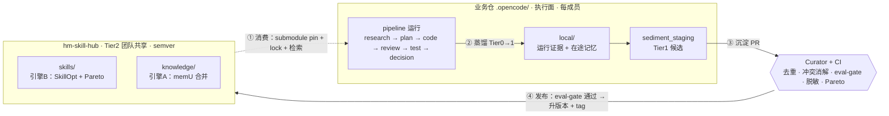
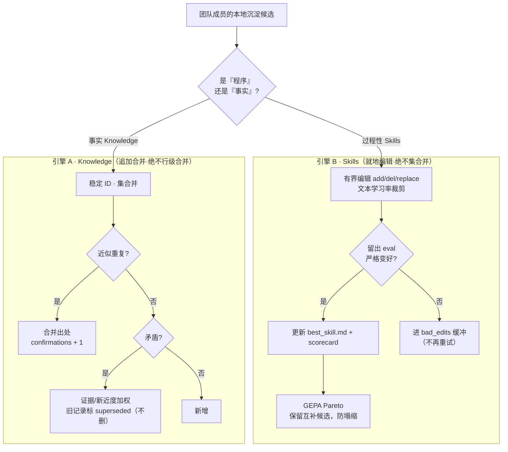
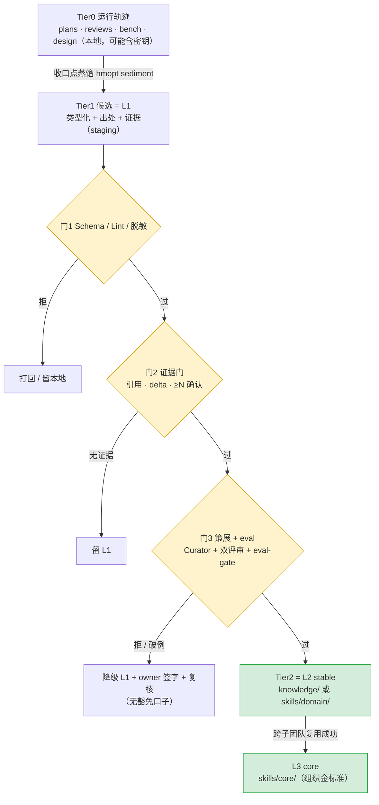
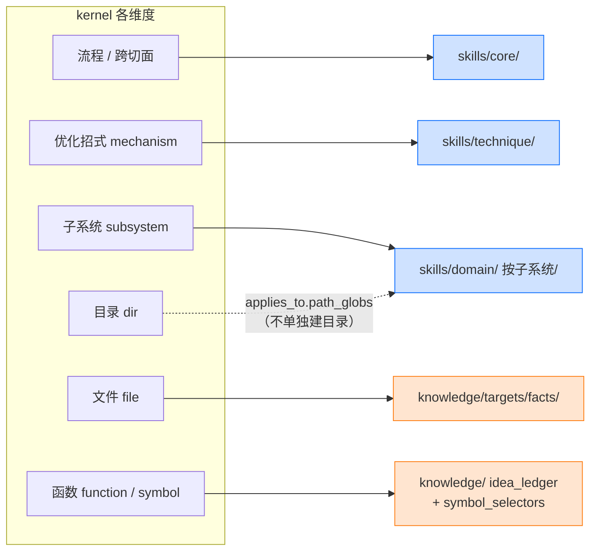
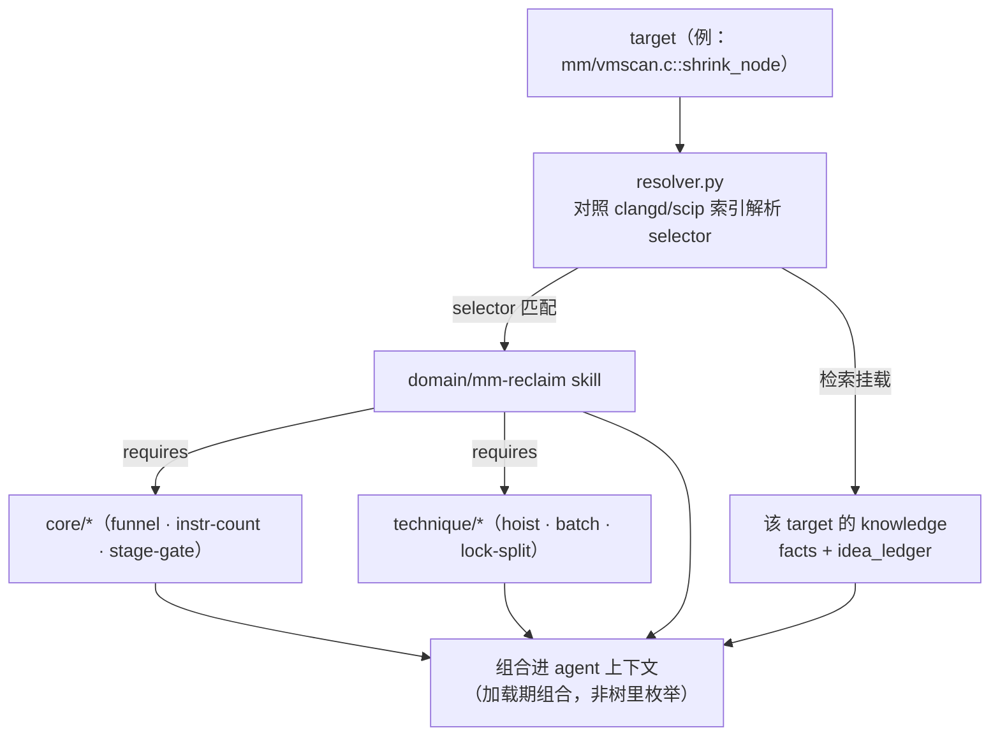
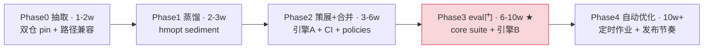
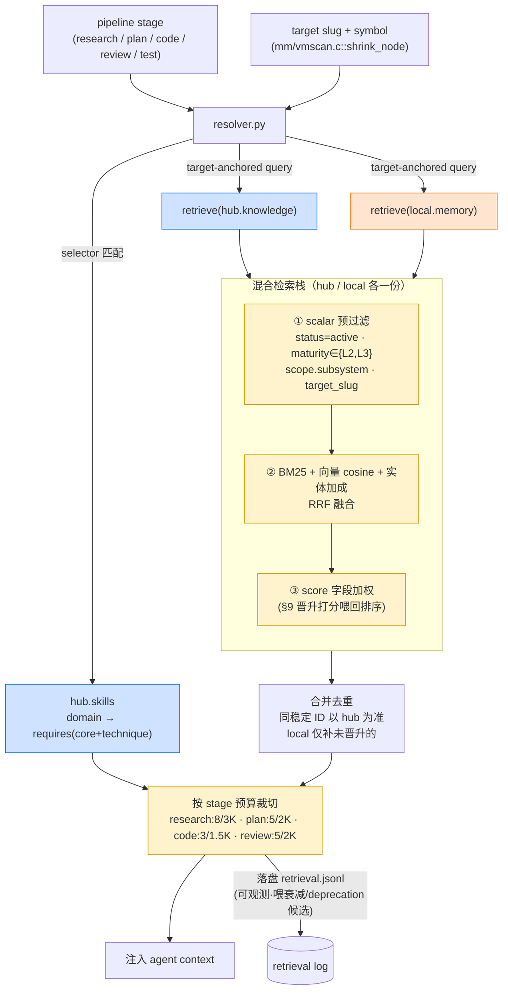

# Team Skill Hub 方案图示（配套可视化）

| 项 | 值 |
|---|---|
| 文档状态 | Draft v2（配套 `Team_Skill_Hub_Design_CN.md` v2.2）|
| 日期 | 2026-06-09 |
| 说明 | 7 张 Mermaid 图，GitHub / VS Code 直接渲染。先看图建立整体直觉，细节回主文档对应 § |
| 修订 | v2：新增图 7「读路径：混合检索 + 上下文预算」（配套主文档 v2.2 §12 改写） |

整体顺序：① 闭环全景 → ② 两套引擎（脊柱）→ ③ 沉淀漏斗 → ④ skills 维度归宿 → ⑤ 运行时组合 → ⑥ 路线图 → ⑦ 读路径（v2 新增）。

---

## 图 1 · 闭环全景（整体）—— 对应主文档 §5

两个仓库 + 四步闭环：消费 → 蒸馏 → 沉淀合并 → eval 发布 → 再消费。

---

## 图 2 · 两类资产 / 两套引擎（脊柱·具体）—— 对应主文档 §4.1 / §10

一条候选按「是程序还是事实」分流，走两套完全不同的合并引擎。

---

## 图 3 · 沉淀漏斗：三层 + 三道门 + L0–L3（具体）—— 对应主文档 §4.2 / §8 / §9

一条原始轨迹如何层层过门、晋升为团队资产。

---

## 图 4 · skills/ 维度归宿：消灭组合爆炸（具体）—— 对应主文档 §6.2

kernel 多维度各有唯一归宿；**只有 3 个维度是真正的 skill 文件夹**，file/function 全部沉到 `knowledge/`。

---

## 图 5 · 运行时组合：组合而非枚举（具体）—— 对应主文档 §6.2 / §12

给定一个 target，`resolver` 按 selector 解析、组合小技能、挂载知识——`(子系统 × 招式)` 矩阵在加载期消化。

---

## 图 6 · 分阶段路线图（整体）—— 对应主文档 §14

Phase 3（建 eval 套件）是关键长杆，红色标注。

---

---

## 图 7 · 读路径：混合检索 + 上下文预算（v2 新增）—— 对应主文档 §12

resolver 在 pipeline 各阶段并行查 hub + local；scalar 过滤先于 BM25 + 向量融合，最后按 stage 预算裁切注入。

> **关键不变式**：markdown 是真相源，`index/` 是派生缓存——cascade 增量重嵌即可，可任何时刻整树重建；切换 faiss / pgvector / LanceDB 不影响数据。

---

**看完图后回主文档**：脊柱与原则 §4 · 布局 §6 · 数据模型 §7 · 合并引擎伪代码 §10 · 检索与运行时组合 §12 · 治理稳定可用 §13 · 风险 §15。
